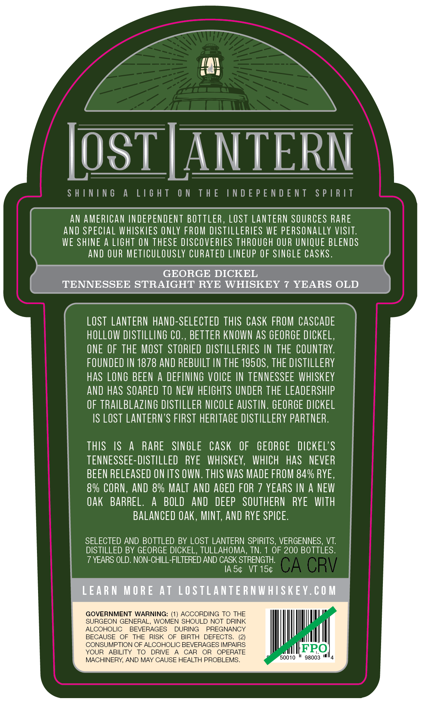
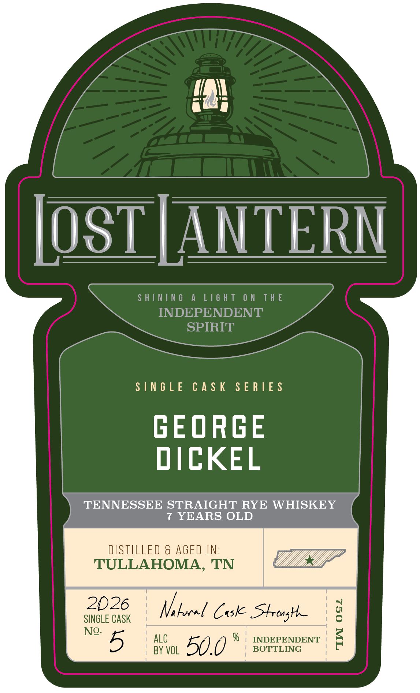
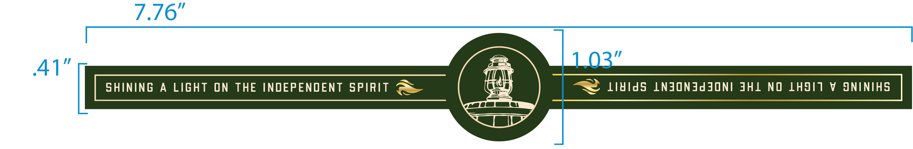

# TTB COLA Label Images - TTBID 26233001000427

**Brand Name:** LOST LANTERN

**Issue Date:** 08/31/2026

**Origin Code:** 46

**Product Class/Type:** 102

**Source:** [TTB Public COLA Registry](https://ttbonline.gov/colasonline/viewColaDetails.do?action=publicFormDisplay&ttbid=26233001000427)

## Label Images

### Back Label

### Front Label

### Label 3

## Extracted Label Text

*Text extracted via OCR - may contain errors*

**Detected Age:** 7 Years

### Back Label

LosT LANTERN
S H ININ 6
A
L16 H T
0 N
T H E
IN D E P E N D E NT
S P |R IT
AN AMERICAN INDEPENDENT BOTTLER , LOST LANTERN SOURCES RARE
ANd SPECLAL WHISKIES ONLY FROM DISTILLERLES WE PERSONALLY VISIT:
WE SHNE A LIGHT ON THESE DISCOVERIES THROUGH OUR UNIQUE BLENDS
AND OUR METICULOUSLY CURATED LINEUP OF SINGLE CaSks.
GEORGE DICKEL
TENNESSEE STRAIGHT RYE WHISKEY
7 YEARS OLD
LOST LANTERN hand-SELECTED THIS CASK FROM CASCADE
hOLLOW DISTILLING €O.
BETTER KNOWN AS GEORGE DICKEL,
ONE OF THE MOST  STORIED DISTILLERIES IN THE COUNTRY:
FOUNDED IN 1878 AND REBUILT IN THE 1950S, THE DISTILLERY
has LONG BEEN
A DEFINING VOICE IN TENNESSEE WHISKEY
anD haS SOARED TO NEW HEIGHTS UNDER THE LEADERSHIP
OF TRAILBLAZING DISTILLER NICOLE AUSTIN. GEORGE DICKEL
IS LOST LANTERN'S FIRST HERITAGE DISTILLERY PARTNER.
THIS
IS
A
RARE
SINGLE
CaSk
OF
GEORGE
DICKEL'$
TENNESSEE-DISTILLED
RYE
WHISKEY,
WHICH
Has
NEVER
BEEN RELEASED ON ITS OWN. THIS wAS MADE FROM 84% RYE ,
8% CORN,
AND &% MALT AND AGED FOR 7 YEARS IN A NEW
Oak
BARREL.
A
BOLD
and
DEEP   SOUTHERN
RYE    WITH
BALANCED €Ak, MNT,anD RYE SPICE:
SELECTED AND BOTTLED BY LOST LANTERN SPIRITS, VERGENNES,
VT:
DISTILLED BY GEORGE DICKEL, TULLAHOMA, TN.
OF 200 BOTTLES.
7 YEARS OLD. NON-CHILL-FILTERED AND CASK STRENGTH:
IA 54
VT 154
CA CRV
LEARN MORE At LOSTLANTE RNWHISKEY.C0 M
GOVERNMENT WARNING:
(1} ACCORDING TO THE
SURGEON GENERAL, WOMEN SHOULD NOT DRINK
ALCOHOLIC
BEVERAGES
DURING
PREGNANCY
BECAUSE
OF
THE
RISK OF
BIRTH
DEFECTS,
CONSUMPTION OF ALCOHOLIC BEVERAGES IMPAIRS
YOUR
ABILITY
TO
DRIVE
CAR
OR
OPERATE
FPO
MACHINERY, AND MAY CAUSE HEALTH PROBLEMS
50010
98003

### Front Label

OST |ANTERN

SHINING A LIGHT ON THE

INDEPENDENT

SPIRIT

SINGLE CASK SERIES

GEORGE

DICKEL

TENNESSEE STRAIGHT RYE WHISKEY

7 YEARS OLD

DISTILLED & AGED IN:

TULLAHOMA, TN

Zi”

2026

SINGLE CASK

Nelocel Case Strong

No. 5

ALC

BOTTLING

INDEPENDENT

BY VOL

50.0 *

### Label 3

| SHINING A LIGHT ON THE INDEPENDENT SPIRIT @& ii V LididS LNJONAddONI JHL NO LHSIT V ONINIHS |
