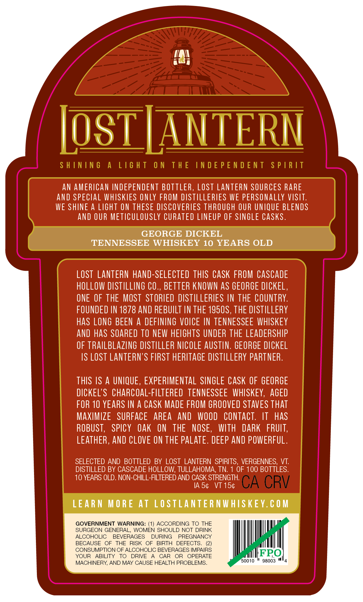
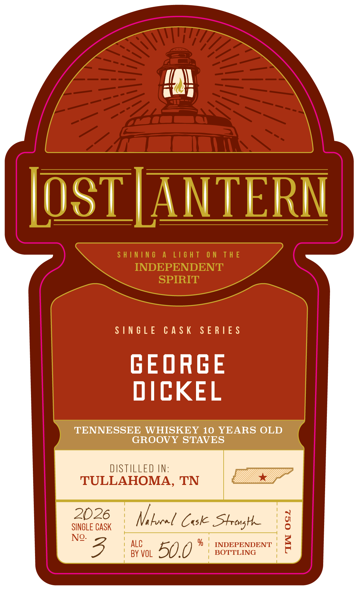

# TTB COLA Label Images - TTBID 26233001000439

**Brand Name:** LOST LANTERN

**Issue Date:** 09/01/2026

**Origin Code:** 46

**Product Class/Type:** 140

**Source:** [TTB Public COLA Registry](https://ttbonline.gov/colasonline/viewColaDetails.do?action=publicFormDisplay&ttbid=26233001000439)

## Label Images

### Back Label

### Front Label

### Label 3

## Extracted Label Text

*Text extracted via OCR - may contain errors*

**Detected Age:** 10 Years

### Back Label

LosTIANTERN
S H ININ 6
A
L16 H T
0 N
T H E
IN D E P E N D E N T
S P |R IT
AN AMERICAN INDEPENDENT BOTTLER, LOSt LANTeRN SOURCES RARE
anD SPECLAL WHISKIES ONLY FROM DISTILLERLES WE PERSONaLlY VISIT:
WE SHINE A LIGHT ON THESE DISCOVERIES THROUGH OUR UNIQUE BLENDS
AND OUR METICULOUSLY CURATED LINEUP OF SINGLE CASks.
GEORGE DICKEL
TENNESSEE WHISKEY 10 YEARS OLD
LOST  LANTERN hand-SELECTED THIS CASK FROM CASCADE
HOLLOW DISTILLING €O.
BETTER KNOWN aS GEORGE DICKEL ,
ONE OF THE MOST  STORIED DISTILLERIES IN THE COUNTRY:
FOUNDED IN 1878 AND REBUILT IN THE 1950S, THE DISTILLERY
has LONG BEEN A DEFINING VOICE IN TENNESSEE WHISKEY
anD haS SOARED TO NEW HELGHTS UNDER THE LEADERSHIP
OF TRAILBLAZING DISTILLER NCOLE AUSTIN. GEORGE DICKEL
IS LOST LANTERN'S FIRST HERITAGE DISTILLERY PARTNER:
THIS IS A UNIQUE , EXPERIMENTAL SINGLE CaSk OF GEORGE
DICKEL'S charcoal-FILTERED   TENNESSEE   WHISKEY,
AGED
FOR 10 YEARS IN a CaSK MADE FROM GROOVED STAVES ThAT
MAXIMIZE
SURFACE
AREA
AND
WOOD
Contact: IT
Has
ROBUST,   SPICY
Oak
ON
THE
NOSE,
WITH
DARK   FRUIT;
LEATHER, AND CLOVE ON THE PALATE. DEEP AND POWERFUL.
SELECTED AND BOTTLED BY LOST LANTERN  SPIRITS, VERGENNES_
VT:
DISTILLED BY CASCADE HOLLOW; TULLAHOMA, TN:
OF 100 BOTTLES.
10 YEARS OLD. NON-CHILL-FILTERED AND CASK STRENGTH:
IA 54
VT 154
CA CRV
LEARN
M ORE AT
LO STLANTER NWHIS KEY. C 0 M
GOVERNMENT WARNING: (1) ACCORDING TO THE
SURGEON GENERAL, WOMEN SHOULD NOT DRINK
ALCOHOLIC
BEVERAGES
DURING
PREGNANCY
BECAUSE
OF
THE
RISK
OF
BIRTH
DEFECTS_
CONSUMPTION OF ALCOHOLIC BEVERAGES IMPAIRS
YOUR
ABILITY
TO
DRIVE
CAR
OR
OPERATE
FPO
MACHINERY AND MAY CAUSE HEALTH PROBLEMS_
50010
98003

### Front Label

IOSTJANTERN

SINGLE CASK SERIES

GEORGE
DICKEL

TENNESSEE WHISKEY 10 YEARS OLD
GROOVY STAVES

DISTILLED IN:
TULLAHOMA, TN

2b26 Neborel Cok Strong
No alo 77) | INDEPENDENT |
3 ayve 50.0 ° sorriina

### Label 3

SHINING A LIGHT ON THE INDEPENDENT SPIRIT —— ene ~~ Li¥idS LNJON3Jd SONI JHL NO LHSIT V SNINIHS
camel
ci =
Se
