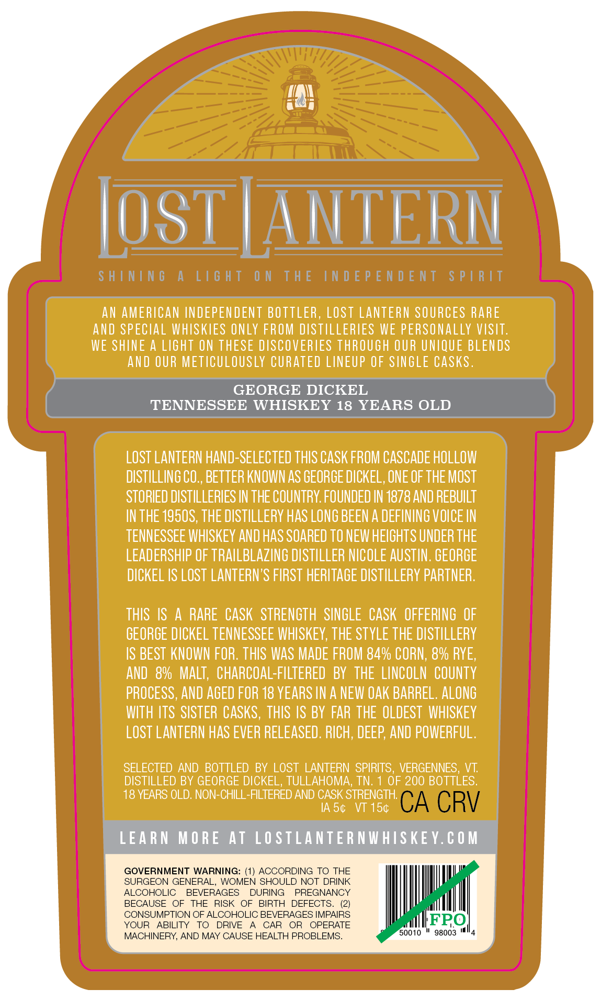
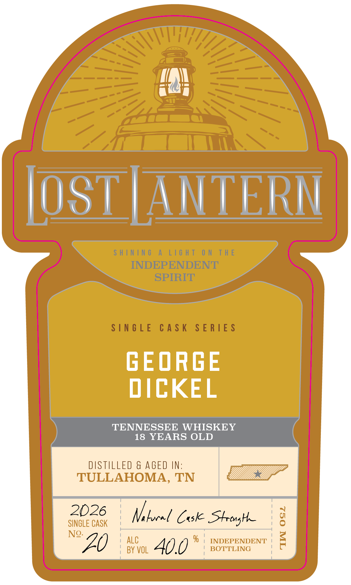

# TTB COLA Label Images - TTBID 26233001000444

**Brand Name:** LOST LANTERN

**Issue Date:** 08/31/2026

**Origin Code:** 46

**Product Class/Type:** 140

**Source:** [TTB Public COLA Registry](https://ttbonline.gov/colasonline/viewColaDetails.do?action=publicFormDisplay&ttbid=26233001000444)

## Label Images

### Back Label

### Front Label

### Label 3

## Extracted Label Text

*Text extracted via OCR - may contain errors*

**Detected Age:** 18 Years

### Back Label

TH\
fay
LIS |
OL ANTLERI
AN AMERICAN INDEPENDENT BOTTLER, LOST LANTERN SOURCES RARE
AND SPECIAL WHISKIES ONLY FROM DISTILLERIES WE PERSONALLY VISIT.
WE SHINE A LIGHT ON THESE DISCOVERIES THROUGH OUR UNIQUE BLENDS
AND OUR METICULOUSLY CURATED LINEUP OF SINGLE CASKS.
GEORGE DICKEL
TENNESSEE WHISKEY 18 YEARS OLD

LOST LANTERN HAND-SELECTED THIS CASK FROM CASCADE HOLLOW
DISTILLING CO., BETTER KNOWN AS GEORGE DICKEL, ONE OF THE MOST
STORIED DISTILLERIES IN THE COUNTRY. FOUNDED IN 1878 AND REBUILT
INTHE 19508, THE DISTILLERY HAS LONG BEEN A DEFINING VOICE IN
TENNESSEE WHISKEY AND HAS SOARED TO NEW HEIGHTS UNDER THE
LEADERSHIP OF TRAILBLAZING DISTILLER NICOLE AUSTIN. GEORGE
DICKEL IS LOST LANTERN’S FIRST HERITAGE DISTILLERY PARTNER.
THIS IS A RARE CASK STRENGTH SINGLE CASK OFFERING OF
GEORGE DICKEL TENNESSEE WHISKEY, THE STYLE THE DISTILLERY

IS BEST KNOWN FOR. THIS WAS MADE FROM 84% CORN, 8% RYE,
AND 8% MALT, CHARCOAL-FILTERED BY THE LINCOLN COUNTY
PROCESS, AND AGED FOR 18 YEARS IN A NEW OAK BARREL. ALONG
WITH ITS SISTER CASKS, THIS IS BY FAR THE OLDEST WHISKEY
LOST LANTERN HAS EVER RELEASED. RICH, DEEP, AND POWERFUL.
SELECTED AND BOTTLED BY LOST LANTERN SPIRITS, VERGENNES, VT.
DISTILLED BY GEORGE DICKEL, TULLAHOMA, TN. 1 OF 200 BOTTLES.

18 YEARS OLD. NON-CHILL-FILTERED AND CASK STRENGTH.

IAS¢ VI 15¢

LEARN MORE AT LOSTLANTERNWHISKEY.COM
GOVERNMENT WARNING: (1) ACCORDING TO THE

SURGEON GENERAL, WOMEN SHOULD NOT DRINK

ALCOHOLIC BEVERAGES DURING PREGNANCY

BECAUSE OF THE RISK OF BIRTH DEFECTS. (2)

CONSUMPTION OF ALCOHOLIC BEVERAGES IMPAIRS FPO

YOUR ABILITY TO DRIVE A CAR OR OPERATE tele
MACHINERY, AND MAY CAUSE HEALTH PROBLEMS. 50010 " 98003 "4

### Front Label

f\

OST IAN]

LAN

GEORGE

DICKEL

YEAR SoLD

i

2026

SINGLE CASK

= tural Casle Prag |

“ZO

1 ALC

BY VOL

% | INDEPENDENT !

BOTTLING

7

A0.0

### Label 3

[ Sue A LIGHT OW THE DEPENDENT SrIRTT NN ~=S eias ig0na.30N0 aH WO LNOIT v aNINT |
SHINING A LIGHT ON THE INDEPENDENT SPIRIT Re (os) zw LIWIdS LNAJONAdSONI JHL NO LHSI7 V ONINIHS
garann
ee a
