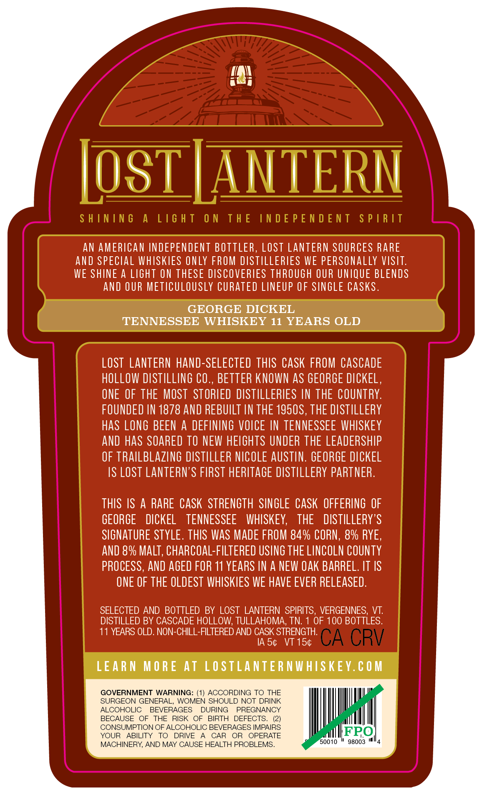
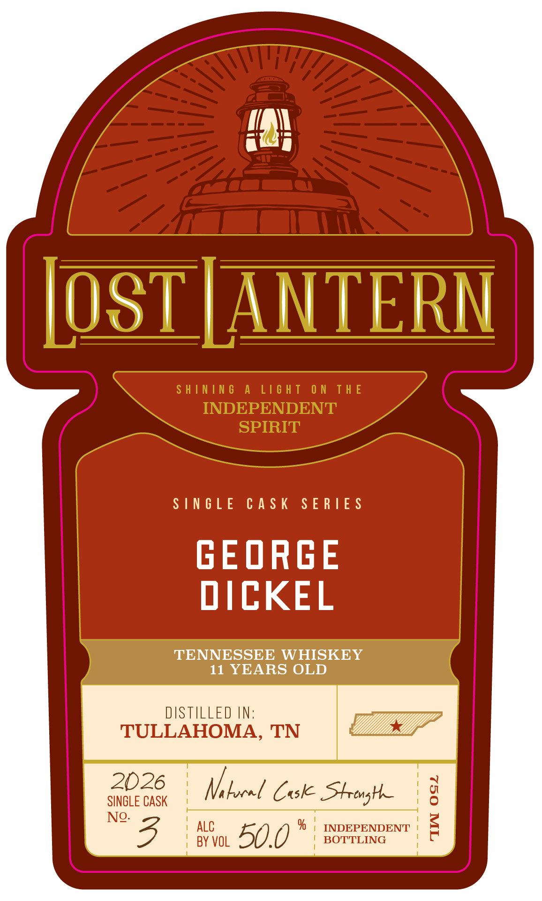

# TTB COLA Label Images - TTBID 26233001000446

**Brand Name:** LOST LANTERN

**Issue Date:** 09/03/2026

**Origin Code:** 46

**Product Class/Type:** 140

**Source:** [TTB Public COLA Registry](https://ttbonline.gov/colasonline/viewColaDetails.do?action=publicFormDisplay&ttbid=26233001000446)

## Label Images

### Back Label

### Front Label

### Label 2

## Extracted Label Text

*Text extracted via OCR - may contain errors*

**Detected Age:** 11 Years

### Back Label

LosTLANTERN
S H ININ 6
A
L16 H T
0 N
T H E
IN D E P E N D E N T
S P |R /T
AN AMERICAN INDEPENDENT BOTTLER, LOST LANTERN SOURCES RARE
ANd SPECLAL WHISKIES ONLY FROM DISTILLERTES WE PERSONALLY VISIT.
WE SHINE a LIGHT ON THESE DISCOVERIES THROUGH OUR UNIQUE BLENDS
aNd OUR METICULOUSLY CURATED LINEUP OF SINGLE CaSks .
GEORGE DICKEL
TENNESSEE WHISKEY 11 YEARS OLD
LOST  LANTERN hand-SELECTED THIS CaSK FROM CASCADE
HOLLOW DISTILLING CO ,, BETTER KNOWN AS GEORGE DICKEL,
ONE OF THE MOST  STORIED DISTILLERIES IN THE COUNTRY:
FOUNDED IN 1878 AND REBUILT IN THE 1950S, THE DISTILLERY
Has LONG BEEN
A
DEFINING VOICE IN TENNESSEE WHSKEY
and haS SOARED TO NEW HELGHTS UNDER THE LEADERSHIP
OF TRAILBLAZING DISTILLER NICOLE AUSTIN. GEORGE DICKEL
IS LOST LANTERN'S FIRST HERITAGE DISTILLERY PARTNER.
THIS IS
A RARE CASK STRENGTH  SINGLE CASK OFFERING OF
GEORGE
DICKEL
TENNESSEE
WHISKEY;
THE
DISTILLERY'S
SIGNATURE STYLE. THIS WaS MADE FROM 84% CORN, &% RYE,
AND &% MaLT, chARCOAL-FILTERED USING THE LINCOLN COUNTY
PROCESS, AND AGED FOR 11 YEARS IN A NEW OAK BARREL. IT IS
ONE OF THE OLDEST WHISKIES WE HAVE EVER RELEASED.
SELECTED AND BOTTLED BY LOST LANTERN
SPIRITS, VERGENNES, VT:
DISTILLED BY CASCADE HOLLOW; TULLAHOMA, TN:
OF 100 BOTTLES.
11 YEARS OLD. NON-CHILL-FILTERED AND CASK STRENGTH:
IA 54
VT 154
CA CRV
LEARN
M O RE At LOSTLANTE R NWHISKE Y. € 0 M
GOVERNMENT WARNING: (1) ACCORDING TO THE
SURGEON GENERAL.
WOMEN SHOULD NOT DRINK
ALCOHOLIC
BEVERAGES
DURING
PREGNANCY
BECAUSE
OF
THE
RISK
OF
BIRTH
DEFECTS
CONSUMPTION OF ALCOHOLIC BEVERAGES IMPAIRS
YOUR
ABILITY
TO
DRIVE
CAR
OR
OPERATE
FPO
MACHINERY AND MAY CAUSE HEALTH PROBLEMS
50010
98003

### Front Label

in

IOS)

LAN)

mat

SINGLE CASK SERIES

GEORGE

DICKEL

TENNESSEE WHISKEY

11 YEARS OLD

2026

'

a

SINGLE CASK

Vi locel Cok Strong

°)

| ALC

i INDEPENDENT

S

No. B

| BY VOL

50.0"

| BOTTLING

7

### Label 2

SHINING A LIGHT ON THE INDEPENDENT SPIRIT —— ene ~~ Li¥idS LNJON3Jd SONI JHL NO LHSIT V SNINIHS
camel
ci =
Se
