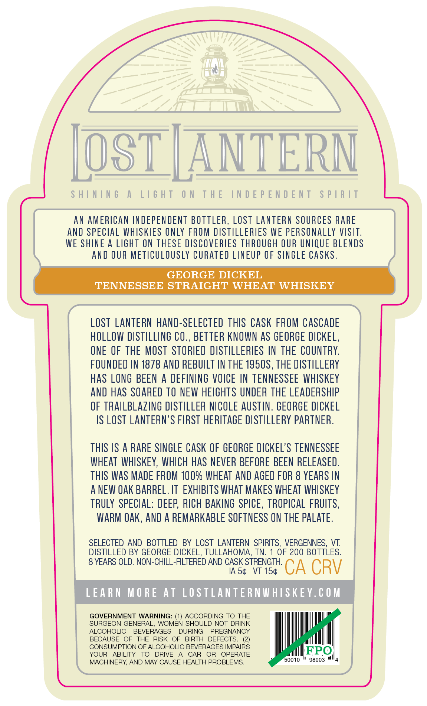
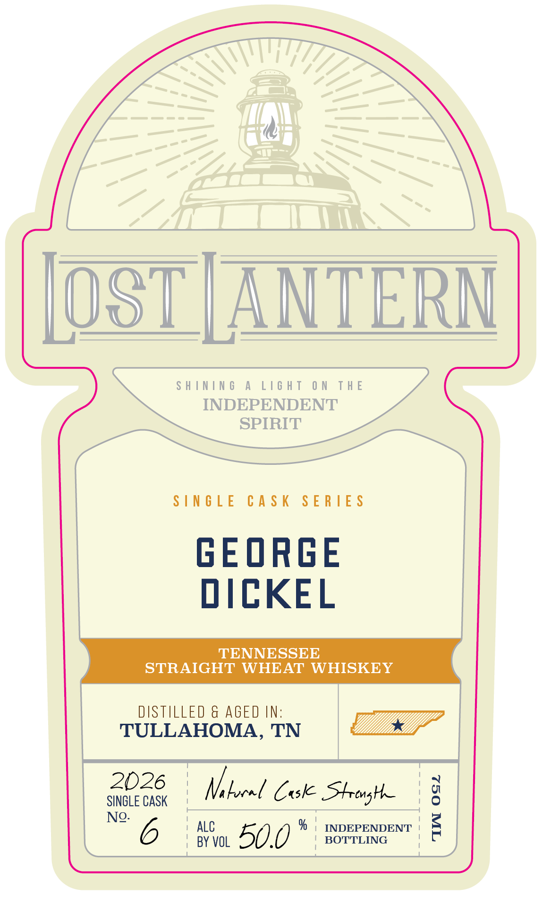

# TTB COLA Label Images - TTBID 26233001000452

**Brand Name:** LOST LANTERN

**Issue Date:** 08/31/2026

**Origin Code:** 46

**Product Class/Type:** 100

**Source:** [TTB Public COLA Registry](https://ttbonline.gov/colasonline/viewColaDetails.do?action=publicFormDisplay&ttbid=26233001000452)

## Label Images

### Back Label

### Front Label

### Label 3

## Extracted Label Text

*Text extracted via OCR - may contain errors*

**Detected Age:** 8 Years

### Back Label

SHINING A LIGHT ON THE INDEPENDENT SPIRIT
AN AMERICAN INDEPENDENT BOTTLER, LOST LANTERN SOURCES RARE
AND SPECIAL WHISKIES ONLY FROM DISTILLERIES WE PERSONALLY VISIT.
WE SHINE A LIGHT ON THESE DISCOVERIES THROUGH OUR UNIQUE BLENDS
AND OUR METICULOUSLY CURATED LINEUP OF SINGLE CASKS.
GEORGE DICKEL
TENNESSEE STRAIGHT WHEAT WHISKEY
LOST LANTERN HAND-SELECTED THIS CASK FROM CASCADE
HOLLOW DISTILLING CO., BETTER KNOWN AS GEORGE DICKEL,
ONE OF THE MOST STORIED DISTILLERIES IN THE COUNTRY.
FOUNDED IN 1878 AND REBUILT IN THE 1950S, THE DISTILLERY
HAS LONG BEEN A DEFINING VOICE IN TENNESSEE WHISKEY
AND HAS SOARED TO NEW HEIGHTS UNDER THE LEADERSHIP
OF TRAILBLAZING DISTILLER NICOLE AUSTIN. GEORGE DICKEL
IS LOST LANTERN’S FIRST HERITAGE DISTILLERY PARTNER.

THIS IS A RARE SINGLE CASK OF GEORGE DICKEL’S TENNESSEE
WHEAT WHISKEY, WHICH HAS NEVER BEFORE BEEN RELEASED.
THIS WAS MADE FROM 100% WHEAT AND AGED FOR 8 YEARS IN
A NEW OAK BARREL. IT EXHIBITS WHAT MAKES WHEAT WHISKEY
TRULY SPECIAL: DEEP, RICH BAKING SPICE, TROPICAL FRUITS,
WARM OAK, AND A REMARKABLE SOFTNESS ON THE PALATE.
SELECTED AND BOTTLED BY LOST LANTERN SPIRITS, VERGENNES, VT.
DISTILLED BY GEORGE DICKEL, TULLAHOMA, TN. 1 OF 200 BOTTLES.

8 YEARS OLD. NON-CHILL-FILTERED AND CASK STRENGTH.

IAS¢ VT 15¢ CA CRV
LEARN MORE AT LOSTLANTERNWHISKEY.COM
GOVERNMENT WARNING: (1) ACCORDING TO THE
SURGEON GENERAL, WOMEN SHOULD NOT DRINK
ALCOHOLIC BEVERAGES DURING PREGNANCY
BECAUSE OF THE RISK OF BIRTH DEFECTS. (2)
CONSUMPTION OF ALCOHOLIC BEVERAGES IMPAIRS IFPO
YOUR ABILITY TO DRIVE A CAR OR OPERATE fetter
MACHINERY, AND MAY CAUSE HEALTH PROBLEMS. 0010 * 96003 "4

### Front Label

OST | ANTERN

SHINING A LIGHT ON THE

INDEPENDENT

SPIRIT

SINGLE CASK SERIES

GEORGE

DICKEL

TENNESSEE

STRAIGHT WHEAT WHISKEY

DISTILLED & AGED IN:

TULLAHOMA, TN

2026

SINGLE CASK

Vi bocel Cuske SHtrenghe

' 0

a

ALC

INDEPENDENT <

I

i.

No. 6

BY VOL

50.0 *

| BOTTLING

### Label 3

7.376"
41'
103"
ShInIng
A
LIGhT
ON
THE
INDEPENDENT
SpIRIT
lAIds
LNJONJdjoni JHL
NO
LHJIT
V
JNINIHS
