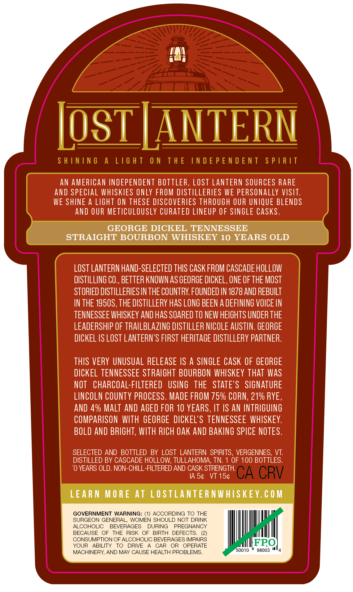
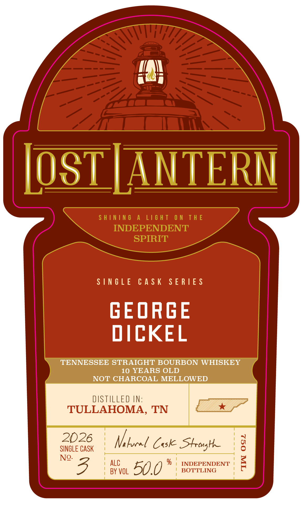
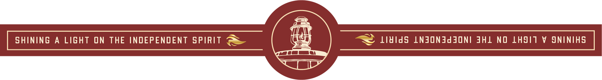

# TTB COLA Label Images - TTBID 26233001000454

**Brand Name:** LOST LANTERN

**Issue Date:** 08/31/2026

**Origin Code:** 46

**Product Class/Type:** 101

**Source:** [TTB Public COLA Registry](https://ttbonline.gov/colasonline/viewColaDetails.do?action=publicFormDisplay&ttbid=26233001000454)

## Label Images

### Back Label

### Front Label

### Label 3

## Extracted Label Text

*Text extracted via OCR - may contain errors*

**Detected Age:** 10 Years

### Back Label

LosT LANTERN
S H ININ 6
A
L16 H T
0 N
T H E
IN D E P E N D E NT
S P |R IT
AN AMERICAN INDEPENDENT BOTTLER, LOSt LANTeRN SOURCES RARE
and SPECLAL WHISKIES ONLY FROM DISTILLERLES WE PERSONALLY VISIT:
WE SHINE A LIGHT ON THESE DISCOVERIES THROUGH OUR UNIQUE BLENDS
AND OUR METICULOUSLY CURATED LINEUP OF SINGLE CASks.
GEORGE DICKEL TENNESSEE
STRAIGHT BOURBON WHISKEY 10 YEARS OLD
LOST LANTERN hand-SELECTED THIS CASK FROM CASCADE HOLLOW
DISTILLING CO, BETTER KNOWN AS GEORGE DICKEL, ONE OF THE MOST
STORIED DISTILLERIES IN THE COUNTRY FOUNDED IN 1878 AND REBUILT
IN THE 1950S, THE DISTILLERY HAS LONG BEEN A DEFLNING VOICE IN
TENNESSEE WHISKEY AND HAS SOARED TO NEW HEGHTS UNDER THE
LEADERSHIP OF TRAILBLAZING DISTILLER NICOLE AUSTN. GEORGE
DICKEL IS LOST LANTERN'S FIRST HERITAGE DISTILLERY PARTNER:
THIS VERY UNUSUAL RELEASE IS A SINGLE CASK OF GEORGE
DICKEL TENNESSEE STRAIGHT BOURBON WHISKEY ThAT WaS
NOT
charcoal-FILTERED
USING
THE   STATE'S
SIGNATURE
LINCOLN CoUNTY PROCESS. MADE FROM 75% CORN, 21% RYE,
AND 4% Malt AND AGEd FOR 10 YEARS, IT IS AN INTRIGUING
COMPARISON  WITH  GEORGE   DICKEL'S TENNESSEE WHISKEY:
BOLD AND BRIGHT, WITH RICH €ak ANd BAKING SPICE NOTES.
SELECTED AND BOTTLED
BY LOST LANTERN  SPIRITS
VERGENNES;
VT:
DISTILLED BY CASCADE HOLLOW; TULLAHOMA, TN:
OF 100 BOTTLES.
'0 YEARS OLD: NON-CHILL-FILTERED AND CASK STRENGTH:
IA 54
VT 154
CA CRV
LEARN
M O RE At LOSTLANTER NWHISKEY.€ 0 M
GOVERNMENT WARNING: (1) ACCORDING TO THE
SURGEON GENERAL, WOMEN SHOULD NOT DRINK
ALCOHOLIC
BEVERAGES
DURING
PREGNANCY
BECAUSE
OF
THE
RISK
OF
BIRTH
DEFECTS.
CONSUMPTION OF ALCOHOLIC BEVERAGES IMPAIRS
YOUR
ABILITY
TO
DRIVE
CAR
OR
OPERATE
FPO
MACHINERY AND MAY CAUSE HEALTH PROBLEMS
50010
98003

### Front Label

OL /ANTERN

SINGLE CASK SERIES

GEORGE
DICKEL

TENNESSEE STRAIGHT BOURBON WHISKEY
10 YEARS OLD
NOT CHARCOAL MELLOWED

DISTILLED IN:
TULLAHOMA, TN

2026

SINGLE CASK

Nhlacel Cask Strong
N® TAC 2°) 7 % | INDEPENDENT |
a) | BY VOL AD 0 BOTTLING

### Label 3

SHINING A LIGHT ON THE INDEPENDENT SPIRIT —— ene ~~ Li¥idS LNJON3Jd SONI JHL NO LHSIT V SNINIHS
camel
ci =
Se
