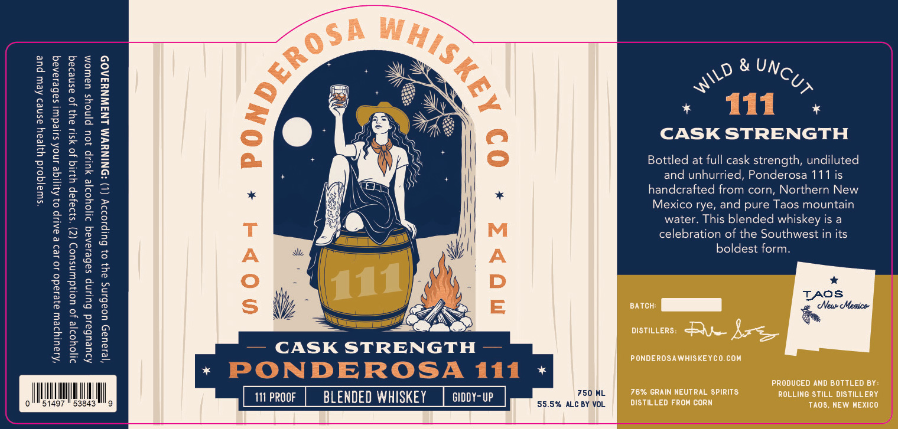
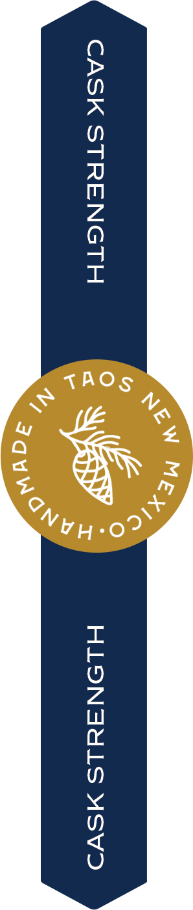

# TTB COLA Label Images - TTBID 26233001000479

**Brand Name:** ROLLING STILL

**Fanciful Name:** PONDEROSA 111

**Issue Date:** 09/03/2026

**Origin Code:** 34

**Product Class/Type:** 137

**Source:** [TTB Public COLA Registry](https://ttbonline.gov/colasonline/viewColaDetails.do?action=publicFormDisplay&ttbid=26233001000479)

## Label Images

### Back Label

### Label 2

## Extracted Label Text

*Text extracted via OCR - may contain errors*

*1 image(s) excluded: text did not meet readability threshold*

**Detected Proof:** 111

### Back Label

1
W
&
8
8
1
1
111
HEE
CASK STRENGTH
8
2
8
J
8
Bottled at full cask
strength; undiluted
Iu
and unhurried, Ponderosa 111 is
2
handcrafted from corn, Northern New
3
I
Mexico rye;
and pure Taos mountain
3
[
water. This blended whiskey is a
2
celebration of the Southwest in its
2
1
A
A
boldest form:
[
3
0
D
1
1
S
E
BATCH:
TAQSMumico
2
JuL
CASK STRENGTH
DISTILLERS:
A8z
PONDEROSAWHISKEYcO.COm
PONDEROSA
111
PRODUCED AND BOTTLED BY
111 PPOOF
BLENDED WHISKEY
gIDDY-UP
750 ML
7696 GRain NEUTRAL SpPiRits
ROLLINC STILL DISTILLERY
51497
53843
55.5%
ALC BY VOL
DISTILLED FROM CORN
Taos; NEW MexiCO
(
WhlsKer
UNCUT
WILD
l11
[
