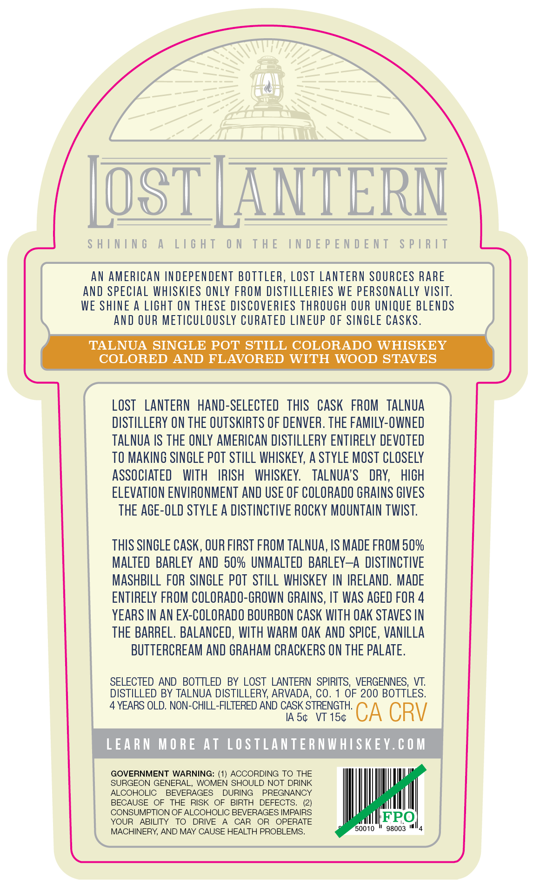
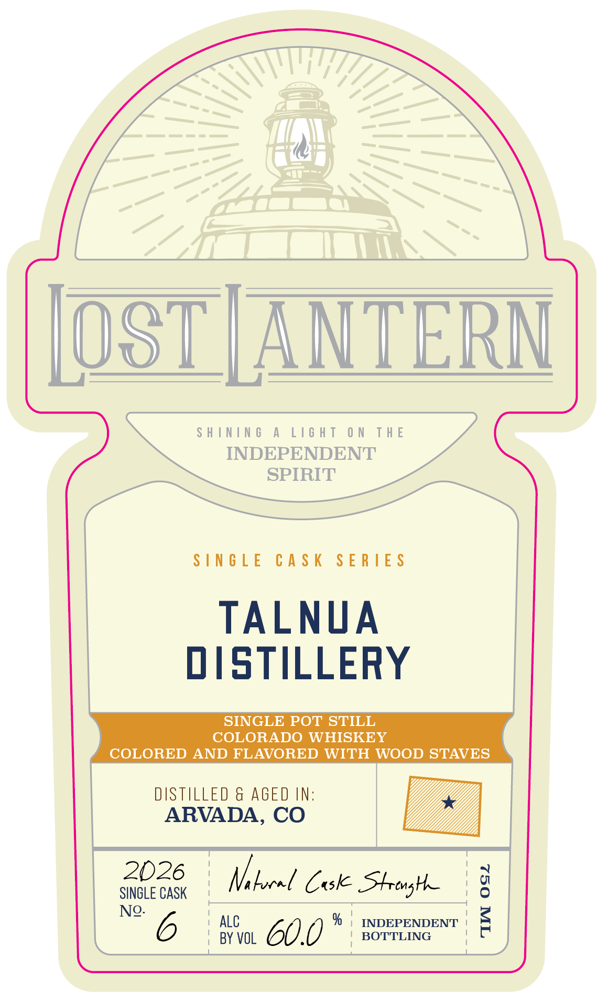

# TTB COLA Label Images - TTBID 26233001000510

**Brand Name:** LOST LANTERN

**Issue Date:** 09/03/2026

**Origin Code:** 46

**Product Class/Type:** 140

**Source:** [TTB Public COLA Registry](https://ttbonline.gov/colasonline/viewColaDetails.do?action=publicFormDisplay&ttbid=26233001000510)

## Label Images

### Back Label

### Front Label

### Label 2

## Extracted Label Text

*Text extracted via OCR - may contain errors*

**Detected Age:** 4 Years

### Back Label

SHINING A LIGHT ON THE INDEPENDENT SPIRIT
AN AMERICAN INDEPENDENT BOTTLER, LOST LANTERN SOURCES RARE
AND SPECIAL WHISKIES ONLY FROM DISTILLERIES WE PERSONALLY VISIT.
WE SHINE A LIGHT ON THESE DISCOVERIES THROUGH OUR UNIQUE BLENDS
AND OUR METICULOUSLY CURATED LINEUP OF SINGLE CASKS.
TALNUA SINGLE POT STILL COLORADO WHISKEY
COLORED AND FLAVORED WITH WOOD STAVES
LOST LANTERN HAND-SELECTED THIS CASK FROM TALNUA
DISTILLERY ON THE OUTSKIRTS OF DENVER. THE FAMILY-OWNED
TALNUA IS THE ONLY AMERICAN DISTILLERY ENTIRELY DEVOTED
TO MAKING SINGLE POT STILL WHISKEY, A STYLE MOST CLOSELY
ASSOCIATED WITH IRISH WHISKEY. TALNUA’S DRY, HIGH
ELEVATION ENVIRONMENT AND USE OF COLORADO GRAINS GIVES
THE AGE-OLD STYLE A DISTINCTIVE ROCKY MOUNTAIN TWIST.

THIS SINGLE CASK, OUR FIRST FROM TALNUA, IS MADE FROM 50%
MALTED BARLEY AND 50% UNMALTED BARLEY—A DISTINCTIVE
MASHBILL FOR SINGLE POT STILL WHISKEY IN IRELAND. MADE
ENTIRELY FROM COLORADO-GROWN GRAINS, IT WAS AGED FOR 4
YEARS IN AN EX-COLORADO BOURBON CASK WITH OAK STAVES IN
THE BARREL. BALANCED, WITH WARM OAK AND SPICE, VANILLA
BUTTERCREAM AND GRAHAM CRACKERS ON THE PALATE.
SELECTED AND BOTTLED BY LOST LANTERN SPIRITS, VERGENNES, VT.
DISTILLED BY TALNUA DISTILLERY, ARVADA, CO. 1 OF 200 BOTTLES.

4 YEARS OLD. NON-CHILL-FILTERED AND CASK STRENGTH.

IAS¢ VT 15¢ CA CRV
LEARN MORE AT LOSTLANTERNWHISKEY.COM
GOVERNMENT WARNING: (1) ACCORDING TO THE
SURGEON GENERAL, WOMEN SHOULD NOT DRINK
ALCOHOLIC BEVERAGES DURING PREGNANCY
BECAUSE OF THE RISK OF BIRTH DEFECTS. (2)
CONSUMPTION OF ALCOHOLIC BEVERAGES IMPAIRS IFPO
YOUR ABILITY TO DRIVE A CAR OR OPERATE fetter
MACHINERY, AND MAY CAUSE HEALTH PROBLEMS. 0010 * 96003 "4

### Front Label

[OST [ANTERN

SHINING A LIGHT ON THE

INDEPENDENT

SPIRIT

SINGLE CASK SERIES

TALNUA

DISTILLERY

SINGLE POT STILL

COLORADO WHISKEY

COLORED AND FLAVORED WITH WOOD STAVES

DISTILLED & AGED IN:

ARVADA, CO

SINGLE CASK

Vi bocel Cuske SHtrenghe

No- 6

» ALC

; BY VOL

% | INDEPENDENT |

BOTTLING

60.0

### Label 2

7.376"
41'
103"
ShInIng
A
LIGhT
ON
THE
INDEPENDENT
SpIRIT
lAIds
LNJONJdjoni JHL
NO
LHJIT
V
JNINIHS
