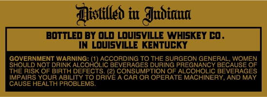
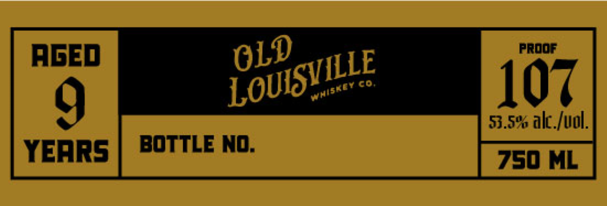

# TTB COLA Label Images - TTBID 26233001000666

**Brand Name:** KING OF MIAMI

**Issue Date:** 09/03/2026

**Origin Code:** 22

**Product Class/Type:** 101

**Source:** [TTB Public COLA Registry](https://ttbonline.gov/colasonline/viewColaDetails.do?action=publicFormDisplay&ttbid=26233001000666)

## Label Images

### Back Label

### Front Label

## Extracted Label Text

*Text extracted via OCR - may contain errors*

**Detected Proof:** 107

### Back Label

Mistilled iu Judinu
BOTTLed BY oLd Lovisvile WHISKEY Co .
IN Lovisville KENTUCKY
GOVERNMENT WARNING:
MITOKOLACGORDMG
TO THE SURGEON
GECEBACAUGE
WOMEN
SHOULD NOT DRINK
BEVERAGES DURING PREGNANCY
OF
THE RISK OF BIRTH
ABILDEFEG DRIZE GOASUOR=
TION OF ALCOHOLIC
BEVERAGES
IMPAIRS YOUR
A CAR OR OPERATE MACHINERY, AND MAY
CAUSE HEALTH PROBLEMS

### Front Label

proof
AGed
Co;
107
9
53.5% alc_Iuol.
YeARS
BOTTLe No:
750 ML
OLD
LOUISVILLE
Whisity
