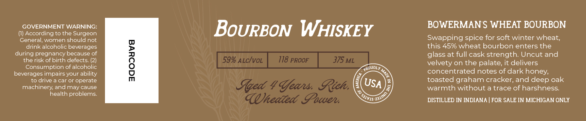

# TTB COLA Label Images - TTBID 26234001000022

**Brand Name:** BOWERMAN FARMS DISTILLERY

**Issue Date:** 09/01/2026

**Origin Code:** 06

**Product Class/Type:** 141

**Source:** [TTB Public COLA Registry](https://ttbonline.gov/colasonline/viewColaDetails.do?action=publicFormDisplay&ttbid=26234001000022)

## Label Images

### Label 1

### Label 2

## Extracted Label Text

*Text extracted via OCR - may contain errors*

**Detected Proof:** 118

### Label 1

gOWERMAyy
Gaus
DISTILLERY
BOTTLED BY BOWERMAN
FARMS DISTILLERY IN
Hlittanit, LAletigan

### Label 2

GOVERNMENT WARNING:
BoURBON WHISKEY
BOWERMAN S WHEAT BOURBON
According to the Surgeon
General; women should not
Swapping spice for soft winter wheat,
drink alcoholic beverages
this 45% wheat bourbon enters the
during pregnancy because of
glass at full cask strength: Uncut and
therisk of birth defects_
1
59% ALcIvoL
118 PROOF
375 ML
velvety on the palate; it delivers
Consumption of alcoholic
PRoudly
beverages impairs your ability
concentrated notes of dark honey;
to drive a car or operate
toasted graham cracker; and deep oak
machinery; and may cause
Aged
'Ufeans Rich,
USA
warmth without a trace of harshness:
health problems:
(Uieated Iawuen
DISTILLED IN INDIANA
FOR SALE IN MICHIGAN ONLY
1
'QA1INO
'SJIVIS E
