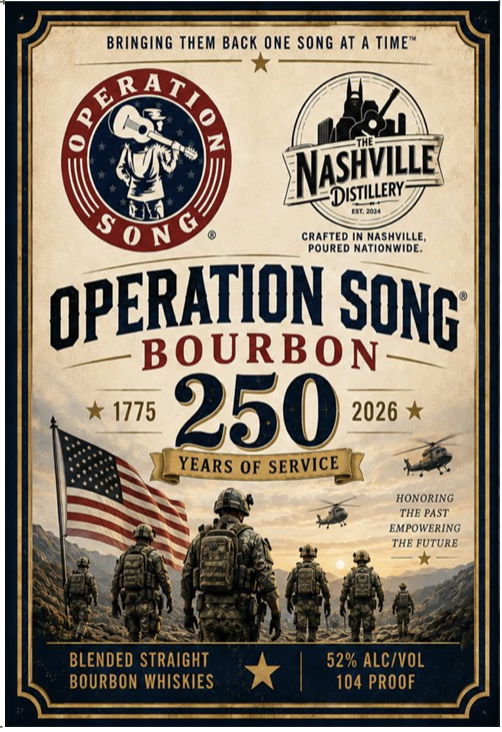

# TTB COLA Label Images - TTBID 26234001000145

**Brand Name:** THE NASHVILLE DISTILLERY

**Issue Date:** 09/01/2026

**Origin Code:** 43

**Product Class/Type:** 121

**Source:** [TTB Public COLA Registry](https://ttbonline.gov/colasonline/viewColaDetails.do?action=publicFormDisplay&ttbid=26234001000145)

## Label Images

### Front Label

## Extracted Label Text

*Text extracted via OCR - may contain errors*

**Detected Proof:** 104

### Front Label

BRINGING THEM BACK ONE SONG ATA TIMES

XX

anbahian ah

ear as

SATS

day

N

ASHVILLE

\\

ENA

y)

(DISTILLERY

ONY

CRAFTED IN NASHVILLE,

POURED NATIONWIDE.

RATION So

OPE

BOURBON

ONG’

* 1775 250 -— x

tus OF SERVICE [

HONORING

EMPOWERING

THE PAST

THE FUTURE

=e

Bt

(tood

1

ED S

52% ALC/VOL

BOURBON WHISKIES

*

104 PROOF
