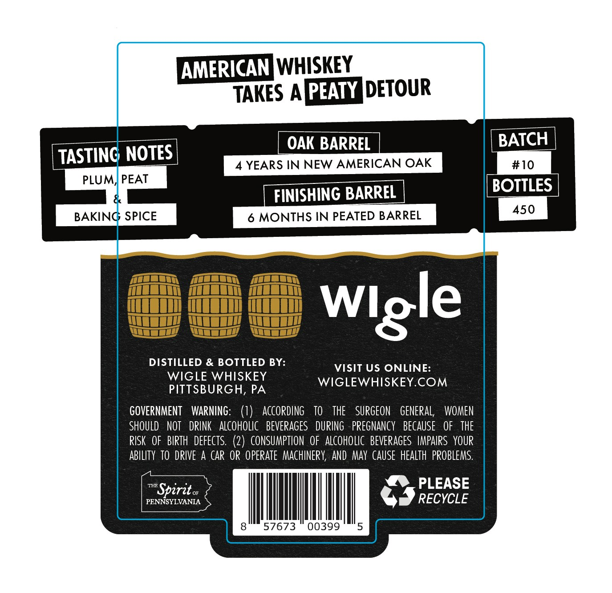
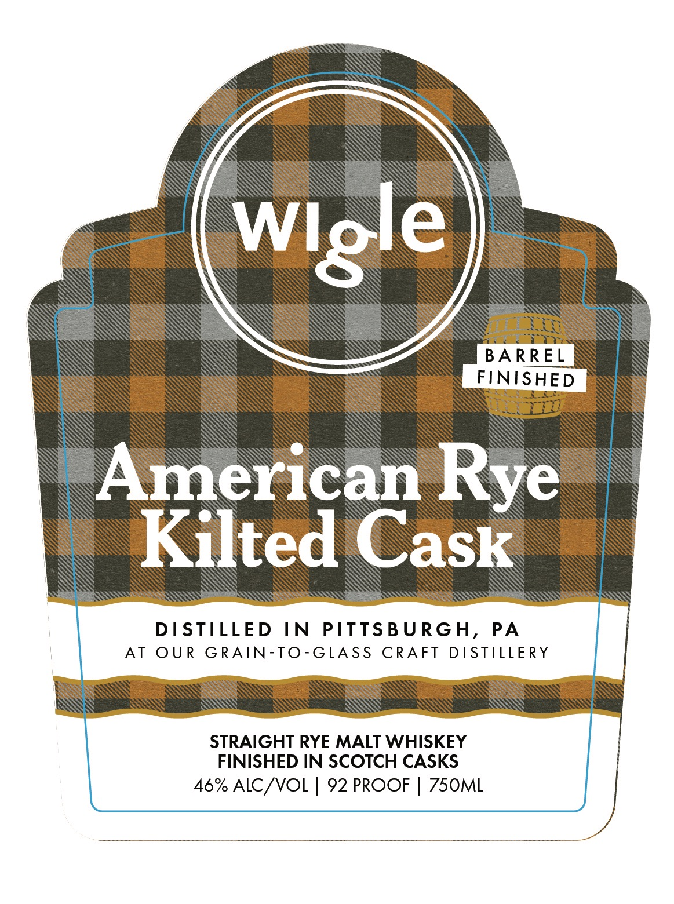

# TTB COLA Label Images - TTBID 26235001000025

**Brand Name:** WIGLE

**Fanciful Name:** AMERICAN RYE KILTED CASK

**Issue Date:** 09/01/2026

**Origin Code:** 39

**Product Class/Type:** 109

**Source:** [TTB Public COLA Registry](https://ttbonline.gov/colasonline/viewColaDetails.do?action=publicFormDisplay&ttbid=26235001000025)

## Label Images

### Back Label

### Front Label

## Extracted Label Text

*Text extracted via OCR - may contain errors*

**Detected Proof:** 92

### Back Label

AMERICANWHISKEY
TAKES APPEATY DETOUR
OAK BARREL
BATCH
TASTING NOTES
YEARS IN NEW AMERICAN OAK
#10
PLUM; PEAT
BOTTLES
FINISHING BARREL
450
BAKING SPICE
6 MONTHS IN PEATED BARREL
DISTILLED & BOTTLED BY:
VISIT US ONLINE:
WIGLE WHISKEY
WIGLEWHISKEYCOM
PITTSBURGH, PA
GOVERNMENT
WARNING:   (1)
ACcopdING
TO
the
SURGEON
GENERAL;
WOMEN
ShOULD
NOT
DPINK
ALCOHOLIC   BEVERAGES
DUPING
PREGNANCY   BECAUSE   OF   THE
RISK   OF   BIRTH  defects. (2)   CONSUMPTION   oF   aLcoHoLIc  BEVERAGES  IMPAIPS YOUR
ABILITY  TO DRIVE A Cap  OR OPERATE   MAchIneRY, AND May  CAUSE  heALTh  PROBLEMS:
THR
PLEASE
Spirit
PENNSYLVANIA
RECYCLE
57673
00399
Wlgle

### Front Label

Wiole

oats

BARREL

FI

Sys

SHED

Wises

Amer

can Rye |

Kilted Cask

DISTILLED IN PITTSBURGH, PA

AT OUR GRAIN-TO-GLASS CRAFT DISTILLERY

STRAIGHT RYE MALT WHISKEY

FINISHED IN SCOTCH CASKS

46% ALC/VOL | 92 PROOF | 750ML
