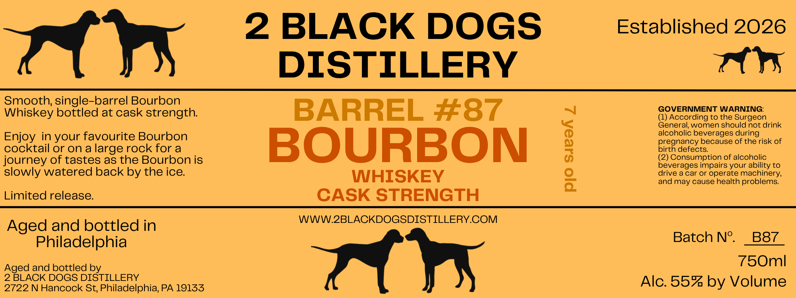

# TTB COLA Label Images - TTBID 26235001000083

**Brand Name:** 2 BLACK DOGS DISTILLERY

**Fanciful Name:** BARREL 87 BOURBON WHISKEY

**Issue Date:** 09/02/2026

**Origin Code:** 39

**Product Class/Type:** 141

**Source:** [TTB Public COLA Registry](https://ttbonline.gov/colasonline/viewColaDetails.do?action=publicFormDisplay&ttbid=26235001000083)

## Label Images

### Label 1

## Extracted Label Text

*Text extracted via OCR - may contain errors*

### Label 1

2 BLACK DOGS

Established 2026

DISTILLERY

TTYS

Smooth, single-barrel Bourbon

GOVERNMENT WARNING:

Whiskey bottled at cask strength.

BARREL #87

(1) According to the Surgeon

alcoholic beverages during

General, women should not drink

Enjoy in your favourite Bourbon

pregnancy because of the risk of

cocktail or on a large rock for a

birth defects.

journey of tastes as the Bourbon is

BOURBON

(2) Consumption of alcoholic

beverages impairs your ability to

slowly watered back by the ice.

drive a car or operate machinery,

WHISKEY

and may cause health problems.

Limited release.

CASK STRENGTH

WWW.2BLACKDOGSDISTILLERY.COM

Aged and bottled in

Philadelphia

Batch N°. _B87

Aged and bottled by

750ml

2 BLACK DOGS DISTILLERY

2722 N Hancock St, Philadelphia, PA 19133

Tt Pr

Alc. 55% by Volume
