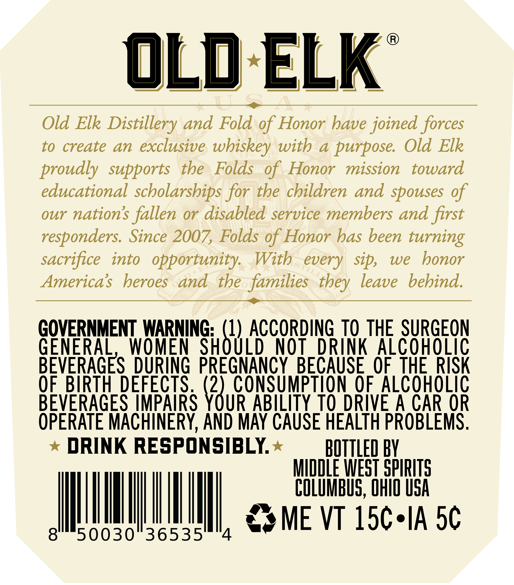
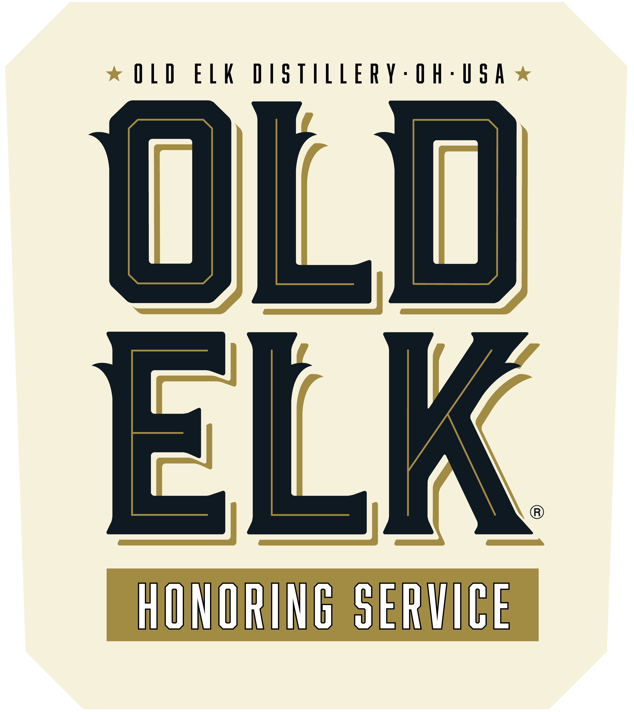
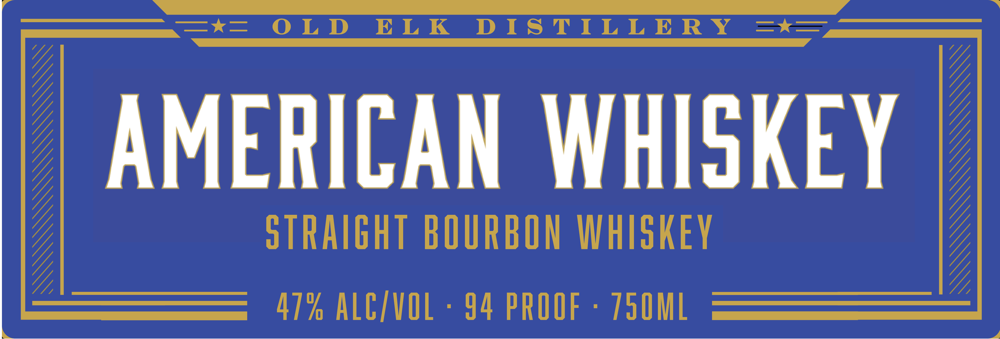
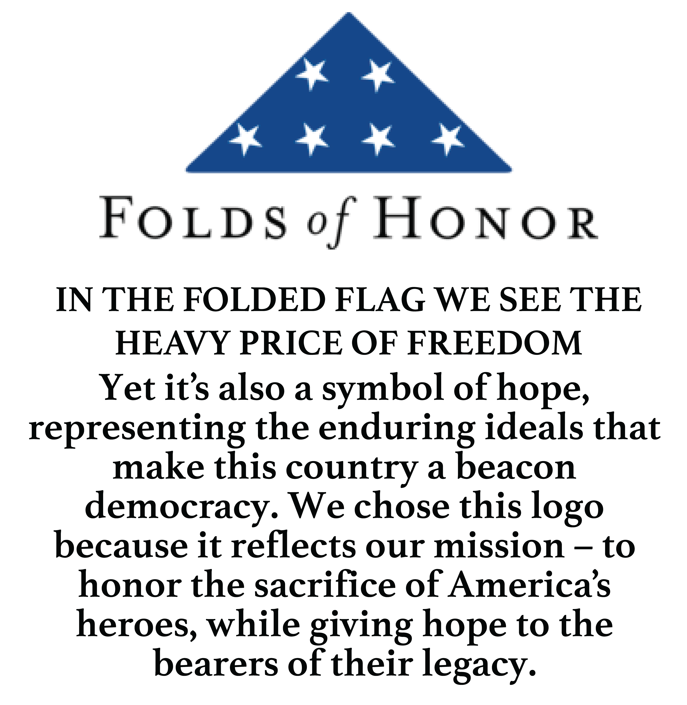

# TTB COLA Label Images - TTBID 26235001000084

**Brand Name:** OLD ELK

**Issue Date:** 09/01/2026

**Origin Code:** 09

**Product Class/Type:** 101

**Source:** [TTB Public COLA Registry](https://ttbonline.gov/colasonline/viewColaDetails.do?action=publicFormDisplay&ttbid=26235001000084)

## Label Images

### Back Label

### Front Label

### Label 2

### Label 4

### Label 5

## Extracted Label Text

*Text extracted via OCR - may contain errors*

*1 image(s) excluded: text did not meet readability threshold*

**Detected Proof:** 94

### Back Label

OLd ELK
Old Elk Distillery and Fold of Honor have joined forces
to
create
an exclusive
wbiskey with
a
purpose
Old Elk
proudly  supports
tbe
Folds
of
Honor
mission
toward
educational scholarships for the children and spouses of
our nations
fallen or disabled service members and first
responders: Since 2007, Folds of Honor has been turning
sacrifice
into
opportunity
With
S
every
sip,
we
bonor
America $
beroes
and the families
leave
bebind.
GOVERNMENT WARNING: (1) ACCORDING TO THE SURGEON
GENERAL
WOMEN
SHOULD
NOT
DRINK Alcoholic
BEVERAGES DURING PREGNANCY BECAUSE_OF THE RISK
0F.BIRTH DEFECTS  (2) CONSUMPtION OF ALCOHOLIC
BEVERAGES IMPAIRS YOUR ABILITY TO DRIVE A CAR OR
OPERATE MACHINERY AND MAY CAUSE HEALTH PROBLEMS .
DRINK RESPONSIBLY
BOTTLED BY
MIDDLE WEST SPIRITS
COLUMBUS, OHIO uSA
ME VT 15c'IA 5c
50030"36535'
4
they

### Front Label

OLD ELK DISTILLERY-OH-USA

ULU

ELK

HONORING SERVICE

### Label 2

O_O aaa,
—*k= OLD ELK DISTILLERY =tk=,
OE

AMERICAN WHISKEY

STRAIGHT BOURBON WHISKEY
47% ALC/VOL - 94 PROOF - 750ML

=
SMAMXA'SLAALAA.A L.A

### Label 5

FoLDs
HoNo R
IN THE FOLDED FLAG WE SEE THE
HEAVY PRICE OF FREEDOM
Yet its also a
symbol ofhope,
representing the enduring ideals that
make this country a beacon
democracy
We chose this
because it reflects our mission _ to
honor the sacrifice of Americas
heroes, while giving hope to the
bearers of their legacy
%f
logo
