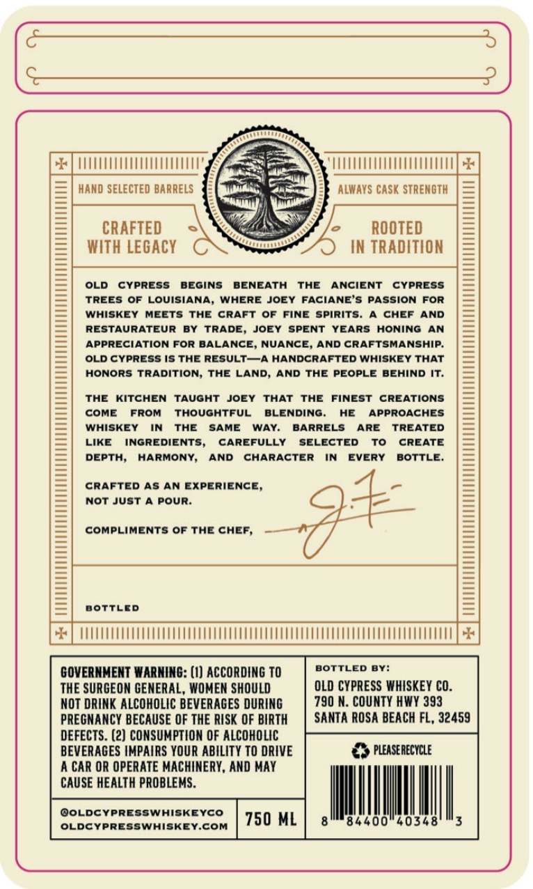
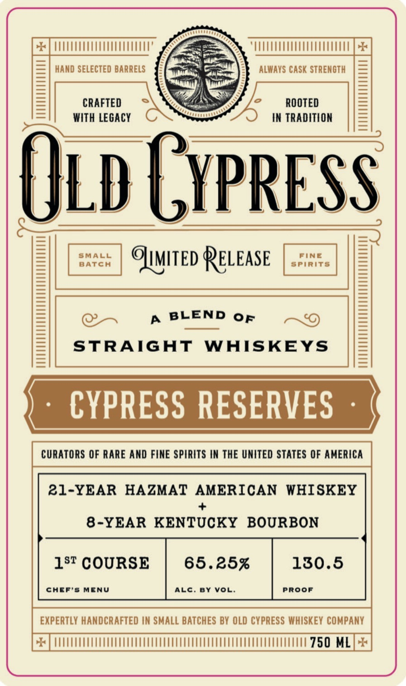

# TTB COLA Label Images - TTBID 26235001000177

**Brand Name:** OLD CYPRESS WHISKEY COMPANY

**Fanciful Name:** CYPRESS RESERVES

**Issue Date:** 09/18/2026

**Origin Code:** 16

**Product Class/Type:** 120

**Source:** [TTB Public COLA Registry](https://ttbonline.gov/colasonline/viewColaDetails.do?action=publicFormDisplay&ttbid=26235001000177)

## Label Images

### Back Label

### Front Label

## Extracted Label Text

*Text extracted via OCR - may contain errors*

**Detected Proof:** 130.5

### Back Label

hand SELECTED BARRELS
alwavs CaSk STRENGTH
CRAFTED
ROOTED
WIth LegaCY
IN TRADITION
OLD
CYPRESS
BEGINS
BENEATH
THE
ANCIENT
CYPRESS
TREES OF LOUISIANA, WHERE JOEY FACIANE'S PASSION FOR
WHISKEY
MEETS THE
CRAFT
OF
FINE
SpirIts.
CHEF AND
RESTAURATEUR
BY
TRADE,
JOEY
SPENT
YEARS HONING
AN
APPRECIATION FOR BALANCE, NUANCE, AND CRAFTSMANSHIP:
OLD CYPRESS IS THE RESULT_A HANDCRAFTED WHISKEY THAT
HONORS TRADITION; THE LAND; AND THE PEOPLE
BEHIND IT_
THE
KITCHEN TAUGHT
JOEY
THAT
THE
FINEST CREATIONS
COME
FROM
THOUGHTFUL
BLENDING.
HE
APPROACHES
WHISKEY
IN
THE
SAME
WAY:
BARRELS
ARE
TREATED
LIKE
INGREDIENTS,
CAREFULLY
SELECTED
To
CREATE
DEPTH;
HARMONY,
AND
CHARACTER
IN
EVERY
BOTTLE.
CRAFTED AS
AN EXPERIENCE,
Not Just
A POUR:
COMPLIMENTS Of THE CHEF,
BOTTLED
GOVERNMENT WARNING: (1) ACCORDING TO
BOTTLED
BY:
THE SURGEON GENERAL, WOMEN SHOULD
OLD CYPRESS WHISKEY CO.
NOT DRINK ALCOHOLIC BEVERAGES DURING
790 N. COUNTY HWY 393
PREGNANCY BECAUSE OF THE RISK OF BIRTH
SaNTA ROSA BEACH FL, 32459
DEFECTS . (2) CONSUMPTION OF ALCOHOLIC
BEVERAGES IMPAIRS YOUR ABILITY TO DRIVE
pleaserecYCLE
A CAR OR OPERATE MACHINERY, AND MAY
CAUSE HEALTH PROBLEMS.
OOLDCYPRESSWHISKEYCO
OLDCYPRESSWHISKEY.coM
750 ML
'84400"40348

### Front Label

HANd SELECTED BARRELS
alWayS CaSk STRENGTH
CRAFTED
ROOTED
WIth Legacy
IN TRADITION
Old GYpRESS
SMALL
OIMITED
RELEASE
FINE
BATCH
spiriTs
BLEND
STRAIGHT
WHISKEYS
CYPRESS RESERVES
CURATORS OF RARE AND FINE SPIRITS IN THE UNITED STATES OF AMERICA
21-YEAR
HAZMAT
AMERICAN
WHISKEY
8-YEAR KENTUCKY
BOURBON
18T COURSE
65.25%
130.5
CHEF'S MENU
ALC. BY VoL:
PRooF
EXPERTLY HANDCRAFTED IN SMALL BATCHES BY OLD CYPRESS WHISKEY COMPANY
750 ML
OF
