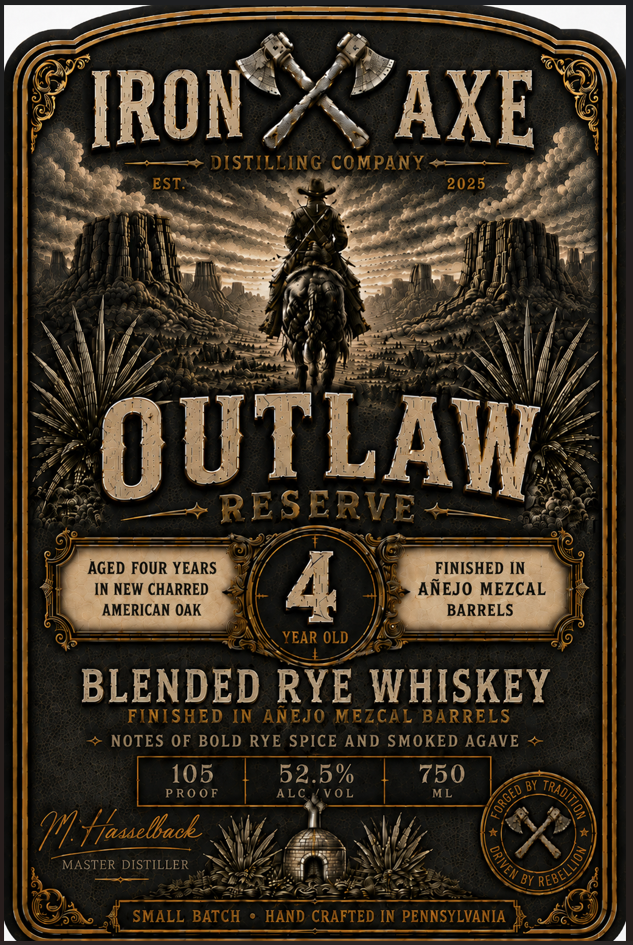
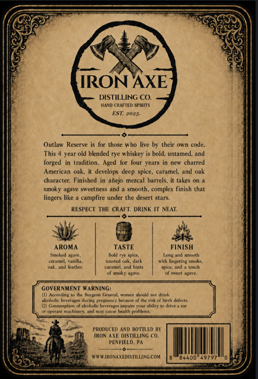

# TTB COLA Label Images - TTBID 26236001000070

**Brand Name:** OUTLAW RESERVE

**Issue Date:** 08/31/2026

**Origin Code:** 39

**Product Class/Type:** 132

**Source:** [TTB Public COLA Registry](https://ttbonline.gov/colasonline/viewColaDetails.do?action=publicFormDisplay&ttbid=26236001000070)

## Label Images

### Label 1

### Label 2

## Extracted Label Text

*Text extracted via OCR - may contain errors*

**Detected Proof:** 105

### Label 1

IRON
AXE
DISTILLING COMPANY
EST
2025
OUTLAW
RE SERVE
AGED FOUR YEARS
FINISHED [N
IN NEW CHARRED
4
ANEJO MEZCAL
AMERICAN OAK
BARRELS
YEAR OLD
BLENDED RYE WHISKEY
FINISHED IN ANEJO MEZCAL BARRELS
NOTES OF BOLD RYE SPICE AND SMOKED AGAVE
105
52.5 %
750
PRo 0F
ALC
VOL
ML
Fjaaaelace
MASTER DISTILLER
SMALL BATCH
HAND CRAFTED IN PENNSYLVANIA
Trada
RED-

### Label 2

IRONAXE-
DISTILLING CO.
Hasn ORAFTFIL SPIRITS
30S
Outlaw Reserve
fur those who
live by their own code.
This
year old blended rye whiskey
bold, untamed, and
forged
tradition.
Aged for
Charted
Amcrican
oak;
develops deep
spice, caramel,
charctcr
Finished
Mctcn
barrels;
takes on
~MIUET
iEvl
sweclness
smnooth
complex finish that
lingers like
campfire under the desert
ttars
RESPECT THE CRAFT: DRINK
NEAT
AROMA
TASTE
FINISH
EmkAeaur
Lak 4nd sxth
Knmmm
n
Ieeetnal Gar
Ah lingerngMott
Mneeutner
nMA
nahenii
spreand
uch
4ioty JAe
sueet wFate
GOVERNMENT WarNiNG:
Acnuring
(mtl #umn Exuki
BrttuuRe Guring Pucenanc
JecJu~ Othe Taleehria eenot
Ceattumuealot
Akohelic Leuerane [apha You Aulily tordrte
hrILr
'machirzty;
Lalun
'pretkema_
PRODUCED AND HOTTLED KY
ImOnAE MISLNG C0
PENFIELD, PA
HIRO VanapishMLNGGOM
84400
Anein
05
