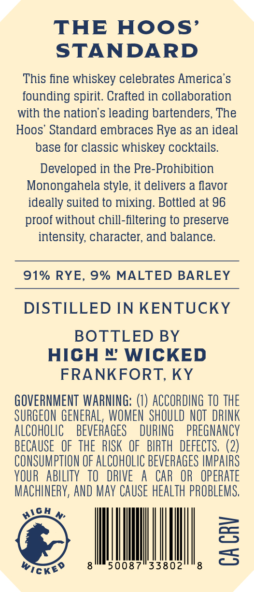
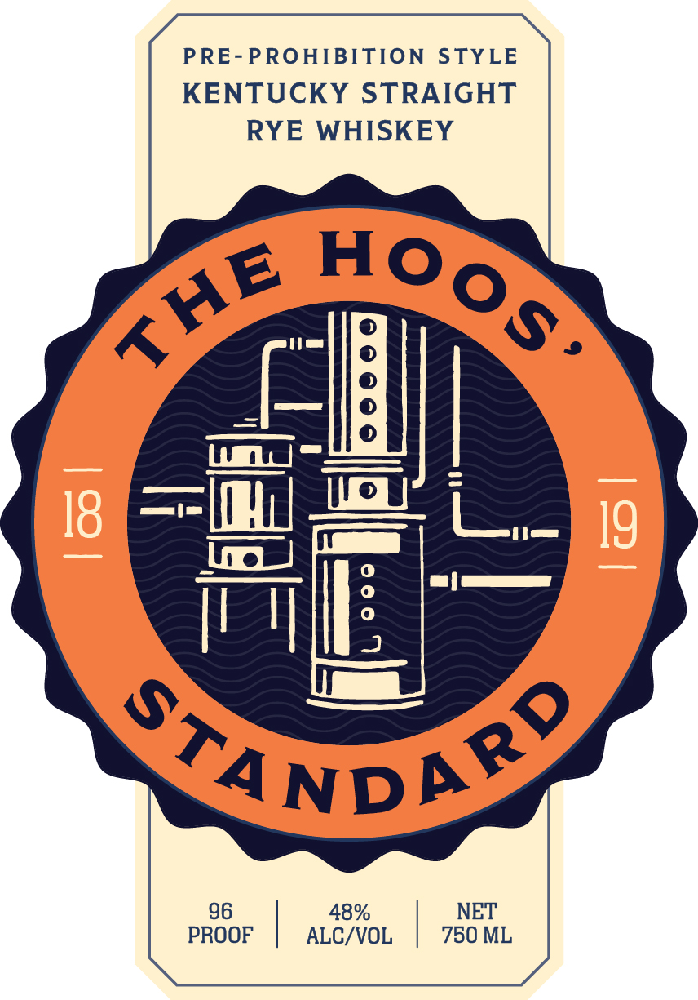

# TTB COLA Label Images - TTBID 26236001000151

**Brand Name:** THE HOOS STANDARD

**Issue Date:** 08/31/2026

**Origin Code:** 22

**Product Class/Type:** 102

**Source:** [TTB Public COLA Registry](https://ttbonline.gov/colasonline/viewColaDetails.do?action=publicFormDisplay&ttbid=26236001000151)

## Label Images

### Back Label

### Front Label

## Extracted Label Text

*Text extracted via OCR - may contain errors*

**Detected Proof:** 96

### Back Label

THE
Hoos'
STANDARD
This iine whiskey celebrates America'$
founding spirit. Craited in collaboration
with the nation's leading bartenders, The
Hoos' Standard embraces Rye as an ideal
base for classic whiskey cocktails
Developed in the Pre-Prohibition
Monongahela style, it delivers a flavor
ideally suited to mixing: Bottled at 96
proof without chill-filtering to preserve
intensity; character; and balance:
91% RYE, 9% MALTED BARLEY
DISTILLED IN KENTUCKY
BOTTLED BY
HIGH # WICKED
FRANKFORT, KY
GOVERNMENT WARNING: (€) ACCORDING TO THE
SURGEON GENERAL, WOMEN  SHOULD NOT  DRINK
AlCOhOLIC
BEVERAGES
DURING
pREGNANCY
beCAUSE   OF  thE   RUSK OF   BIRTH  DEFECTS, (2)
CONSUMPTHON OF ALCOHOLIC BEVERAGES IMPAIRS
YOUR   AblLITy  TO   DRIVE
A
CAR   OR   OpeRATE
MACHINERY, AND May CAUSE HeALTh PROBLeMS,
3
wickeo
50087
33802
3
HlO

### Front Label

PRE-PROHIBITION STYLE
KENTUCKY STRAIGHT
RYE WHISKEY

96 48% NET
PROOF ALC/VOL 750 ML
