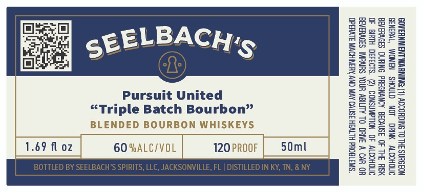

# TTB COLA Label Images - TTBID 26236001000185

**Brand Name:** SEELBACH'S

**Fanciful Name:** PURSUIT

**Issue Date:** 09/17/2026

**Origin Code:** 16

**Product Class/Type:** 131

**Source:** [TTB Public COLA Registry](https://ttbonline.gov/colasonline/viewColaDetails.do?action=publicFormDisplay&ttbid=26236001000185)

## Label Images

### Label 1

## Extracted Label Text

*Text extracted via OCR - may contain errors*

**Detected Proof:** 120

### Label 1

GOVERNMENT WARNING: (1) ACCORDING TO THE SURGEON
GENERAL, WOMEN SHOULD NOT DRINK ALCOHOLIC
BEVERAGES DURING PREGNANCY BECAUSE OF THE RSK
OF BIRTH DEFECTS. (2) CONSUMPTION OF ALCOHOLIC
BEVERAGES IMPAIRS YOUR ABILITY TO DRIVE A CAR OR
OPERATE MACHINERY, AND MAY CAUSE HEALTH PROBLEMS.

50ml

120 PROOF

2
if
u
°
a
a
S
°
a
a

i

3
3
£3
ea
2c
2g
36
ae
*2
be
E

ENDE
60 %ALC/VOL |

BL
