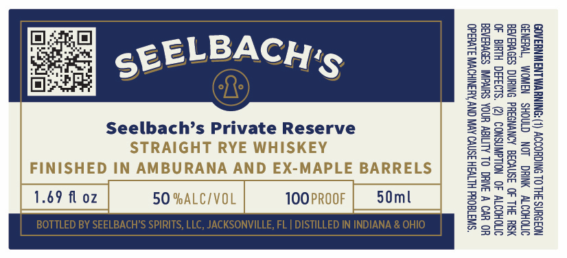

# TTB COLA Label Images - TTBID 26236001000193

**Brand Name:** SEELBACH'S

**Fanciful Name:** PRIVATE RESERVE

**Issue Date:** 09/04/2026

**Origin Code:** 16

**Product Class/Type:** 102

**Source:** [TTB Public COLA Registry](https://ttbonline.gov/colasonline/viewColaDetails.do?action=publicFormDisplay&ttbid=26236001000193)

## Label Images

### Label 1

## Extracted Label Text

*Text extracted via OCR - may contain errors*

### Label 1

GOVERNMENT WARNING: (1) ACCORDING TO THE SURGEON
GENERAL, WOMEN SHOULD NOT DRINK ALCOHOLIC
BEVERAGES DURING INANCY BECAUSE OF THE RISK
OF BIRTH DEFECTS. CONSUMPTION OF ALCOHOLIC
BEVERAGES IMPAIRS YOUR ABILITY TO DRIVE A CAR OR
OPERATE MACHINERY, AND MAY CAUSE HEALTH PROBLEMS.

Seelbach’s Private Reserve
