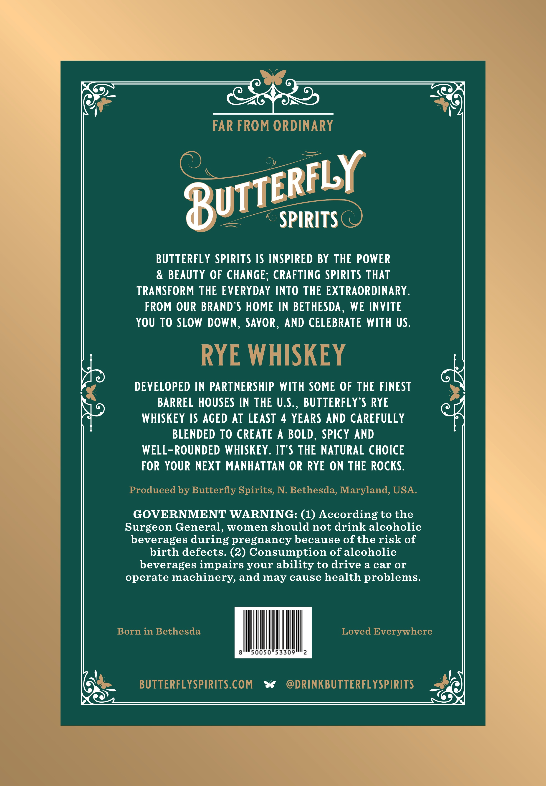

# TTB COLA Label Images - TTBID 26236001000207

**Brand Name:** BUTTERFLY SPIRITS

**Issue Date:** 09/10/2026

**Origin Code:** 25

**Product Class/Type:** 142

**Source:** [TTB Public COLA Registry](https://ttbonline.gov/colasonline/viewColaDetails.do?action=publicFormDisplay&ttbid=26236001000207)

## Label Images

### Front Label

## Extracted Label Text

*Text extracted via OCR - may contain errors*

**Detected Age:** 4 Years

### Front Label

FAR FROM ORDINARY
SPIRITS
BUTTERFLY SPIRITS IS INSPIRED BY THE POWER
BEAUTY OF CHANGE; CRAFTING SPIRITS THAT
TRANSFORM THE EVERYDAY INTO THE EXTRAORDINARY
FROM OUR BRAND'S HOME IN BETHESDA ,
WE INVITE
YOU To SLOW DOWN
SAVOR , AND CELEBRATE WITH US.
RYE WHISKEY
DEVELOPED IN PARTNERSHIP WITH SOME OF THE FINEST
BARREL HOUSES IN THE U.._
BUTTERFLY S RYE
WHISKEY IS AGED AT LEAST
4 YEARS AND CAREFULLY
BLENDED TO CREATE
A
BOLD
SPICY AND
WELL-ROUNDED WHISKEY. IT'S THE NATURAL CHOICE
FOR YOUR NEXT MANHATTAN OR RYE ON THE ROcKS:
Produced by Butterfly Spirits, N. Bethesda, Maryland, USA.
GOVERNMENT WARNING: (1) According to the
Surgeon General, women should not drink alcoholic
beverages during pregnancy because ofthe risk of
birth defects. (2) Consumption of alcoholic
beverages impairs your ability to drive a car or
operate machinery, and may cause health problems.
Born in Bethesda
Loved Everywhere
50050"53309
2
BUTTERFL YSPIRITS.COM
DRINKBUTTERFL YSPIRITS
8UTTERFLY
