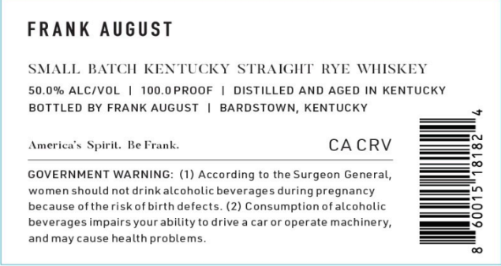

# TTB COLA Label Images - TTBID 26236001000238

**Brand Name:** FRANK AUGUST

**Issue Date:** 08/31/2026

**Origin Code:** 22

**Product Class/Type:** 102

**Source:** [TTB Public COLA Registry](https://ttbonline.gov/colasonline/viewColaDetails.do?action=publicFormDisplay&ttbid=26236001000238)

## Label Images

### Front Label

### Label 2

## Extracted Label Text

*Text extracted via OCR - may contain errors*

**Detected Proof:** 100

### Front Label

FRAnK August
SMALL BATCH KENTUCKY STKAIGMT RYE WIISKEY
50,0% ALC/VOL
100.0 PROOF
DISTiLLED AND AGED IN KENTUCKY
BOTTLED BY FRANK AUGUST
BARDSTOWN; KENTUCKY
Ameriea ` Spiril. BeFrank:
CA CRV
2
GOVERNMENT WARNING: (1) According to the Surgeon General,
women shouldnot drink
lcoholic beverage
during pregnancy
because ofthe risk ofbirth defects: (2) Consumption ofalcoholic
3
beverages impairsyourability to drive
car or operate machinery,
and may cause health problems

### Label 2

SMALL BATCH

KENTUCKY STRAIGHT RYE WHISKEY

50.0% ABV

l

100.0 PROOF

I

250 ML
