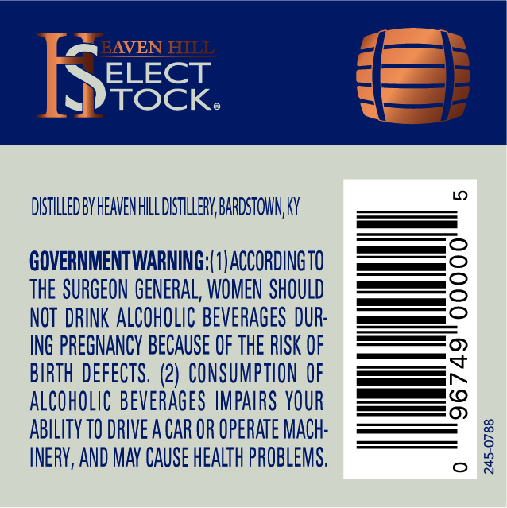
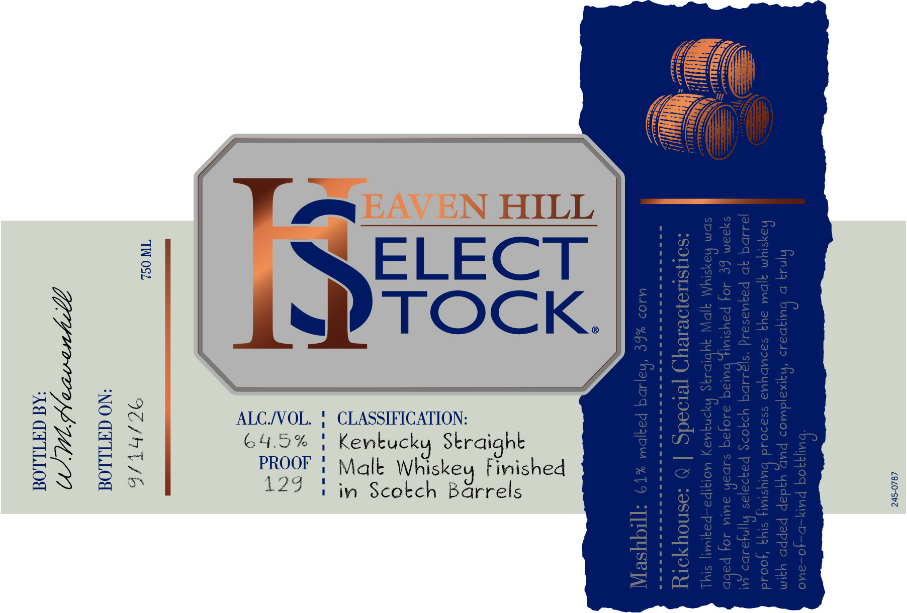

# TTB COLA Label Images - TTBID 26236001000240

**Brand Name:** HEAVEN HILL

**Fanciful Name:** SELECT STOCK

**Issue Date:** 08/31/2026

**Origin Code:** 22

**Product Class/Type:** 109

**Source:** [TTB Public COLA Registry](https://ttbonline.gov/colasonline/viewColaDetails.do?action=publicFormDisplay&ttbid=26236001000240)

## Label Images

### Back Label

### Label 1

### Label 3

## Extracted Label Text

*Text extracted via OCR - may contain errors*

### Back Label

EAVEN HILL
ELECT
TOCKo
DISTILLED BY HEAVENHILL DISTLLLeRY BARDSTOWN, Ky
GOVERNMENTWARNING:(0|ACCORDINGTO
THE SURGEON GENERAL, WOMEN SHOULD
NOT  DRINK ALCOHOLIC BEVERAGES DUR:
ING PREGNANCY BECAUSE OF THE RISK OF
BIRTH DEFECTS. (2) CONSUMPTION OF
ALCOHOLIC beverages HMPAIRS YOUR
ABILITY TO DRIVE A CAR OR OpeRATE MACh:
INERV, AND MAv CAuSe HEALTh PROBLEMS,
1

### Label 1

BOTTLED BY:

BOTTLED ON:

Gf

750 ML

ALC/VOL. !
64.5% |
PROOF !

129 | im Scotch Barrels

ie

CLASSIFICATION:
Kentucky Straight
Malt Whiskey Finished

245-0787

### Label 3

HEAVEN HILV

SONALLY

RAFTED

DISTILLERY

r

ey

Koy
