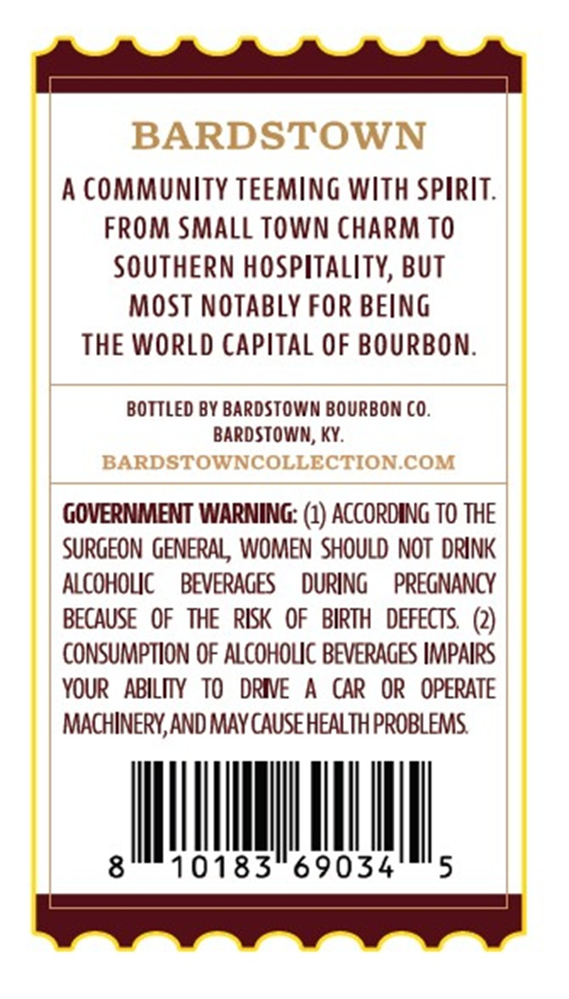
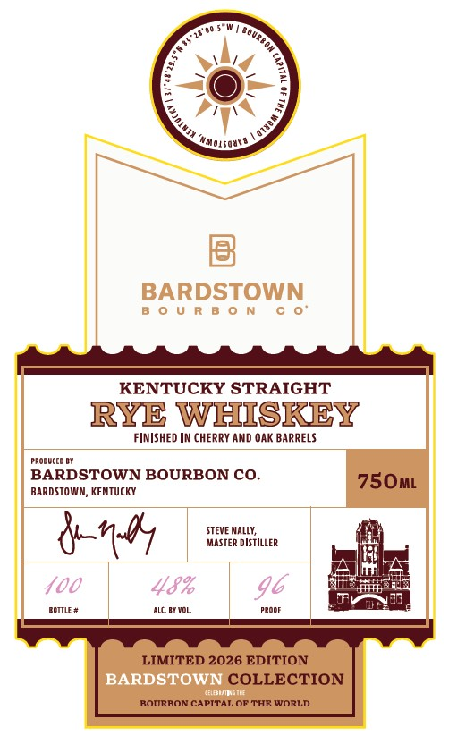
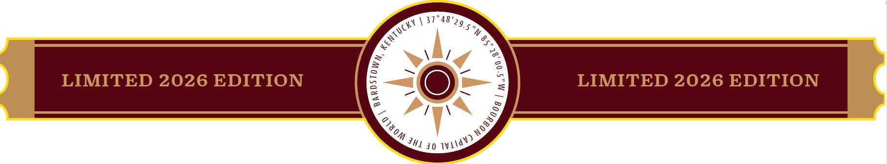

# TTB COLA Label Images - TTBID 26236001000435

**Brand Name:** BARDSTOWN BOURBON CO.

**Issue Date:** 08/31/2026

**Origin Code:** 22

**Product Class/Type:** 102

**Source:** [TTB Public COLA Registry](https://ttbonline.gov/colasonline/viewColaDetails.do?action=publicFormDisplay&ttbid=26236001000435)

## Label Images

### Back Label

### Label 1

### Label 3

## Extracted Label Text

*Text extracted via OCR - may contain errors*

**Detected Proof:** 96

### Back Label

BARDSTOWN
A community TeEminG With Spirit:
FROM SMAll Town charm TO
SOUTHERN hospitality, BUT
MOST NOTABLY FOR BEiNG
THE WorLd Capital OF BOURBON:
BOTTLED BY BARDSTOWN BOURBOn C0.
Bardstowm; Ky:
BARDSTOWNCOLLECTION COM
GOVERNMENT WARNING: (1) accordinG To THE
Surgeon GenERAl , WOMen  Should NOT  drInK
ALCoHOLIC
BEVERAGES
durIng
PREGNANCY
BecaUSE   OF   THE   RISK   OF   BIRTH   DEFECTS   (2)
CONSUMPTION OF ALCOHOuc BEVERAGES IMPAIRS
YOUR   ABILIY   TO
DRIE
A
CAR  OR   OPERATE
MACHINERY,AND MAY cause HEALTH PROBLEMS
8
10183
69034
5

### Label 1

7
'VMOLsQUUA
BARDSTOWN
KENTUCKY STRAIGHT
RYE WHISKEY
FINISHED IM CheRRY ANd OAK BARRELS
Produced Bi
BARDSTOWN BOURBON CO.
750ML
BARDSTOWIM, KENTUCKY
4-/197
MESTer Dstiller
400
48%
96
BCMLE #
ALC BT VOL;
ProoF
LIMITED 2026 EDITION
BARDSTOWN COLLECTION
BOURBON CAPITAL OF THE WORLD
Qovrrom c
1
Lawod

### Label 3

%.
7,
LIMITED 2026 EDITION
4
LIMITED 2026 EDITION
40
37"48'29.5"N
Kentucky
:
2
1
1
1
Ild N)
JHL
