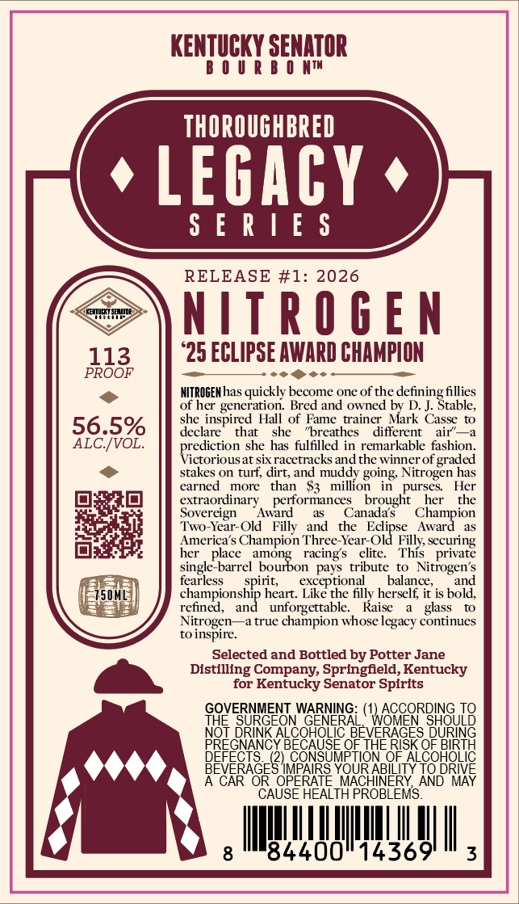
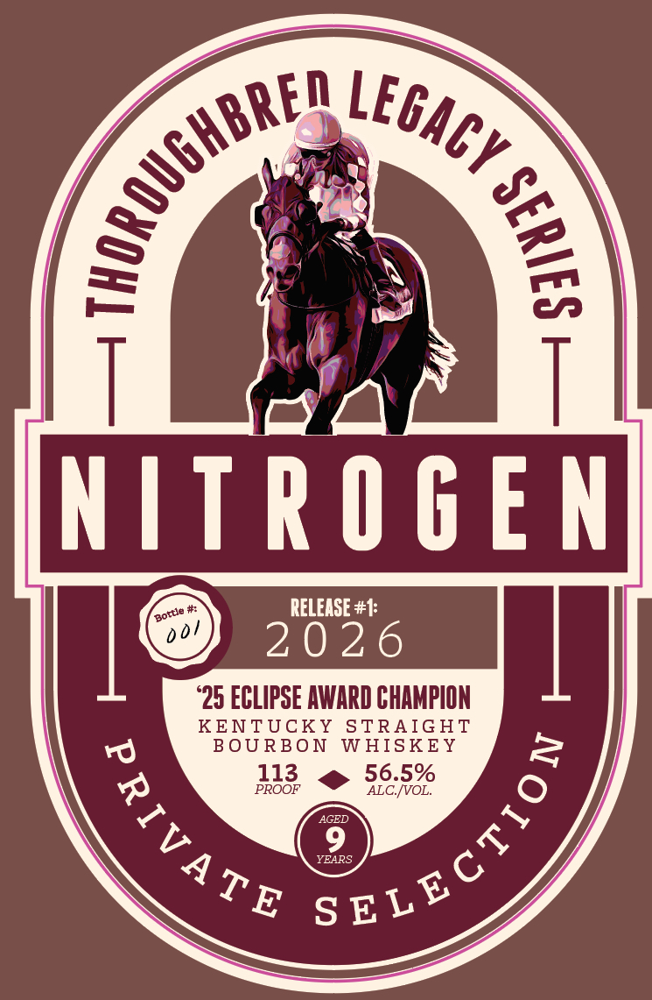

# TTB COLA Label Images - TTBID 26236001000530

**Brand Name:** THOROUGHBRED LEGACY SERIES

**Issue Date:** 09/01/2026

**Origin Code:** 22

**Product Class/Type:** 101

**Source:** [TTB Public COLA Registry](https://ttbonline.gov/colasonline/viewColaDetails.do?action=publicFormDisplay&ttbid=26236001000530)

## Label Images

### Back Label

### Front Label

## Extracted Label Text

*Text extracted via OCR - may contain errors*

**Detected Proof:** 113

### Back Label

KENTUCKY SENATOR
6 U U R
8 0 MtH
thOrOuGhBRED
LEGACY
S [ R |E $
RELEASE #1: 2026
KEYHEYSH
NItRoGEN
113
25 ECLIPSE AWARD CHAMPION
PROOF
NITROGEKhas quickly become one of the
fillies
of her generation
Bred and owned by D. J
she inspired Hall of Fame
trainer Mark Casse
56.5%
declare
that
she
"breathes
different
ALC IVOL_
prediction she
fulfilled in remarkable fashion
Victorious at sixracetracks andthe winner of
graded
stakes on turf; dirt, and muddy going Nitrogen has
earned
more
than
S3
million
purses:
Her
extraordinary
performances
brought
her
the
Sovereign
Award
Canada s
Champion
Year-Old
and
the
Eclipse
Award
America's Champion Three-Year_Old Filly, securing
her
place
among
racing $
elite.
This
private
single-barrel bourbon
pays
tribute
Nitrogen'$
fearless
exceptional
balance;
and
750ML
championship heart: Like the filly herself it is bold,
refined,
and
unforgettable
Raise
glass
Nitrogen
true champion whose
continues
to inspire
Selected and Bottled by Potter Jane
Distilling Company, Springfeld,Kentucky
for
Kentucky Senator Spirits
GQEERMGENN
2843443,5896226908.88
48E8488EOEYFRRSF83
AUE
THE RISK
5886B358
OF
HoLic
OURABL
TO DRIVE
MACHINERY, AND MAY
CAUSE HEALTH PROBLEMS
8
84400"14369
3
defining abic
air'
has
Two-_
Filly
spinit;
legacy-

### Front Label

NLEG

pot

My

RS

Sn

~S

(|

RELEASE #4:

‘25 ECLIPSE AWARD CHAMPION

REND

UCKY STRAIGHT

BON WHISKEY

PROOF

113

> 355%

EAR:
