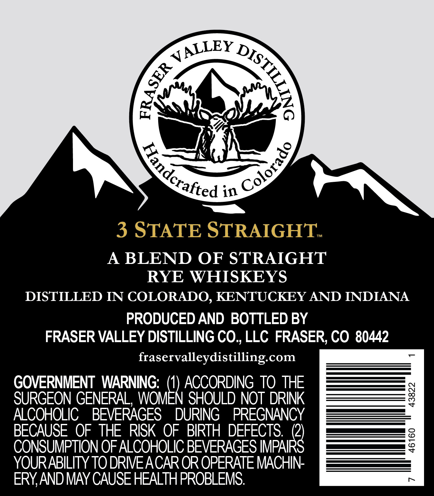
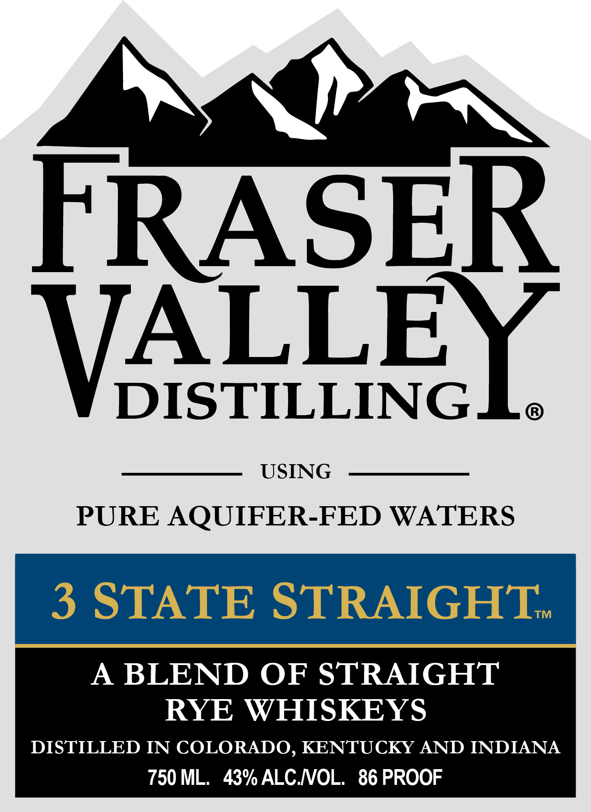

# TTB COLA Label Images - TTBID 26236001000578

**Brand Name:** FRASER VALLEY DISTILLING

**Fanciful Name:** 3 STATE STRAIGHT

**Issue Date:** 09/14/2026

**Origin Code:** 13

**Product Class/Type:** 102

**Source:** [TTB Public COLA Registry](https://ttbonline.gov/colasonline/viewColaDetails.do?action=publicFormDisplay&ttbid=26236001000578)

## Label Images

### Back Label

### Front Label

## Extracted Label Text

*Text extracted via OCR - may contain errors*

**Detected Proof:** 86

### Back Label

in
3 STATE STRAIGHT;
A
BLEND OF STRAIGHT
RYE WHISKEYS
DISTILLED IN COLORADO, KENTUCKEY AND INDIANA
PRODUCED AND BOTTLED BY
FRASER VALLEY DISTILLING CO, LLC FRASER, CO 80442
fraservalleydistilling com
GOVERNMENT WARNING; (1) ACCORDING TO THE
SURGEON GENERAL, WOMEN SHOULD NOT DRINK
8
ALCOHOLIC
BEVERAGES
DURING
PREGNANCY
BECAUSE OF THE RISK OF BIRTH DEFECTS: (2)
CONSUMPTION OF ALCOHOLIC BEVERAGES IMPAIRS
8
YOURABILITY TO DRIEACAR OR OPERATE MACHIN
ERYAND MAY CAUSE HEALTHPROBLEMS:
JALLEY
DISTILE
0
5
Colorado
Haindcrafted

### Front Label

FRASER
TALLE
USING
PURE AQUIFER-FED WATERS
3 STATE STRAIGHT
TM
A
BLEND OF STRAIGHT
RYE WHISKEYS
DISTILLED IN COLORADO, KENTUCKY AND INDIANA
750 ML
43% ALC NOL
86 PROOF
DISTILLINGLa
