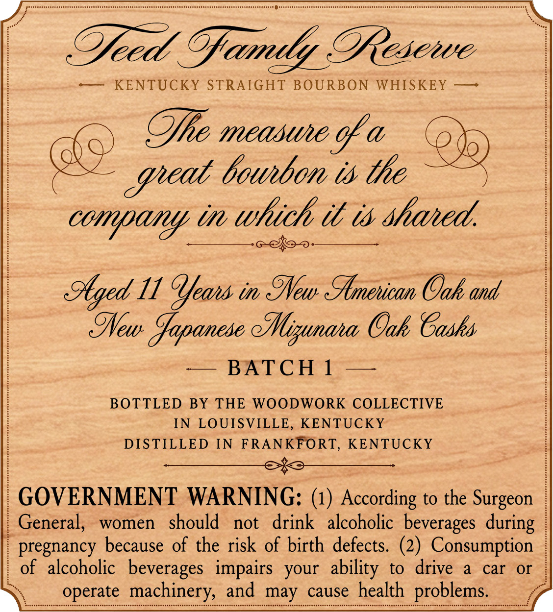
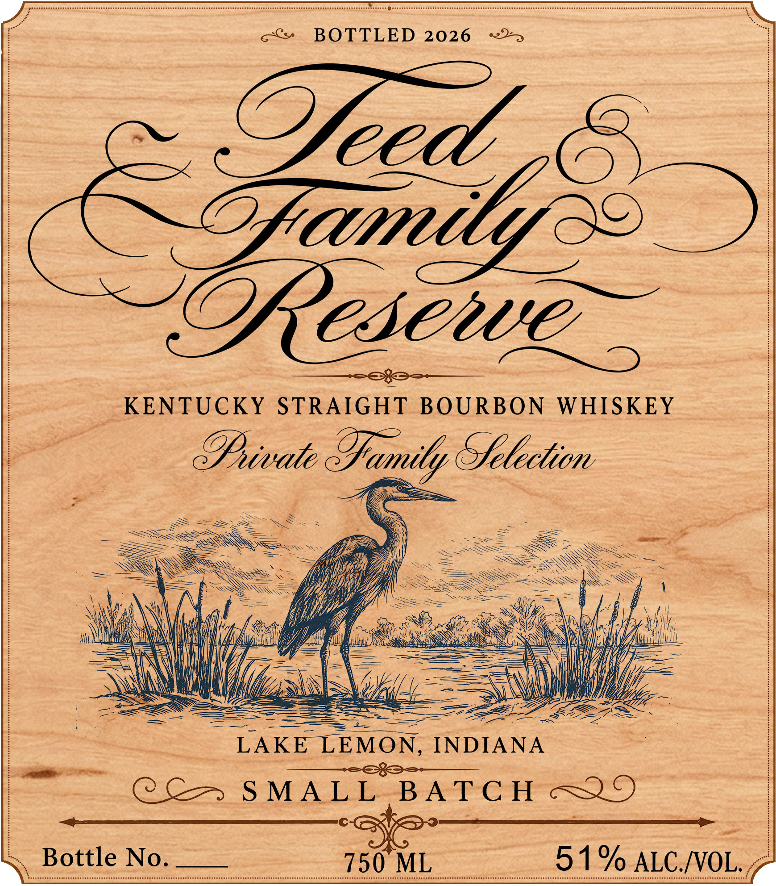

# TTB COLA Label Images - TTBID 26236001000738

**Brand Name:** TEED FAMILY RESERVE

**Issue Date:** 08/31/2026

**Origin Code:** 22

**Product Class/Type:** 101

**Source:** [TTB Public COLA Registry](https://ttbonline.gov/colasonline/viewColaDetails.do?action=publicFormDisplay&ttbid=26236001000738)

## Label Images

### Back Label

### Label 1

## Extracted Label Text

*Text extracted via OCR - may contain errors*

**Detected Proof:** 102

### Back Label

| Teed Family Rea

—— KENTUCKY STRAIGHT BOURBON WHISKEY —~

QYhe measue a

&

yee bourbon ts the

oy

company tr which it ts shared,

UW Vous tn Mew American Oak, and

seem 2), 1 Wal uae eee

BOTTLED BY THE WOODWORK COLLECTIVE

IN LOUISVILLE, KENTUCKY

DISTILLED IN FRANKFORT, KENTUCKY

Sts

GOVERNMENT WARNING: (1) According to the Surgeon

General, women should not drink alcoholic beverages during

pregnancy because of the risk of birth defects. (2) Consumption

of alcoholic beverages impairs your ability to drive a car or

operate machiner

and may cause health

roblems

<g

### Label 1

BOTTLED 2026
2eed
Ozamil
2Resenve
KENTUCKY
STRAIGHT
BOURBON
WHISKEY
9pivate
Sfelection
LAKE
LEMON,
INDIANA
0 C7
S MA L L
BA TC H
Bottle No.
750 ML
51 % ALC NOL;
Sfamily
