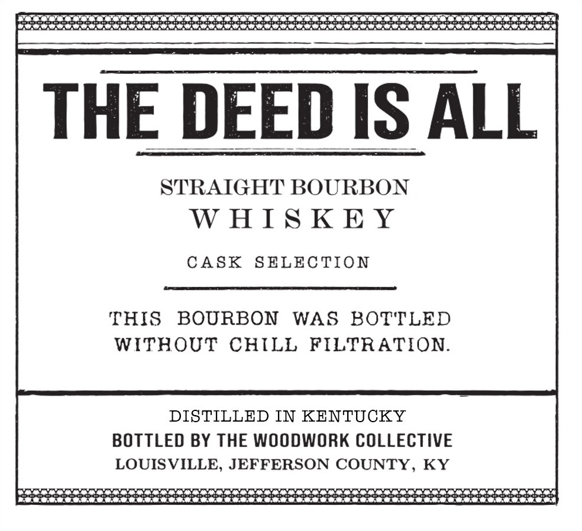
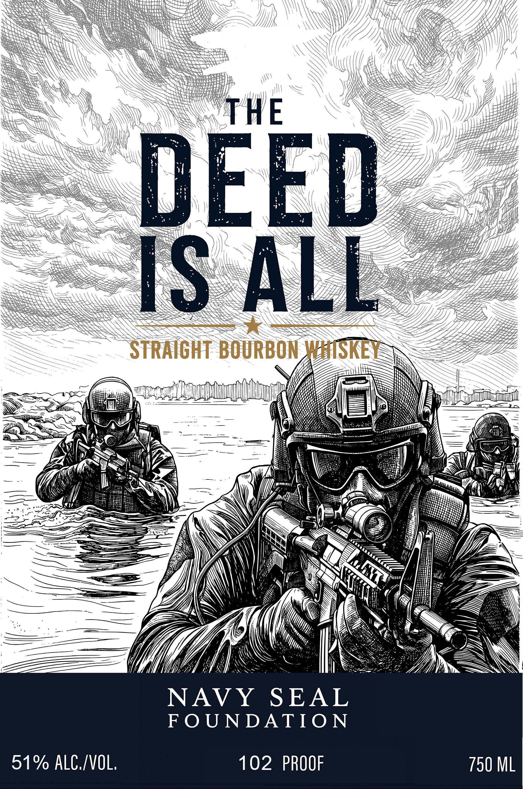

# TTB COLA Label Images - TTBID 26236001000742

**Brand Name:** THE DEED IS ALL

**Issue Date:** 09/22/2026

**Origin Code:** 22

**Product Class/Type:** 101

**Source:** [TTB Public COLA Registry](https://ttbonline.gov/colasonline/viewColaDetails.do?action=publicFormDisplay&ttbid=26236001000742)

## Label Images

### Back Label

### Label 1

## Extracted Label Text

*Text extracted via OCR - may contain errors*

*1 image(s) excluded: text did not meet readability threshold*

### Back Label

minnie etereeseteneeeeenen eee eee eee enat
STRAIGHT BOURBON
WHISKEY
CASK SELECTION
THIS BOURBON WAS BOTTLED
WITHOUT CHILL FILTRATION.
DISTILLED IN KENTUCKY
BOTTLED BY THE WOODWORK COLLECTIVE
LOUISVILLE, JEFFERSON COUNTY, KY
