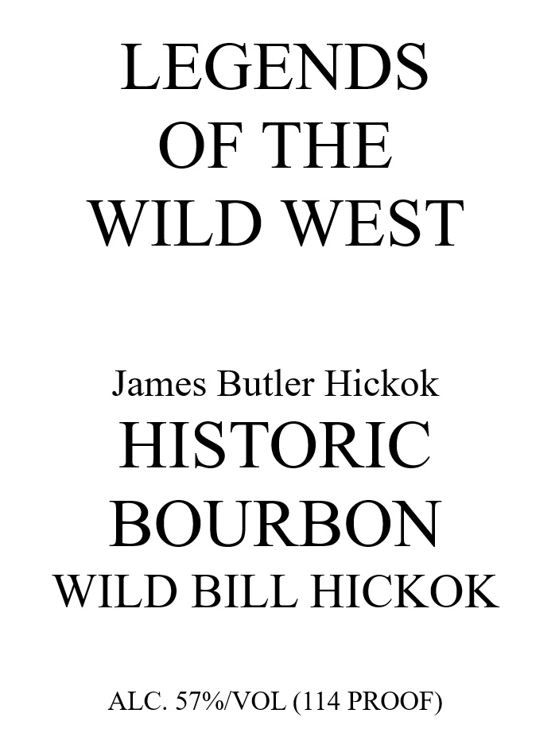
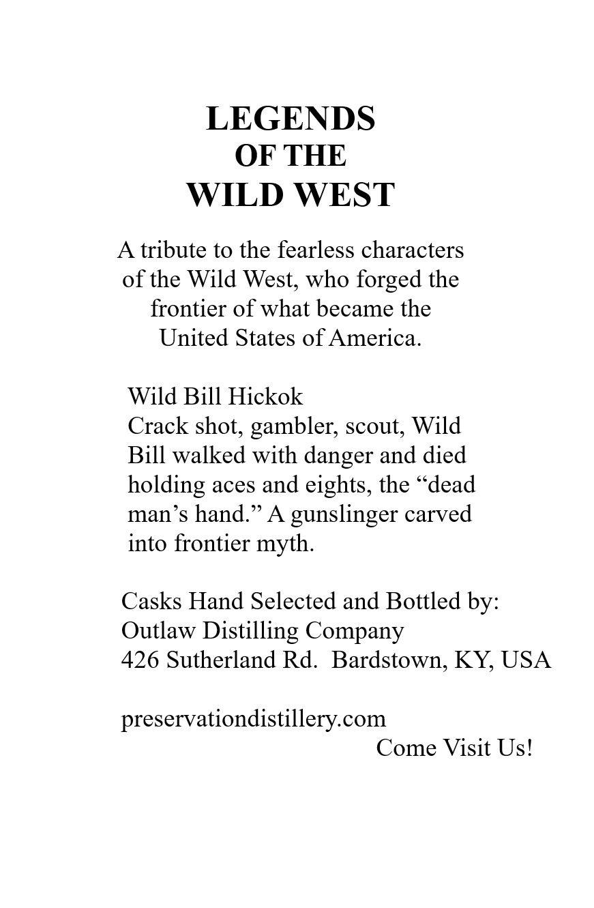
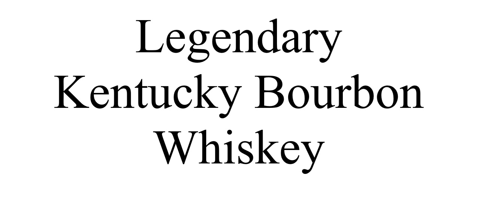
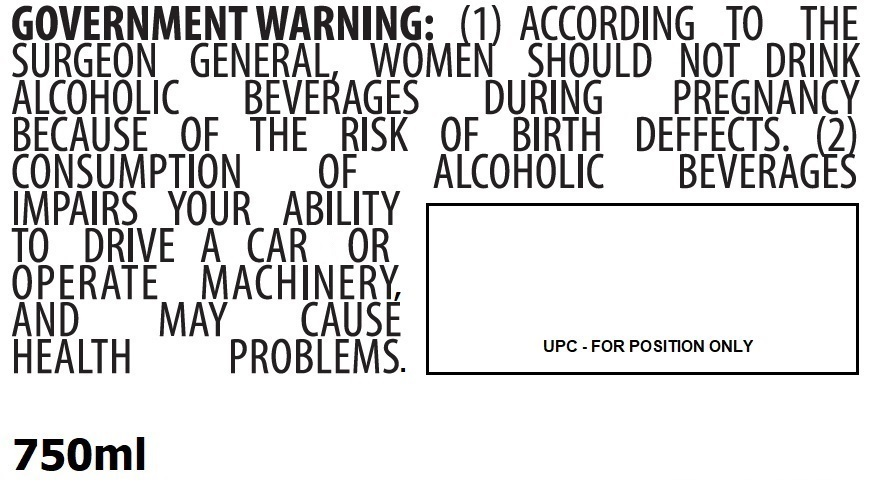

# TTB COLA Label Images - TTBID 26236001000772

**Brand Name:** LEGENDS OF THE WILD WEST

**Issue Date:** 08/31/2026

**Origin Code:** 22

**Product Class/Type:** 141

**Source:** [TTB Public COLA Registry](https://ttbonline.gov/colasonline/viewColaDetails.do?action=publicFormDisplay&ttbid=26236001000772)

## Label Images

### Label 1

### Label 2

### Label 3

### Label 4

### Label 5

## Extracted Label Text

*Text extracted via OCR - may contain errors*

*2 image(s) excluded: text did not meet readability threshold*

**Detected Proof:** 114

### Label 1

LEGENDS

OF THE

WILD WEST

James Butler Hickok

HISTORIC

BOURBON

WILD BILL HICKOK

ALC. 57%/VOL (114 PROOF)

### Label 2

LEGENDS
OF THE
WILD WEST
tribute to the fearless characters
of the Wild West; who forged the
frontier of what became the
United States of America.
Wild Bill Hickok
Crack shot, gambler; scout; Wild
Bill walked with danger and died
holding aces and eights, the "dead
man s hand:
A
gunslinger carved
into frontier myth.
Casks Hand Selected and Bottled by:
Outlaw Distilling Company
426 Sutherland Rd. Bardstown; KY; USA
preservationdistillery com
Come Visit Us!

### Label 5

GOVERNMENT WARNING:
ACCORDING
TO
THE
SURGEON
GENERAL
INGmEr) AGOBD8
NOT
DRINK
AicoHoLic
BEVERAGES
DURiNG
PREGNANCY
BECAUSE
OF
THE
RISK
OF
BIRTH
DEFFECTS
2
CONSUMpTION
OF
Alcohoic
BEVERAGES
IMPAIRS
YOUR
ABILITY
TO
DRIVE
A
CAR
OR
OPERATE
MACHINERY
And
MAY
CAUSE
UPC - FOR POSITION ONLY
HeALTH
PROBLEMS:
750ml
