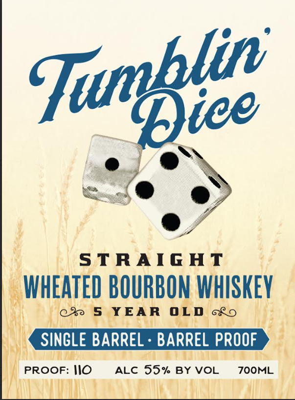
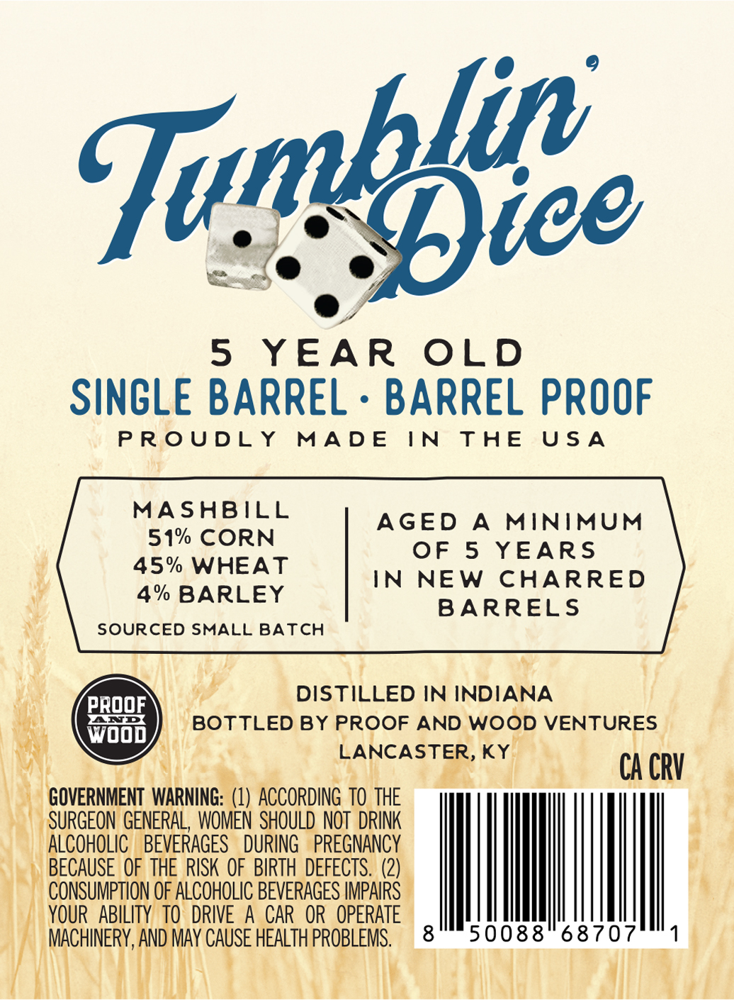

# TTB COLA Label Images - TTBID 26236001000784

**Brand Name:** TUMBLING DICE

**Issue Date:** 09/01/2026

**Origin Code:** 22

**Product Class/Type:** 101

**Source:** [TTB Public COLA Registry](https://ttbonline.gov/colasonline/viewColaDetails.do?action=publicFormDisplay&ttbid=26236001000784)

## Label Images

### Front Label

### Label 2

## Extracted Label Text

*Text extracted via OCR - may contain errors*

**Detected Proof:** 90
**Detected Age:** 5 Years

### Front Label

STRAIGAT
WHEATED BOURBON WhISKEY
930
5
YEAR
0LD
SINCLE BARREL
BARREL PROOF
PROOF: IlO
ALC 55% BY VOL
ZOOML
Tumblee

### Label 2

5
YEAR
OLD
SINGLE BARREL
BARREL PROOF
P R 0 UDL Y
MAD E
IN
T HE
U $ A
MASABILL
AGED
A
MINIMUM
51% CORN
OF 5
YEARs
45%
WHEAT
IN
NEW
CHARRED
4% BARLEY
BARRELS
SOURCED SMALL BATCH
DISTILLED IN INDIANA
PRQOF
BOTTLED BY PROOF AND WOOD VENTURES
Wood_
LANCASTER, KY
CA CRV
GOVERNMENT  WARNING: (1)  ACCORDING TO THE
SURGEON GENERAL, WOMEN  SHOULD NOT  DRINK
ALCOHOLIC
BEVERAGES
DURING
PREGNANCY
BECAUSE OF THE RISK OF BIRTH DEFECTS. (2)
CONSUMPTION OF ALCOHOLIC BEVERAGES IMPAIRS
YOUR   ABILITY  TO  DRIVE
A
CAR OR  OPERATE
MACHINERY,AND MAY CAUSE HEALTH PROBLEMS,
8
50088
68707
Tunbfice
