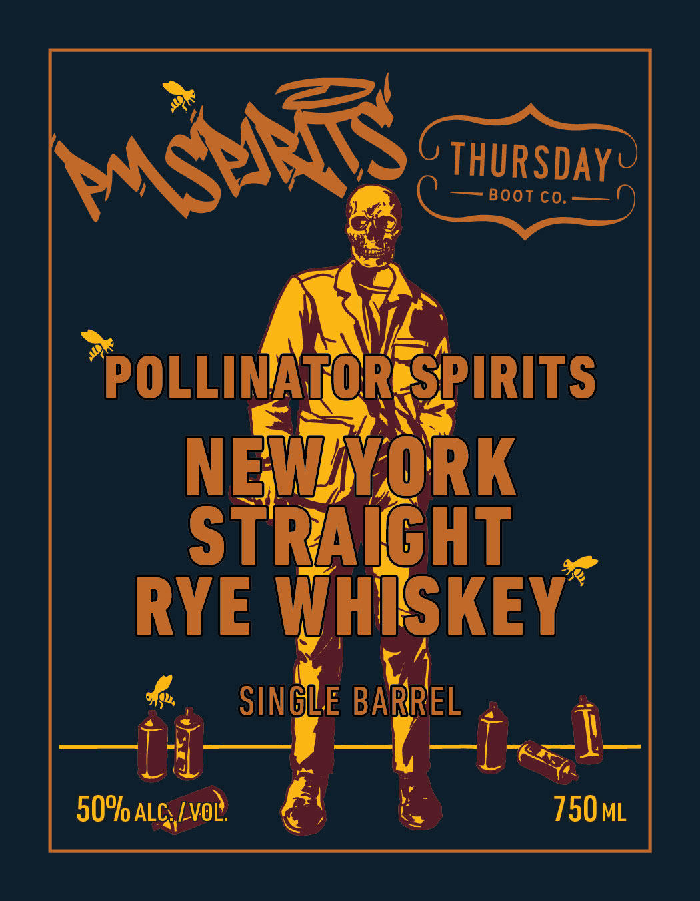
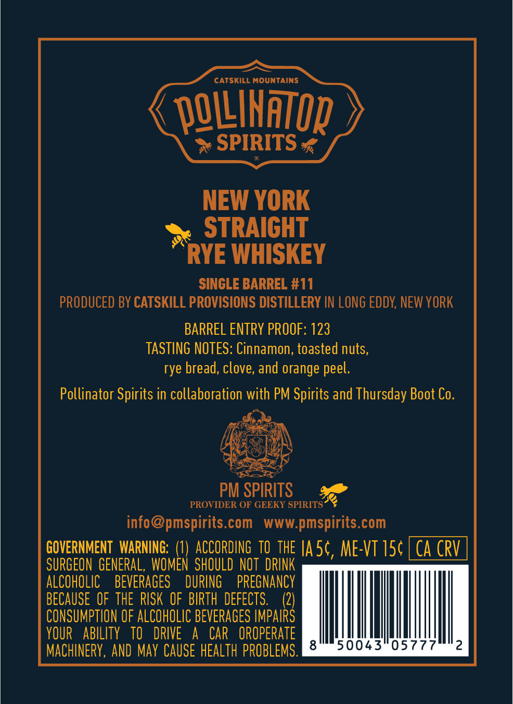

# TTB COLA Label Images - TTBID 26237001000098

**Brand Name:** POLLINATOR SPIRITS

**Issue Date:** 09/08/2026

**Origin Code:** 02

**Product Class/Type:** 102

**Source:** [TTB Public COLA Registry](https://ttbonline.gov/colasonline/viewColaDetails.do?action=publicFormDisplay&ttbid=26237001000098)

## Label Images

### Front Label

### Label 2

## Extracted Label Text

*Text extracted via OCR - may contain errors*

**Detected Proof:** 123

### Front Label

THURSDAY@
Boot Co.
POLLINATOR SPIRITS
NEWSORK
STRAIHT
RYE WHISKEY
SINGLE BARREL
50%l ALC /voL
750ml
MstMR

### Label 2

rantnsu MOUNTAINS

C VOLINATOR /

> SPIRITS ¢

NEW YORK
STRAIGHT
RYE WHISKEY

SINGLE BARREL #11
PRODUCED BY CATSKILL PROVISIONS DISTILLERY IN LONG EDDY, NEW YORK
BARREL ENTRY PROOF: 123
TASTING NOTES: Cinnamon, toasted nuts,
rye bread, clove, and orange peel.
Pollinator Spirits in collaboration with PM Spirits and Thursday Boot Co.
ede

PM SPIRITS 3a

PROVIDER OF GEEKY SPIRITS
info@pmspirits.com www.pmspirits.com

GOVERNMENT WARNING: (1) ACCORDING TO THE |A5¢, ME-VT 15¢| CA CRV

SURGEON GENERAL, WOMEN SHOULD NOT DRINK
ALCOHOLIC BEVERAGES DURING PREGNANCY
BECAUSE OF THE RISK OF BIRTH DEFECTS. (2)
CONSUMPTION OF ALCOHOLIC BEVERAGES IMPAIRS
YOUR ABILITY TO DRIVE A CAR OROPERATE
MACHINERY, AND MAY CAUSE HEALTH PROBLEMS, Mllehth ciate sAlarg
