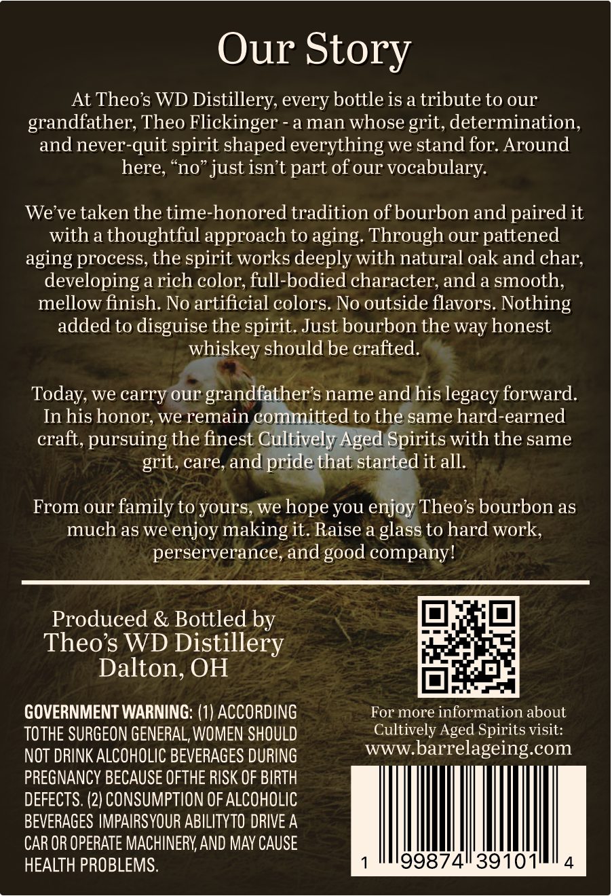
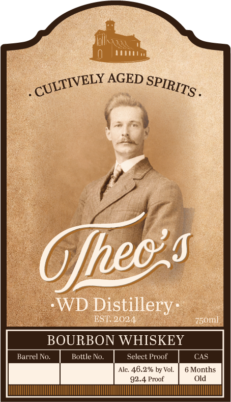

# TTB COLA Label Images - TTBID 26237001000190

**Brand Name:** THEOS WD DISTILLERY

**Issue Date:** 09/08/2026

**Origin Code:** 09

**Product Class/Type:** 141

**Source:** [TTB Public COLA Registry](https://ttbonline.gov/colasonline/viewColaDetails.do?action=publicFormDisplay&ttbid=26237001000190)

## Label Images

### Back Label

### Front Label

### Label 2

## Extracted Label Text

*Text extracted via OCR - may contain errors*

*1 image(s) excluded: text did not meet readability threshold*

**Detected Proof:** 92.4

### Back Label

Our Story
At Theos WD Distillery, every bottle is a tribute to our
grandfather; Theo Flickinger
a man whose grit,determination,
and never-quit spirit shaped everything we stand for: Around
here,
just isnt part of our vocabulary:
We ve taken the time-honored tradition ofbourbon and paired it
with a thoughtful approach to aging: Through our pattened
aging process, the spirit works deeply with natural oak and char;
developing a rich color; full-bodied character; and a smooth,
mellow finish. No artificial colors No outside flavors Nothing
added to disguise the
Just bourbon the way honest
whiskey should be crafted.
Today, we carry our grandfathers name and his legacy forward.
In his honor; we remain committed to the same hard-earned
craft, pursuing the finest Cultively Aged Spirits with the same
grit, care, and pride that started it all.
From our family to yours,
you enjoy Theos bourbon as
much as we
enjoy making it. Raise a glass to hard work,
perserverance, and
companyl
Produced & Bottled by
Theos WD
Distillery
Dalton, OH
GOVERNMENT WARNING: (1) ACCORDING
For more information about
TOTHE SURGEON GENERAL, WOMEN SHOULD
Cultively Aged Spirits visit:
NOT DRINK ALCOHOLIC BEVERAGES DURING
WWW.
barrelageing com
PREGNANCY BECAUSE OFTHE RISK OF BIRTH
DEFECTS: (2) CONSUMPTION OF ALCOHOLIC
BEVERAGES IMPAIRSYOUR ABILITYTO DRIVE A
CAR OR OPERATE MACHINERY AND MAY CAUSE
HEALTH PROBLEMS.
99874
39101
"no'
spirit.
hope
we
good

### Front Label

II
AGED
Gfec $
WD Distillery
EST: 2024
75om
BOURBON WHISKEY
Barrel No.
Bottle No
Select Proof
CAS
Alc:
46.2% by Vol.
6 Months
92.4 Proof
Old
CULTIVELY _
SPIRITS .
