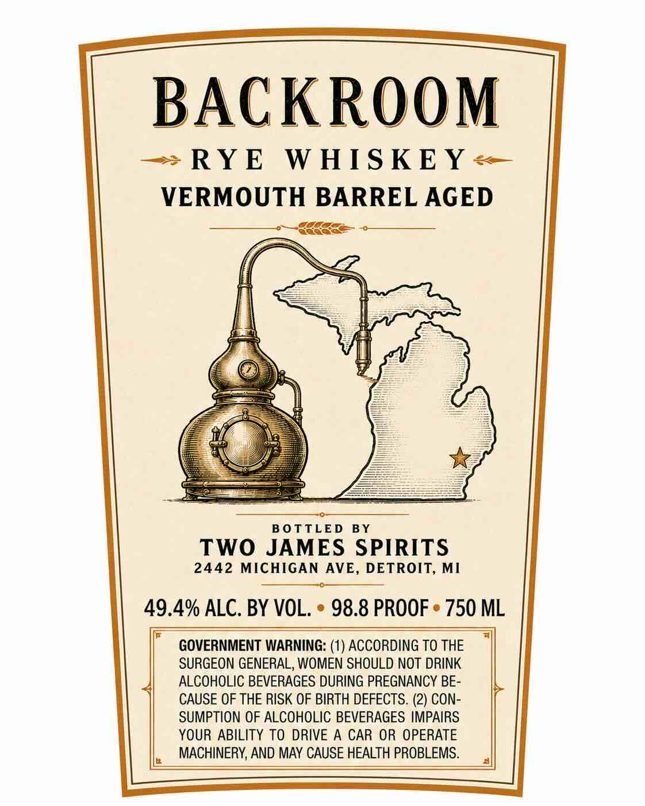

# TTB COLA Label Images - TTBID 26237001000199

**Brand Name:** BACKROOM VERMOUTH BARREL AGED

**Issue Date:** 09/04/2026

**Origin Code:** 06

**Product Class/Type:** 142

**Source:** [TTB Public COLA Registry](https://ttbonline.gov/colasonline/viewColaDetails.do?action=publicFormDisplay&ttbid=26237001000199)

## Label Images

### Back Label

## Extracted Label Text

*Text extracted via OCR - may contain errors*

**Detected Proof:** 98.8

### Back Label

BACKROoM
RYE
W HIS KEY
VERMOUTH BARREL AGED
Bo TTLED
BY
TWO JAMES SPIRITS
2442 MICHIGAN AVE, DETROIT, MI
49.4% ALC. BY VOL.
98.8 PROOF
750 ML
GOVERNMENT WARNING: (1) ACCORDING TO THE
SURGEON GENERAL, WOMEN SHOULD NOT DRINK
ALCOHOLIC BEVERAGES DURING PREGNANCY BE-
CAUSE OF THE RISK OF BIRTH DEFECTS. (2) CON-
SUMPTION OF ALCOHOLIC BEVERAGES IMPAIRS
YOUR ABILITY TO DRIVE A CAR OR OPERATE
MACHINERY, AND MAY CAUSE HEALTH PROBLEMS.
