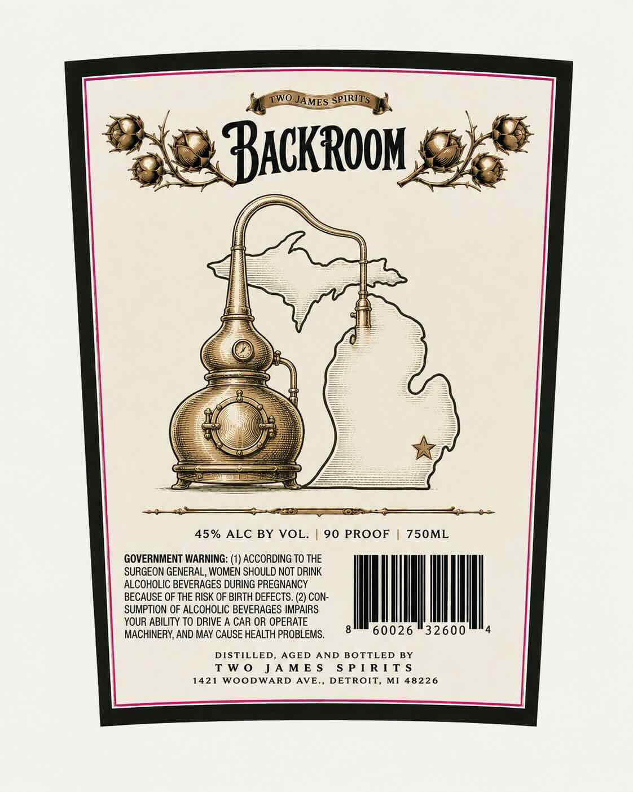
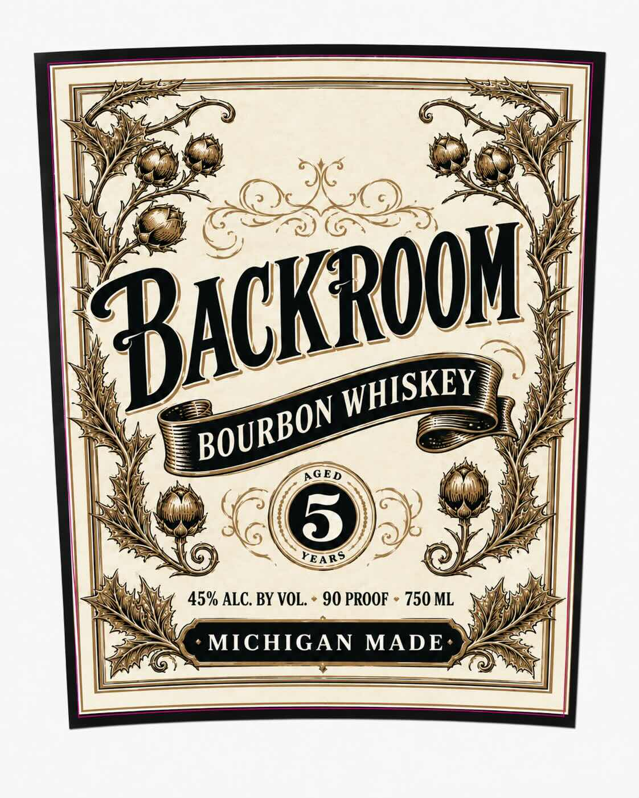

# TTB COLA Label Images - TTBID 26237001000213

**Brand Name:** BACKROOM

**Issue Date:** 09/04/2026

**Origin Code:** 06

**Product Class/Type:** 101

**Source:** [TTB Public COLA Registry](https://ttbonline.gov/colasonline/viewColaDetails.do?action=publicFormDisplay&ttbid=26237001000213)

## Label Images

### Back Label

### Front Label

## Extracted Label Text

*Text extracted via OCR - may contain errors*

**Detected Proof:** 90
**Detected Age:** 6 Years

### Back Label

45% ALC BY VOL. | 90 PROOF | 750ML

GOVERNMENT WARNING: (1) ACCORDING TO THE
SURGEON GENERAL, WOMEN SHOULD NOT DRINK
ALCOHOLIC BEVERAGES DURING PREGNANCY
26°-32600'"4

BECAUSE OF THE RISK OF BIRTH DEFECTS. (2) CON-
SUMPTION OF ALCOHOLIC BEVERAGES IMPAIRS
YOUR ABILITY TO DRIVE A CAR OR OPERATE

MACHINERY, AND MAY CAUSE HEALTH PROBLEMS, 8 600

DISTILLED, AGED AND BOTTLED BY
TWO JAMES SPIRITS
1421 WOODWARD AVE., DETROIT, MI 48226

### Front Label

AGED
6
YEARS
45% ALC. BY VOL
90 PROOF
750 ML
MICHIGAN
MADE
BackROOh-
WHISKEY
BOURBON
