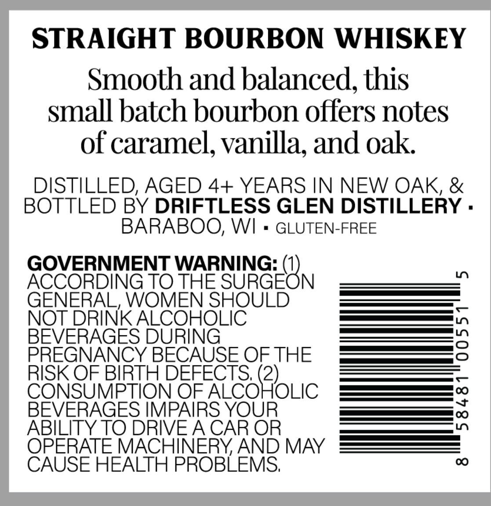
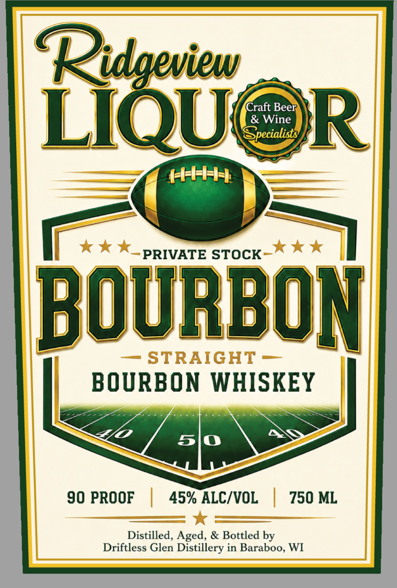

# TTB COLA Label Images - TTBID 26237001000249

**Brand Name:** RIDGEVIEW LIQUOR

**Issue Date:** 09/02/2026

**Origin Code:** 48

**Product Class/Type:** 101

**Source:** [TTB Public COLA Registry](https://ttbonline.gov/colasonline/viewColaDetails.do?action=publicFormDisplay&ttbid=26237001000249)

## Label Images

### Back Label

### Front Label

## Extracted Label Text

*Text extracted via OCR - may contain errors*

**Detected Proof:** 90

### Back Label

STRAIGHT BOURBON WHISKEY
Smooth and balanced; this
small batch bourbon offers notes
of caramel; vanilla; and oak
DISTILLED; AGED 4+ YEARS IN NEW OAK, &
BOTTLED BY DRIFTLESS GLEN DISTILLERY .
BARABOO, WI
GLUTEN-FREE
GOVERNMENT WARNING:
ACCORDING TO THE
SUGEBN
0
GENERAL, WOMEN SHOULD
NOT DRINK ALCOHOLIC
BEVERAGES DURING
3
PREGNANCY BECAUSE OFTHE
RISK OF BIRTH DEFECTS; (2)
CONSUMPTION OF ALCOHOLIC
BEVERAGES IMPAIRS YOUR
1
ABILITY TO DRIVEACAR OR
OPERATE MACHINERYAND MAY
CAUSE HEALTH PROBLEMS;
0

### Front Label

Ridgeview
Craft Beer
LIQU
& Wine
R
HHH-
PRIVATE STOCK
BOURBOM
STRAIGHT
BOURBON WHISKEY
5
90 PROOF
45% ALC/VOL
750 ML
Distilled, Aged, & Bottled by
Driftless Glen Distillery in Baraboo, WI
epecialists
