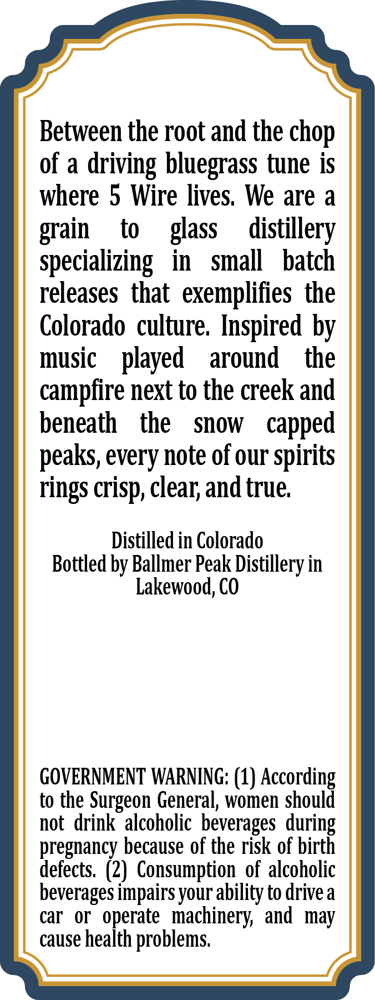
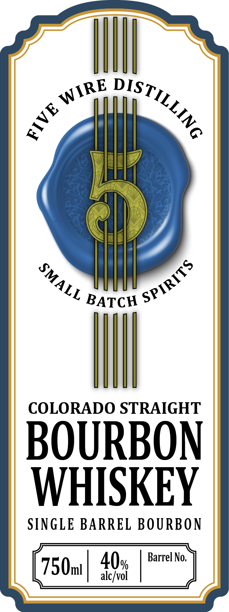

# TTB COLA Label Images - TTBID 26237001000277

**Brand Name:** 5 WIRE DISTILLING

**Issue Date:** 09/01/2026

**Origin Code:** 13

**Product Class/Type:** 101

**Source:** [TTB Public COLA Registry](https://ttbonline.gov/colasonline/viewColaDetails.do?action=publicFormDisplay&ttbid=26237001000277)

## Label Images

### Back Label

### Front Label

## Extracted Label Text

*Text extracted via OCR - may contain errors*

**Detected Proof:** 80

### Back Label

Between the root and the chop
of a
driving bluegrass tune is
where 5 Wire lives, We are a
to
glass
distillery
specializing
in
small
batch
releases  that   exemplifies the
Colorado culture: Inspired by
music
played
around
the
campfire next to the creek and
beneath
the
Snow
capped
peaks, every note of our spirits
rings
clear; and true
Distilled in Colorado
Bottled by Ballmer Peak Distillery in
Lakewood, CO
GOVERNMENT WARNING: (1)
to the Surgeon General; women
leccotdi
not  drink  alcoholic beverages
pregnancy because of the risk of birth
defects   (2) Consumption , of alcoholic
beverages impairsyour ability to drivea
car
or
operate   machinery' and  may
cause heaith
problems
grain
crisp; "
during

### Front Label

BATCH
COLORADO STRAIGHT
BOURBON
WHISKEY
SINGLE BARREL BOURBON
40%
Barrel No,
750ml
alc/vol
WIRE
DiSTILLING
E
SPIRITS
SMALL
