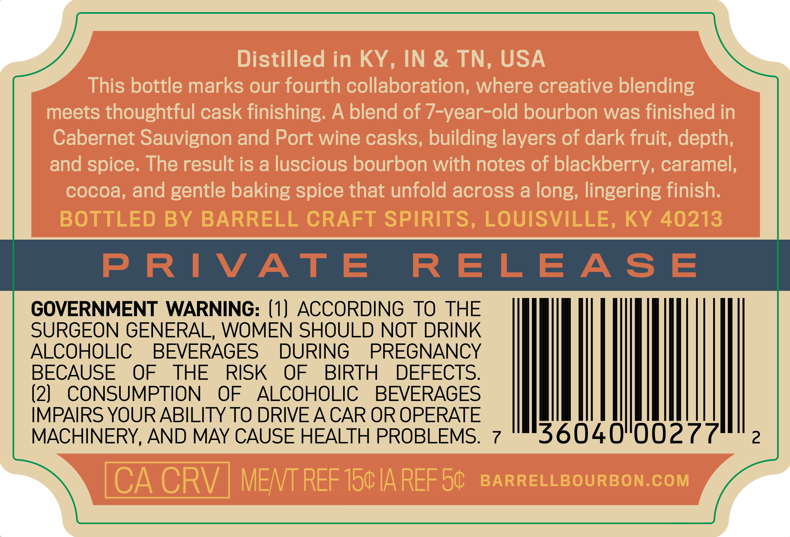
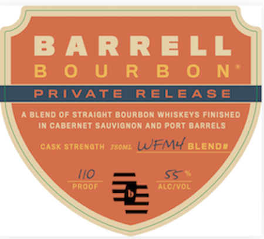
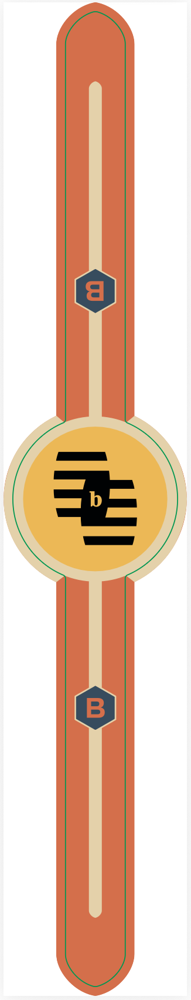

# TTB COLA Label Images - TTBID 26237001000339

**Brand Name:** BARRELL BOURBON

**Issue Date:** 09/02/2026

**Origin Code:** 22

**Product Class/Type:** 121

**Source:** [TTB Public COLA Registry](https://ttbonline.gov/colasonline/viewColaDetails.do?action=publicFormDisplay&ttbid=26237001000339)

## Label Images

### Back Label

### Label 1

### Label 3

## Extracted Label Text

*Text extracted via OCR - may contain errors*

*1 image(s) excluded: text did not meet readability threshold*

### Back Label

Distilled in KY , IN & TN, USA
This bottle marks our fourth collaboration; where creative blending
meets thoughtful cask finishing: A blend of 7-year-old bourbon was finished in
Cabernet Sauvignon and Port wine casks, building layers of dark fruit; depth;
and spice. The result is a luscious bourbon with notes of blackberry, caramel;
cocoa, and gentle baking spice that unfold across a long; lingering finish;
BOTTLED BY BARRELL CRAFT SPIRITS, LOUISVILLE, KY 40213
P RI VAT E
R ELEAS E
GOVERNMENT
WARNING: (1) ACCORDING
TO THE
SURGEON GENERAL, WOMEN SHOULD NOT DRINK
ALCOHOLIC
BEVERAGES
DURING
PREGNANCY
BECAUSE
OF
THE
RISK
OF
BIRTH
DEFECTS
(2)
CONSUMPTION
OF
ALCOHOLIC
BEVERAGES
IMPAIRS YOURABILITY TO DRIVEACAR OR OPERATE
MACHINERY, AND MAY CAUSE HEALTH PROBLEMS.
7
36040"00277
2
CA CRV
MENT REF 150 IA REF 50
BARRELLBOURBON.COM

### Label 1

B ARRELL
B 0 U R B 0 Ne
PRIVATE
RELBASE
BLeNd Of Straioht Bourbon Whiskevs Finished
In CaberNet Sauvionon And iPort Barrels
GasK StrENOTH
Jdd
WFMY BLENDU
[I0
SS
PROOF
Algivol
