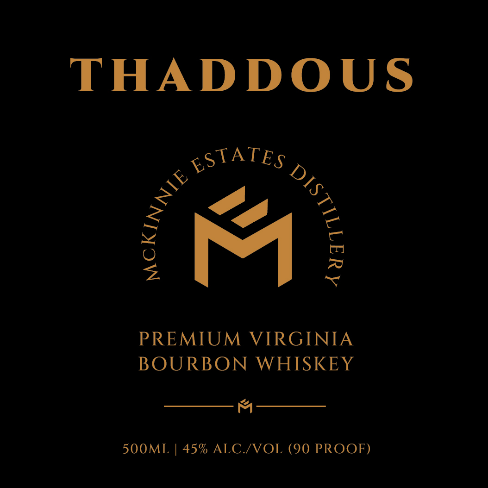
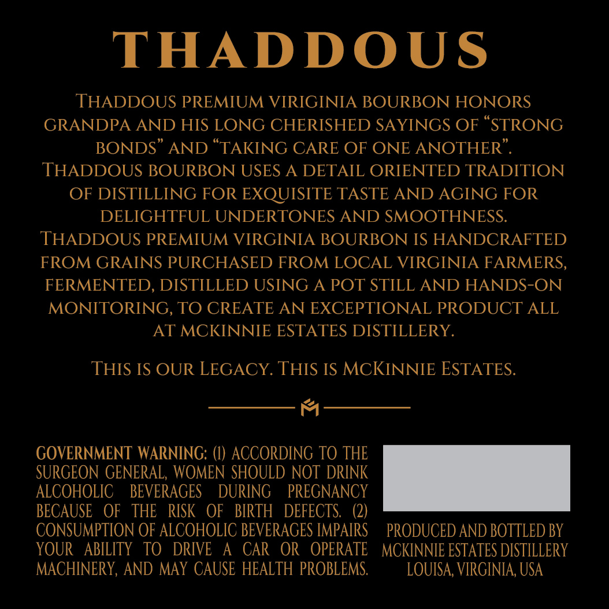

# TTB COLA Label Images - TTBID 26237001000371

**Brand Name:** THADDOUS

**Issue Date:** 09/02/2026

**Origin Code:** 05

**Product Class/Type:** 141

**Source:** [TTB Public COLA Registry](https://ttbonline.gov/colasonline/viewColaDetails.do?action=publicFormDisplay&ttbid=26237001000371)

## Label Images

### Label 1

### Label 2

## Extracted Label Text

*Text extracted via OCR - may contain errors*

**Detected Proof:** 90

### Label 1

THADDOUS

gSTATEs ,

PREMIUM VIRGINIA
BOURBON WHISKEY

MCKIA,
i
@
ns
Agi

4

500ML | 45% ALC./VOL (90 PROOF)

### Label 2

THADDOUS
THADDOUS PREMIUM VIRIGINIA BOURBON HONORS
GRANDPA AND HIS LONG CHERISHED SAYINGS OF
STRONG
BONDS
AND
TAKING CARE OF ONE ANOTHER
THADDOUS BOURBON USES A DETAIL ORIENTED TRADITION
OF DISTILLING FOR EXQUISITE TASTE AND AGING FOR
DELIGHTFUL UNDERTONES AND SMOOTHNESS.
THADDOUS PREMIUM VIRGINIA BOURBON IS HANDCRAFTED
FROM GRAINS PURCHASED FROM LOCAL VIRGINIA FARMERS,
FERMENTED, DISTILLED USING A POT STILL AND HANDS-ON
MONITORING, TO CREATE AN EXCEPTIONAL PRODUCT ALL
AT MCKINNIE ESTATES DISTILLERY.
THIS IS OUR LEGACY THIS IS MCKINNIE ESTATES.
GOVERNMENT WARNING:
ACCORDING TO THE
SURGEON GENERAL, WOMEN SHOULD NOT DRINK
ALCOHOLIC
BEVERAGES
DURING
PREGNANCY
BECAUSE
OF
THE
RISK   OF
BIRTH
DEFECTS:
(2)
CONSUMPTION OF ALCOHOLIC BEVERAGES IMPAIRS
PRODUCED AND BOTTLED BY
YOUR
ABILITY
TO  DRIVE
A
CAR   OR
OPERATE
MCKINNIE ESTATES DISTILLERY
MACHINERY, AND MAY CAUSE HEALTH PROBLEMS:
LOUISA, VIRGINIA, USA
