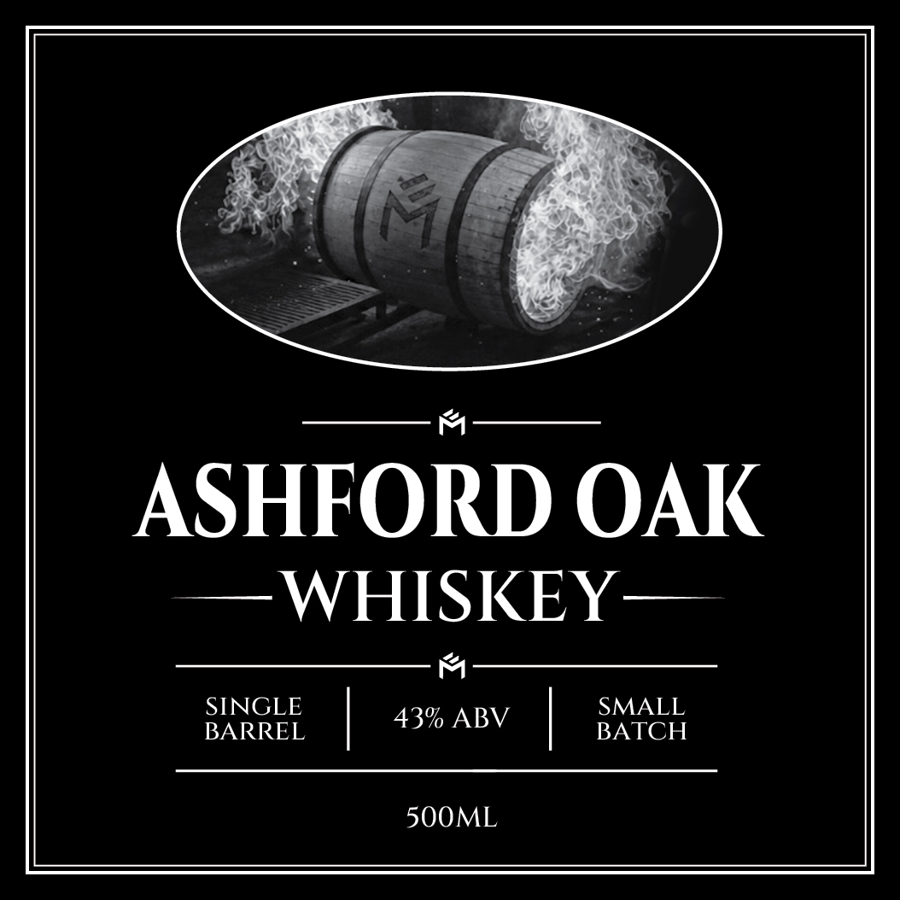
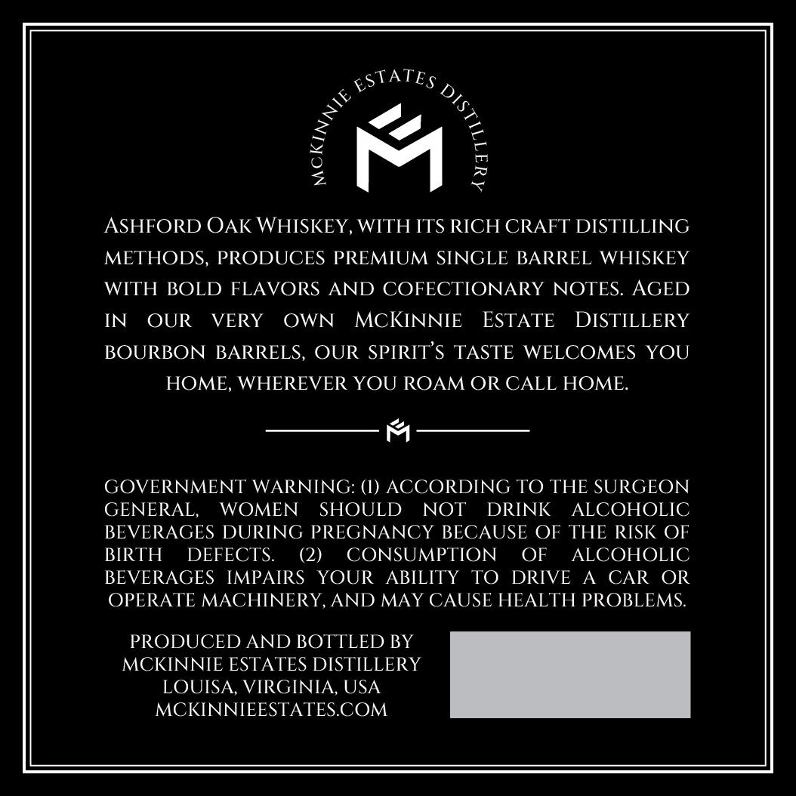

# TTB COLA Label Images - TTBID 26237001000380

**Brand Name:** ASHFORD OAK

**Issue Date:** 09/02/2026

**Origin Code:** 05

**Product Class/Type:** 140

**Source:** [TTB Public COLA Registry](https://ttbonline.gov/colasonline/viewColaDetails.do?action=publicFormDisplay&ttbid=26237001000380)

## Label Images

### Label 1

### Label 2

## Extracted Label Text

*Text extracted via OCR - may contain errors*

### Label 1

ASHFORD OAK
WHISKEY
SINGLE
SMALL
43% ABV
BARREL
BATCH
500ML

### Label 2

gStATEs

es

ASHFORD OAK WHISKEY, WITH ITS RICH CRAFT DISTILLING

METHODS, PRODUCES PREMIUM SINGLE BARREL WHISKEY

WITH BOLD FLAVORS AND COFECTIONARY NOTES. AGED

IN OUR VERY OWN MCKINNIE ESTATE DISTILLERY

BOURBON BARRELS, OUR SPIRITS TASTE WELCOMES YOU

HOME, WHEREVER YOU ROAM OR CALL HOME.

m

GOVERNMENT WARNING: (1) ACCORDING TO THE SURGEON

GENERAL,

WOMEN SHOULD NOT

DRINK ALCOHOLIC

BEVERAGES DURING PREGNANCY BECAUSE OF THE RISK OF

BIRTH DEFECTS.

(2)

CONSUMPTION OF ALCOHOLIC

BEVERAGES IMPAIRS YOUR ABILITY TO DRIVE A CAR OR

OPERATE MACHINERY, AND MAY CAUSE HEALTH PROBLEMS.

PRODUCED AND BOTTLED BY

MCKINNIE ESTATES DISTILLERY

LOUISA, VIRGINIA, USA

MCKINNIEESTATES.COM
