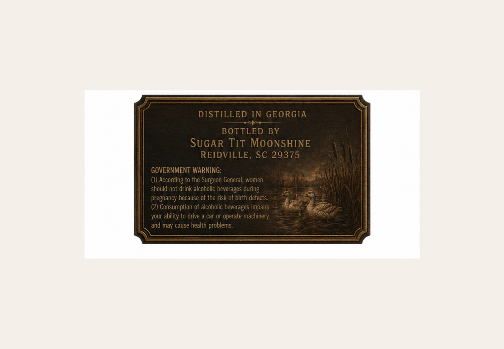
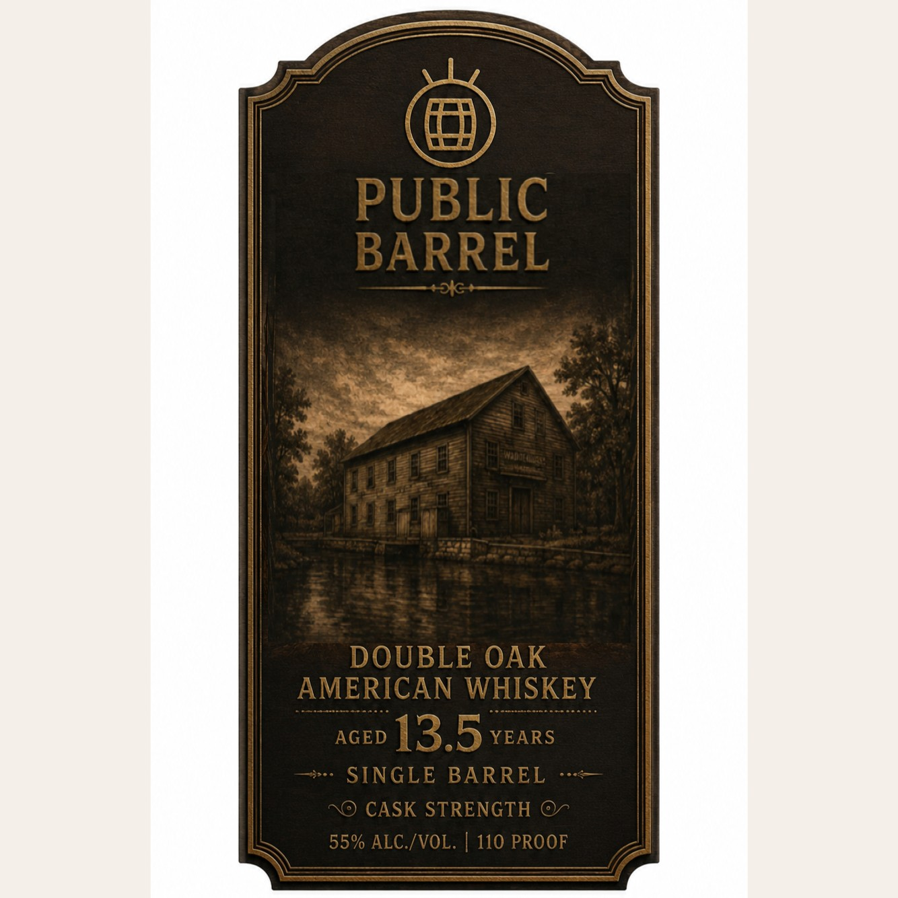

# TTB COLA Label Images - TTBID 26237001000501

**Brand Name:** PUBLIC BARREL

**Issue Date:** 09/02/2026

**Origin Code:** 41

**Product Class/Type:** 140

**Source:** [TTB Public COLA Registry](https://ttbonline.gov/colasonline/viewColaDetails.do?action=publicFormDisplay&ttbid=26237001000501)

## Label Images

### Back Label

### Front Label

## Extracted Label Text

*Text extracted via OCR - may contain errors*

**Detected Proof:** 110
**Detected Age:** 13.5 Years

### Back Label

DISTILLED
IN GEORGIA
BOTTLED
BY
SUGAR TIT MOoNSHINE
REIDVILLE, SC 29375
GOVERNMENT WARNING:
(1) According to the Surgeon General, women
should not drink alcoholic beverages during
pregnancy because of the risk of birth defects
(2) Consumption of alcoholic beverages impairs
your ability to drive
car Or operate
machinery;
and may cause health problems

### Front Label

PUBLIC
BARREL
DOUBLE OAK
AMERICAN WHISKEY
AGED
13.5
YEARS
SINGLE BARREL
CASK STRENGTH
55% ALC /VOL.
110 PROOF
