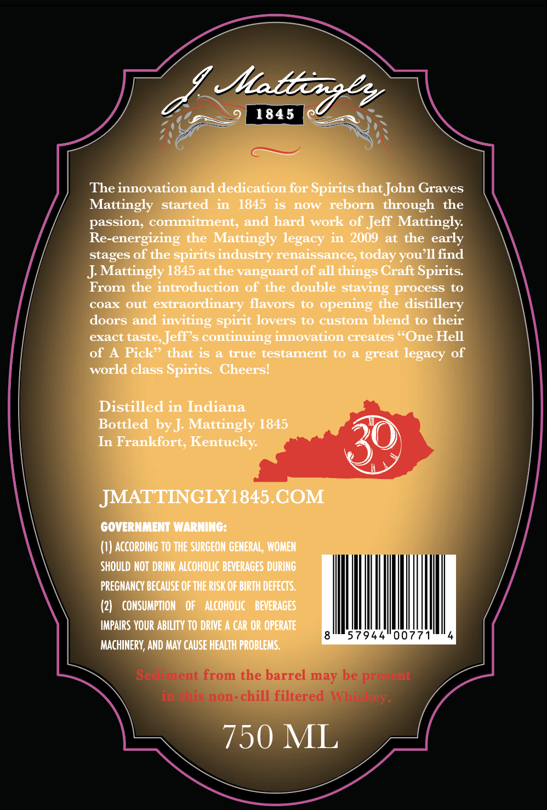
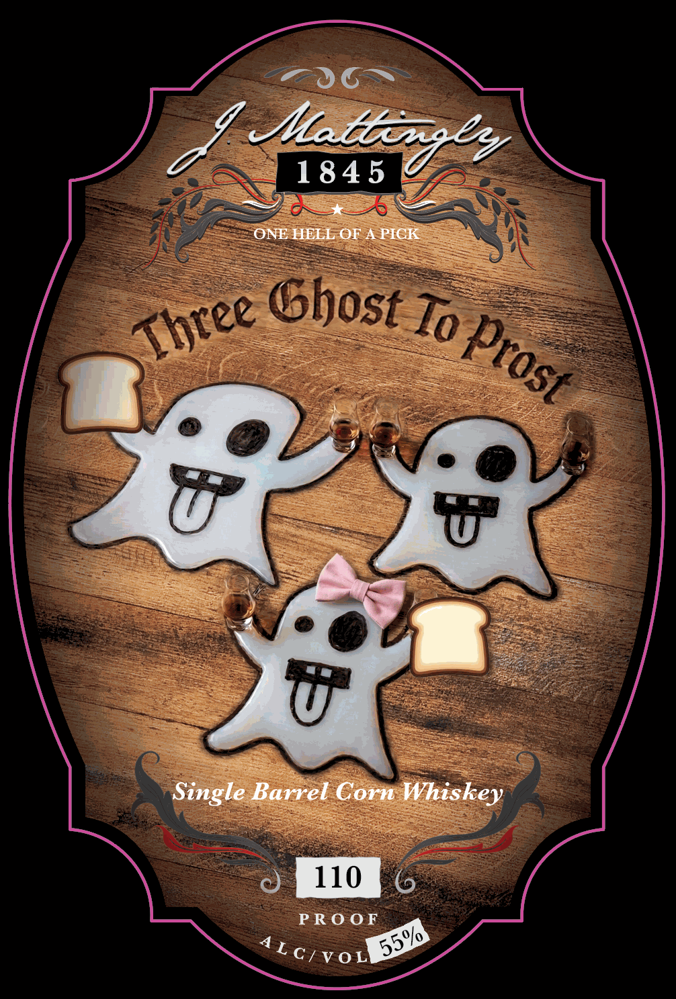

# TTB COLA Label Images - TTBID 26237001000509

**Brand Name:** J. MATTINGLY 1845

**Fanciful Name:** THREE GHOST TO PROST

**Issue Date:** 09/02/2026

**Origin Code:** 22

**Product Class/Type:** 143

**Source:** [TTB Public COLA Registry](https://ttbonline.gov/colasonline/viewColaDetails.do?action=publicFormDisplay&ttbid=26237001000509)

## Label Images

### Back Label

### Front Label

## Extracted Label Text

*Text extracted via OCR - may contain errors*

**Detected Proof:** 110

### Back Label

Iatbo7es
1845
The innovation and dedication for Spirits that John Graves
Mattingly
started
in
1845 is
nOW
reborn  through
the
passion; commitment, and hard work of Jeff Mattingly:
Re-energizing the Mattingly legacy in 2009
at the early
stages of the spirits industry renaissance;
you 11find
J Mattingly 1845at the vanguard of all
Craft Spirits:
From the introduction of the double staving process to
coax out
extraordinary flavors
to
opening the distillery
doors and inviting
lovers to custom blend to their
exact taste Jeff s continuing innovation creates "One Hell
of
Pick??
that iS
a true testament to
great legacy of
world class Spirits   Cheers!
Distilled in Indiana
Bottled by ] Mattingly 1845
In Frankfort, Kentucky
JMATTINGLY1845.COM
GOVERNMIENI WARRNINGS
(1) AccOrding T0 THE SURCEON GENERAL , WOMEN
ShOULD NOT  DRINK ALCOHOLIC BEVERAGES DURING
PREGNANCY BECAUSE OF THE RISK OF BIRTH DEFECTS;
(2)
CONSUMPTION
OF
ALCoHOLic
BEVERAGES
IMpAIRS VOUR AbILITY TO DRIVE A CAR OR OPERATE
57944
0077
MACHINERY, AND MAY CAUSE HEALTH PROBLEMS.
Sediment from the barrel may be present
intthis non-chill filtered Whiskey.
750 ML
today
things
spirit

### Front Label

Muatbexey
184 5
ONE HELL OFA PICK
Ghost To
Single Barrel Corn Whiskey
110
PRO 0 F
Three
Prost
55%
A LC/VoL
