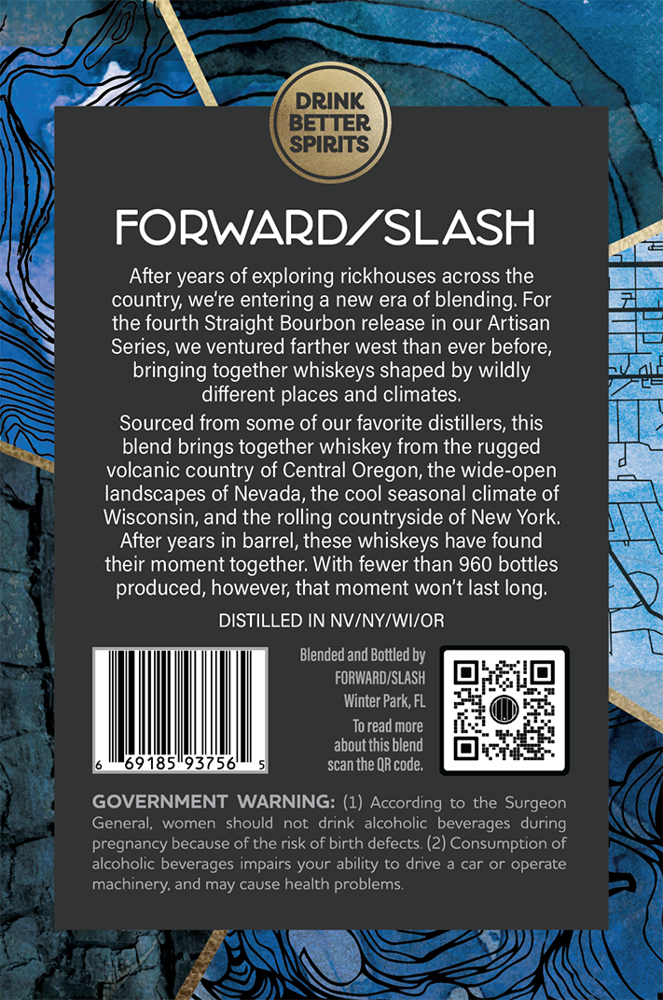
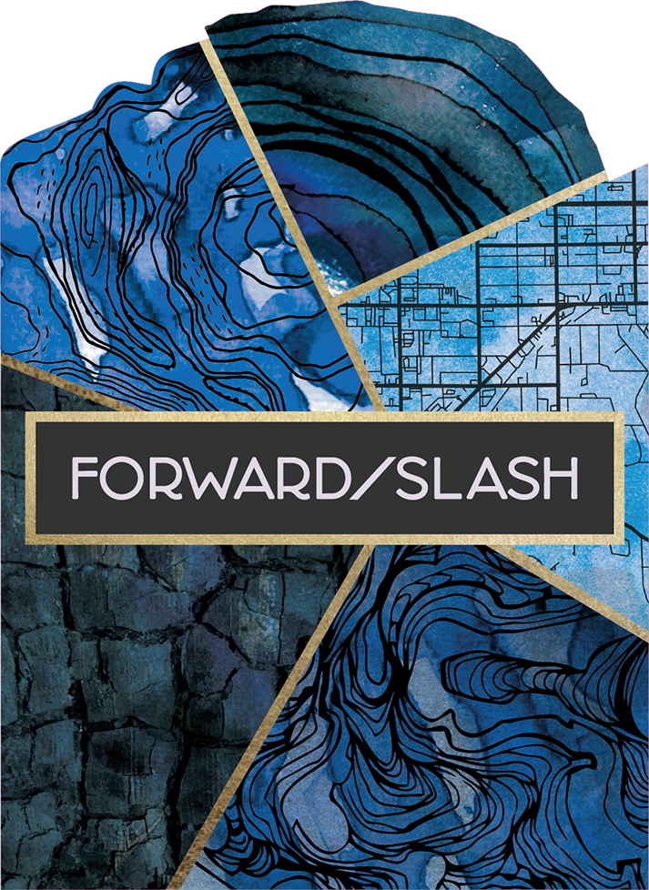
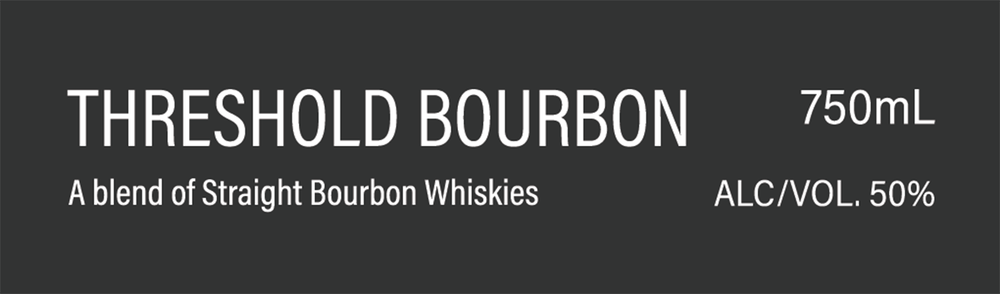
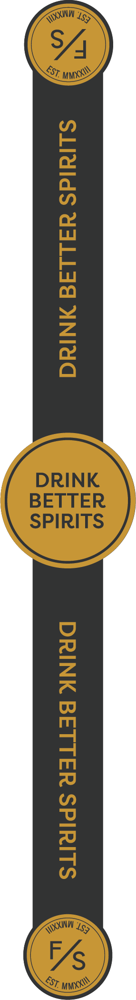

# TTB COLA Label Images - TTBID 26237001000518

**Brand Name:** FORWARD/SLASH

**Fanciful Name:** THRESHOLD BOURBON

**Issue Date:** 09/02/2026

**Origin Code:** 16

**Product Class/Type:** 121

**Source:** [TTB Public COLA Registry](https://ttbonline.gov/colasonline/viewColaDetails.do?action=publicFormDisplay&ttbid=26237001000518)

## Label Images

### Back Label

### Label 1

### Label 2

### Label 4

## Extracted Label Text

*Text extracted via OCR - may contain errors*

*1 image(s) excluded: text did not meet readability threshold*

**Detected Proof:** 100

### Back Label

DRINK
BETTER
SPIRITS
FORWARDZSLASH
After years of exploring rickhouses across the
country; we're entering a new era of blending: For
the fourth Straight Bourbon release in our Artisan
Series; we ventured farther west than ever before,
bringing together whiskeys shaped by wildly
different places and climates;
Sourced from some of our favorite distillers, this
blend brings together whiskey from the rugged
volcanic country of Central Oregon, the wide-open
landscapes of Nevada, the cool seasonal climate of
Wisconsin; and the
'rolling countryside of New York
After years in barrel, these whiskeys have found
their moment together: With fewer than 960 bottles
produced, however; that moment won't last
DISTILLED IN NVINYIWIOR
Blended and Bottled by
FORWARDISLASH
Winter Park, FL
To read more
aboutthis blend
69185"93756
scan the QR code:
GOVERNMENT WARNING: (1) According to the Surgeon
General;
women
should
not  drink alcoholic  beverages  during
pregnancy because of the risk of birth defects (2) Consumption of
alcoholic beverages impairs your ability to drive
car Or operate
machinery:
may cause health problems:
long:
and

### Label 2

THRESHOLD BOURBON

750mL

A blend of Straight Bourbon Whiskies

ALC/VOL. 50%

### Label 4

SLIMIdS Y4L14¢4 WINING DRINK BETTER SPIRITS
