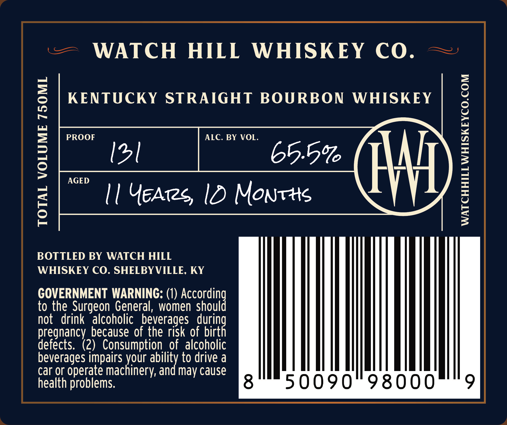
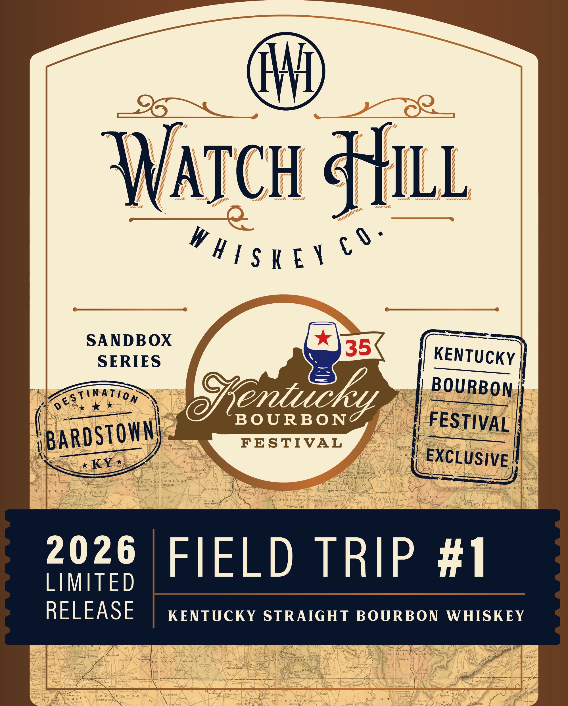

# TTB COLA Label Images - TTBID 26237001000526

**Brand Name:** WATCH HILL WHISKEY CO

**Fanciful Name:** SANDBOX SERIES

**Issue Date:** 09/02/2026

**Origin Code:** 22

**Product Class/Type:** 101

**Source:** [TTB Public COLA Registry](https://ttbonline.gov/colasonline/viewColaDetails.do?action=publicFormDisplay&ttbid=26237001000526)

## Label Images

### Back Label

### Front Label

## Extracted Label Text

*Text extracted via OCR - may contain errors*

### Back Label

=~ WATCH HILL WHISKEY CO. ~

KENTUCKY STRAIGHT BOURBON WHISKEY

AGED

vee ID 1 Yeas 1D Nowe

eet)

BOTTLED BY WATCH HILL

WHISKEY CO. SHELBYVILLE, KY

GOVERNMENT WARNING: (1) According

to the Surgeon General, women should

not drink alcoholic beverages durin

pregnancy because of the risk of birt

defects. (2) Consumption of alcoholic

beverages impairs your ability to drive a

car or operate machinery, and may cause

health problems.

8

50090° 98000

9

### Front Label

4l
WAtch HLL
" H1 $ K ET €0=
SANDBOX
SERIES
35
KENTUCKY
estination
entucku
BOURBON
0
B OURBO N-
FESTIVAL
BARDSTOWN
BRARUFNALAI
FESTIVAL
KY *
EXCLUSIVE
Meem
X n ffD GI
AOINSELRR
Rikns
Wusn
Otal.
MLAZIAIHTASL
2026
FIELD TRIP #1
LIMITED
RELEASE
KENTUCKY
STRAIGHT BOURBON
WHISKEY
UMSRURG
ONESTILLE
Wh
Luar
Qinch Wat t
Tat
ait
CLARKSWILLC
EPRIRGIIEAD
Ttvid
Iet
UAN
