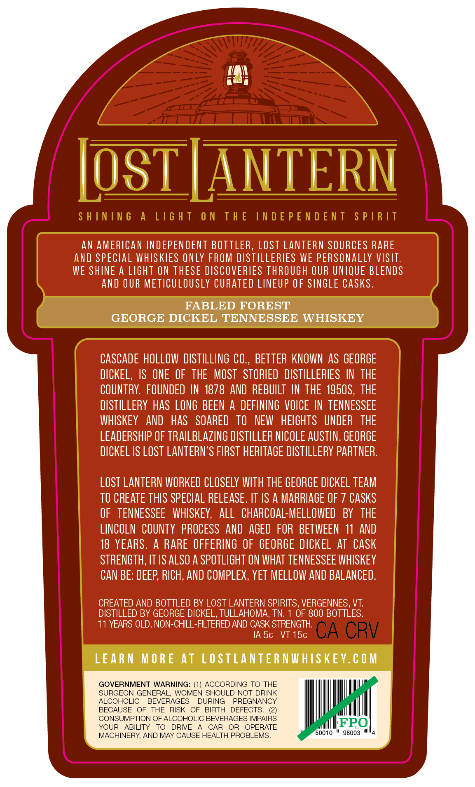
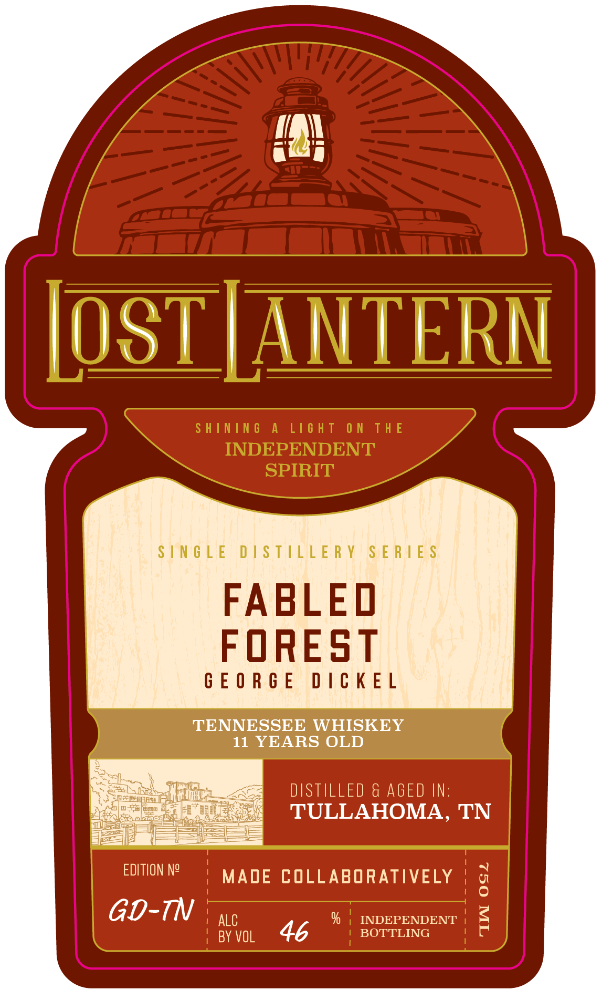

# TTB COLA Label Images - TTBID 26237001000567

**Brand Name:** LOST LANTERN

**Issue Date:** 09/03/2026

**Origin Code:** 46

**Product Class/Type:** 140

**Source:** [TTB Public COLA Registry](https://ttbonline.gov/colasonline/viewColaDetails.do?action=publicFormDisplay&ttbid=26237001000567)

## Label Images

### Back Label

### Front Label

### Label 3

## Extracted Label Text

*Text extracted via OCR - may contain errors*

**Detected Age:** 18 Years

### Back Label

LosT LANTERN
S H ININ 6
A
L16 H T
0 N
T H E
IN D E P E N D E N T
S P |R IT
AN AMERICAN INDEPENDENT BOTTLER, LOSt LANTeRN SOURCES RARE
and SPECIAL WHISKIES ONLY FROM DISTILLERLES WE PERSONALLY VISIT:
WE SHINE A LIGHT ON THESE DISCOVERIES THROUGH OUR UNIQUE BLENDS
ANd OUR METICULOUSLY CURATED LINEUP OF SINGLE CASks.
FABLED FOREST
GEORGE DICKEL TENNESSEE WHISKEY
CASCADE HOLLOW  DISTILLING CO , BETTER KNOWN AS GEORGE
DICKEL, IS ONE OF  THE   MOST   STORIED   DISTILLERIES IN THE
COUNTRY.  FOUNDED IN 1878 AND REBUILT IN THE 1950S , THE
DISTILLERY Has LONG BEEN
A DEFINING VOICE IN TENNESSEE
WHISKEY
anD   haS   SOARED   TO
NEW
HEIGHTS   UNDER   THE
LEADERSHIP OF TRAILBLAZING DISTILLER NICOLE AUSTIN. GEORGE
DICKEL IS LOST LANTERN'S FIRST HERITAGE DISTILLERY PARTNER:
LOST LANTERN WORKED CLOSELY WITH THE GEORGE DICKEL TEAM
TO CREATE THIS SPECLAL RELEASE. IT /S A MARRIAGE OF
CaSKS
OF   TENNESSEE   WHISKEY;
all  CHARCOAL-MELLOWED
BY   THE
LINCOLN  CoUNTY  PROCESS   AND  AGEd  FOR  BETWEEN 11
ANd
18 YEARS.
A RARE OFFERING OF GEORGE DICKEL AT  CASk
STRENGTH, IT IS ALSO A SPOTLIGHT ON WHAT TENNESSEE WHISKEY
CAN BE: DEEP RICH, AND COMPLEX, YET MELLOW AND BALANCED.
CREATED AND BOTTLED BY LOST LANTERN SPIRITS, VERGENNES, VT:
DISTILLED BY GEORGE DICKEL , TULLAHOMA;, TN.
OF 800 BOTTLES.
11 YEARS OLD. NON-CHILL-FILTERED AND CASK STRENGTH:
IA 54
VT 154
CA CRV
LEARN
M O RE At LOSTLANTER NWHISKEY.€ 0 M
GOVERNMENT WARNING: (1) ACCORDING TO THE
SURGEON GENERAL, WOMEN SHOULD NOT DRINK
ALCOHOLIC
BEVERAGES
DURING
PREGNANCY
BECAUSE
OF
THE
RISK
OF
BIRTH
DEFECTS_
CONSUMPTION OF ALCOHOLIC BEVERAGES IMPAIRS
YOUR
ABILITY
TO
DRIVE
CAR
OR
OPERATE
FRO
MACHINERY; AND MAY CAUSE HEALTH PROBLEMS_
50010
98003

### Front Label

ran

OSTIANT!

SINGLE DISTILLERY SERIES

FABLEO
FOREST

GEORGE DICKEL

TENNESSEE WHISKEY
11 YEARS OLD

DISTILLED & AGED IN:
TULLAHOMA, TN

EDITION N°) MADE COLLABORATIVELY

GD -7N ALC % | INDEPENDENT
46

BY VOL BOTTLING

### Label 3

SHINING A LIGHT ON THE INDEPENDENT SPIRIT —— ene ~~ Li¥idS LNJON3Jd SONI JHL NO LHSIT V SNINIHS
camel
ci =
Se
