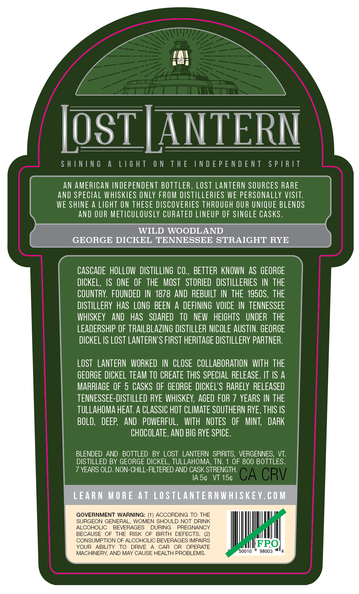
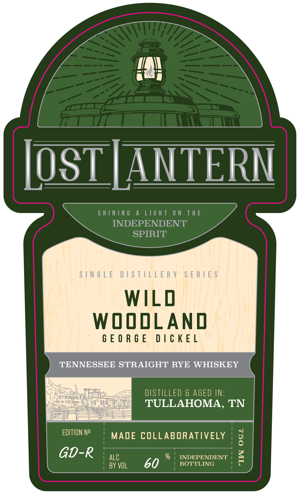

# TTB COLA Label Images - TTBID 26237001000568

**Brand Name:** LOST LANTERN

**Issue Date:** 09/02/2026

**Origin Code:** 46

**Product Class/Type:** 102

**Source:** [TTB Public COLA Registry](https://ttbonline.gov/colasonline/viewColaDetails.do?action=publicFormDisplay&ttbid=26237001000568)

## Label Images

### Back Label

### Front Label

### Label 2

## Extracted Label Text

*Text extracted via OCR - may contain errors*

**Detected Age:** 7 Years

### Back Label

SHINING A LIGHT ON THE INDEPENDENT SPIRIT
AN AMERICAN INDEPENDENT BOTTLER, LOST LANTERN SOURCES RARE
AND SPECIAL WHISKIES ONLY FROM DISTILLERIES WE PERSONALLY VISIT.
WE SHINE A LIGHT ON THESE DISCOVERIES THROUGH OUR UNIQUE BLENDS
AND OUR METICULOUSLY CURATED LINEUP OF SINGLE CASKS.
WILD WOODLAND
GEORGE DICKEL TENNESSEE STRAIGHT RYE
CASCADE HOLLOW DISTILLING CO., BETTER KNOWN AS GEORGE
DICKEL, 1S ONE OF THE MOST STORIED DISTILLERIES IN THE
COUNTRY. FOUNDED IN 1878 AND REBUILT IN THE 1950S, THE
DISTILLERY HAS LONG BEEN A DEFINING VOICE IN TENNESSEE
WHISKEY AND HAS SOARED TO NEW HEIGHTS UNDER THE
LEADERSHIP OF TRAILBLAZING DISTILLER NICOLE AUSTIN. GEORGE
DICKEL IS LOST LANTERN’S FIRST HERITAGE DISTILLERY PARTNER.
LOST LANTERN WORKED IN CLOSE COLLABORATION WITH THE
GEORGE DICKEL TEAM TO CREATE THIS SPECIAL RELEASE. IT IS A
MARRIAGE OF 5 CASKS OF GEORGE DICKEL’S RARELY RELEASED
TENNESSEE-DISTILLED RYE WHISKEY, AGED FOR 7 YEARS IN THE
TULLAHOMA HEAT. A CLASSIC HOT CLIMATE SOUTHERN RYE, THIS IS
BOLD, DEEP, AND POWERFUL, WITH NOTES OF MINT, DARK
CHOCOLATE, AND BIG RYE SPICE.

BLENDED AND BOTTLED BY LOST LANTERN SPIRITS, VERGENNES, VT.
DISTILLED BY GEORGE DICKEL, TULLAHOMA, TN. 1 OF 800 BOTTLES.

7 YEARS OLD. NON-CHILL-FILTERED AND CASK STRENGTH.
IAS¢ VT 15¢
GOVERNMENT WARNING: (1) ACCORDING TO THE
SURGEON GENERAL, WOMEN SHOULD NOT DRINK
ALCOHOLIC BEVERAGES DURING PREGNANCY
BECAUSE OF THE RISK OF BIRTH DEFECTS. (2)
CONSUMPTION OF ALCOHOLIC BEVERAGES IMPAIRS FPO
YOUR ABILITY TO DRIVE A CAR OR OPERATE fatale
MACHINERY, AND MAY CAUSE HEALTH PROBLEMS. 50010 98003 TN'4

### Front Label

ran

OST |ANTERN

SHINING A LIGHT ON THE

INDEPENDENT

SPIRIT

WILD

WOOOLAND

GEORGE DICKEL

TENNESSEE STRAIGHT RYE WHISKEY

DISTILLED & AGED IN:

TULLAHOMA, TN

EDITIONN® =| MADE COLLABORATIVELY a

GD-R | ALC

| INDEPENDENT 1 Ss

| BY VOL

60°

| BOTTLING

oO

### Label 2

| SHINING A LIGHT ON THE INDEPENDENT SPIRIT @& ii V LididS LNJONAddONI JHL NO LHSIT V ONINIHS |
