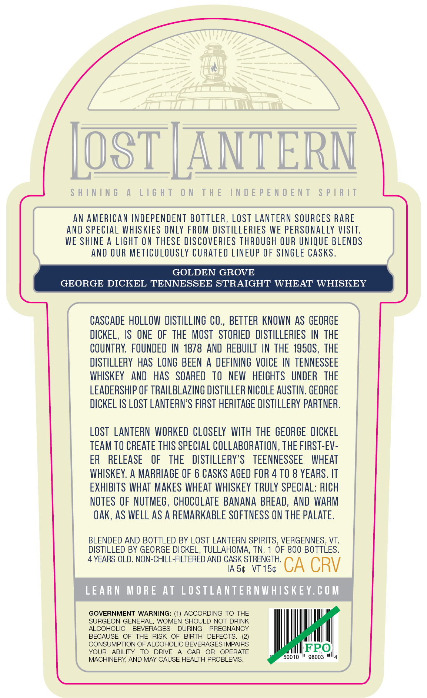
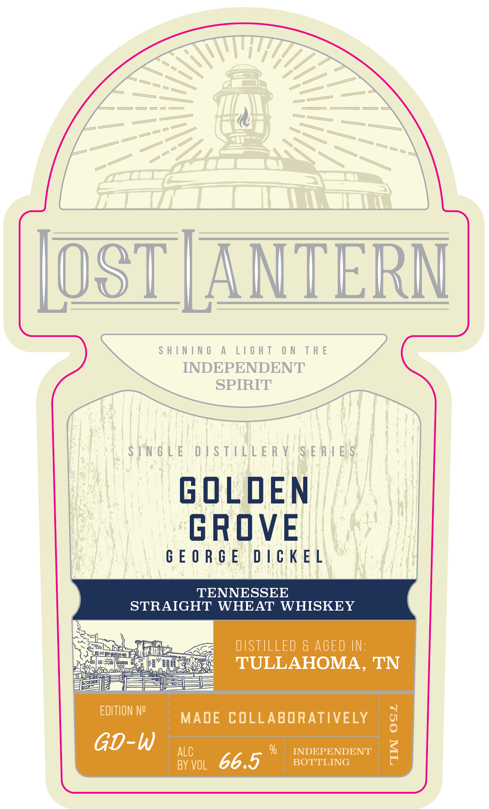
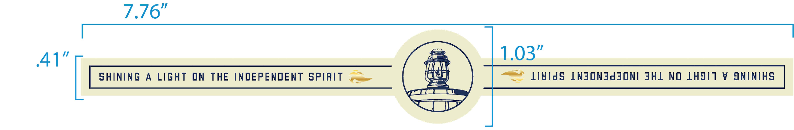

# TTB COLA Label Images - TTBID 26237001000569

**Brand Name:** LOST LANTERN

**Issue Date:** 09/02/2026

**Origin Code:** 46

**Product Class/Type:** 109

**Source:** [TTB Public COLA Registry](https://ttbonline.gov/colasonline/viewColaDetails.do?action=publicFormDisplay&ttbid=26237001000569)

## Label Images

### Back Label

### Front Label

### Label 2

## Extracted Label Text

*Text extracted via OCR - may contain errors*

**Detected Age:** 8 Years

### Back Label

AN AMERICAN INDEPENDENT BOTTLER, LOST LANTERN SOURCES RARE
AND SPECIAL WHISKIES ONLY FROM DISTILLERIES WE PERSONALLY VISIT.
WE SHINE A LIGHT ON THESE DISCOVERIES THROUGH OUR UNIQUE BLENDS

AND OUR METICULOUSLY CURATED LINEUP OF SINGLE CASKS.

GOLDEN GROVE
GEORGE DICKEL TENNESSEE STRAIGHT WHEAT WHISKEY
CASCADE HOLLOW DISTILLING CO., BETTER KNOWN AS GEORGE
DICKEL, IS ONE OF THE MOST STORIED DISTILLERIES IN THE
COUNTRY. FOUNDED IN 1878 AND REBUILT IN THE 1950S, THE
DISTILLERY HAS LONG BEEN A DEFINING VOICE IN TENNESSEE
WHISKEY AND HAS SOARED TO NEW HEIGHTS UNDER THE
LEADERSHIP OF TRAILBLAZING DISTILLER NICOLE AUSTIN. GEORGE
DICKEL IS LOST LANTERN’S FIRST HERITAGE DISTILLERY PARTNER.
LOST LANTERN WORKED CLOSELY WITH THE GEORGE DICKEL
TEAM TO CREATE THIS SPECIAL COLLABORATION, THE FIRST-EV-
ER RELEASE OF THE DISTILLERY’S TEENNESSEE WHEAT
WHISKEY. A MARRIAGE OF 6 CASKS AGED FOR 4 TO 8 YEARS. IT
EXHIBITS WHAT MAKES WHEAT WHISKEY TRULY SPECIAL: RICH
NOTES OF NUTMEG, CHOCOLATE BANANA BREAD, AND WARM
OAK, AS WELL AS A REMARKABLE SOFTNESS ON THE PALATE.
BLENDED AND BOTTLED BY LOST LANTERN SPIRITS, VERGENNES, VT.
DISTILLED BY GEORGE DICKEL, TULLAHOMA, TN. 1 OF 800 BOTTLES.
4 YEARS OLD. NON-CHILL-FILTERED AND CASK STRENGTH.
IAS¢ VT 15¢ CA CRV

GOVERNMENT WARNING: (1) ACCORDING TO THE
SURGEON GENERAL, WOMEN SHOULD NOT DRINK
ALCOHOLIC BEVERAGES DURING PREGNANCY
BECAUSE OF THE RISK OF BIRTH DEFECTS. (2)
CONSUMPTION OF ALCOHOLIC BEVERAGES IMPAIRS FPO
YOUR ABILITY TO DRIVE A CAR OR OPERATE ted terd|
MACHINERY, AND MAY CAUSE HEALTH PROBLEMS. 0010 * 98003 N's

### Front Label

SHINING A LIGHT ON THE
INDEPENDENT
SPIRIT
STNGLE DISTILLER ¥! SERA BS
GEORGE DICKEL
TENNESSEE
STRAIGHT WHEAT WHISKEY
t : a nk
SO riemeeres DISTILLED & AGED IN:
Sie TULLAHOMA, TN
EDITION NY MADE COLLABORATIVELY g
GD-W ALC % | INDEPENDENT <
BY VoL G6. BOTTLING mp

### Label 2

7.376"
41'
103"
ShInIng
A
LIGhT
ON
THE
INDEPENDENT
SpIRIT
lAIds
LNJONJdjoni JHL
NO
LHJIT
V
JNINIHS
