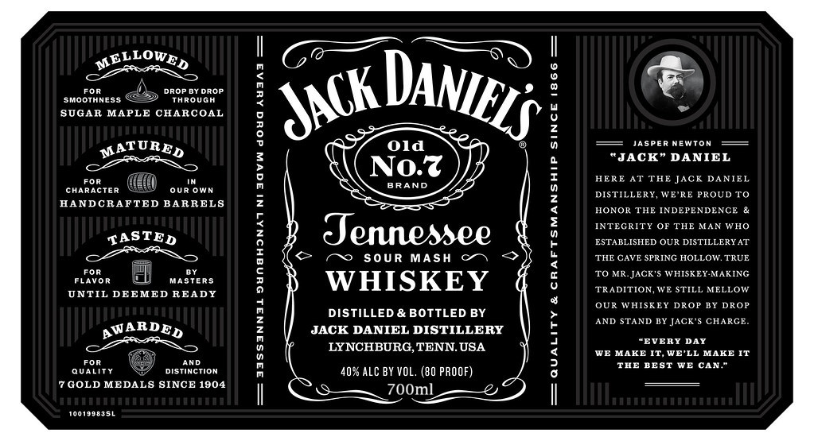

# TTB COLA Label Images - TTBID 26237001000592

**Brand Name:** JACK DANIELS

**Fanciful Name:** OLD NO.7

**Issue Date:** 09/01/2026

**Origin Code:** 01

**Product Class/Type:** 140

**Source:** [TTB Public COLA Registry](https://ttbonline.gov/colasonline/viewColaDetails.do?action=publicFormDisplay&ttbid=26237001000592)

## Label Images

### Label 1

### Label 2

## Extracted Label Text

*Text extracted via OCR - may contain errors*

### Label 1

MELLOWED
Dop b7 DroF
SMOOTHNESs
Through
SUGAR MAPLE CHARCOAL
TiTTI
2
MATURED
Old
Jasper Newton
}
JACK" DANIEL
Fof
Noz
HERE aT THE Jack DANIEL
character
OUR
BRAND
DISTILLERY, WE'RE PROUD To
HANDCRAFTED BARRELS
HONOR THE INDEPENDENCE
IAE
INTEGRITY OF THE MAN WHO
TASTED
3
Jennessee
ESTABLISHED OUR DISTILLERYAT
6
SOUR
MASH
THE CAVE SPRING HOLLOW. TRUE
F0f
TO MRJACK'5 WHISKEY-MAKING
FlaVoR
Masters
{
WHISKEY
TRADITION,VE STILL MELLOW
UNTIL DEEMED READY
OUR WHISEEY DROP BY DROP
#aA
DISTILLED & BOTTLED BY
4
AND STAND BY
JACK'$ CHARGE
AWARDED
JACK DANIEL DISTILLERY
"EVERY DAY
LYNCHBURG,TENN. USA
3
WE MAKE IT, WE'LL MAKE IT
FOF
AnD
ThE BEST WE CAN
Quality
Distinction
407 ALC BY VOL. (B0 PROOF)
GOLD MEDALS SINCE 1904
700ml
a#AmiI
0019983SL
DANIELS
JACk_
Own

### Label 2

RE-IMPORTED BY: CONNOISSEUR WINES & SPIRITS CALIFORNIA NAPA,CA

"OBTAINED FROM A PRIVATE COLLECTION"

CACASHED REFUND CACRV

GOVERNMENT WARNING: (1) ACCORDING TO THE SURGEON GENERAL, WOMEN

SHOULD NOT DRINK ALCOHOLIC BEVERAGES DURING PREGNANCY BECAUSE OF THE

RISK OF BIRTH DEFECTS. (2) CONSUMPTION OF ALCOHOLIC BEVERAGES IMPAIRS YOUR

ABILITY TO DRIVE A CAR OR OPERATE MACHINERY, AND MAY CAUSE HEALTH PROBLEMS.
