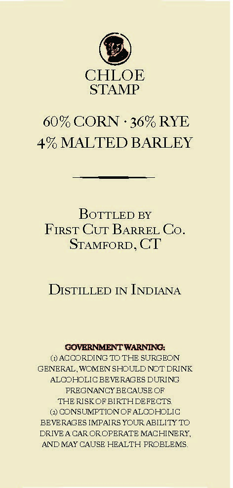
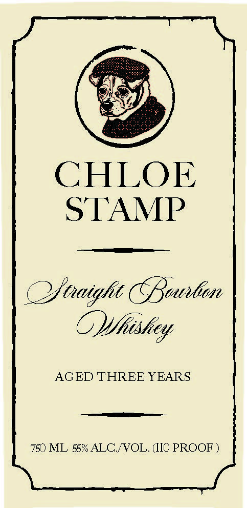

# TTB COLA Label Images - TTBID 26237001000674

**Brand Name:** CHLOE STAMP

**Issue Date:** 09/02/2026

**Origin Code:** 14

**Product Class/Type:** 101

**Source:** [TTB Public COLA Registry](https://ttbonline.gov/colasonline/viewColaDetails.do?action=publicFormDisplay&ttbid=26237001000674)

## Label Images

### Back Label

### Front Label

## Extracted Label Text

*Text extracted via OCR - may contain errors*

### Back Label

@

CHLOE

STAMP

60% CORN - 36% RYE

4% MALTED BARLEY

BOTTLED BY

First Cur Barret Co.

Stamrorp, CT

DIstTILLED IN INDIANA

GOVERNMENT WARNING:

(@) ACCORDING TO THE SURGEON

GENERAL, WOMEN SHOULD NOT DRINK

ALCOHOLIC BEVERAGES DURING

PREGNANCY BECAUSE OF

THE RISK OF BIRTH DEFECTS.

(@ CONSUMPTION OF ALCOHOLIG

BEVERAGES IMPAIRS YOUR ABILITY TO

DRIVEA CAR OROPERATE MACHINERY,

AND MAY CAUSE HEALTH PROBLEMS.

### Front Label

CHLOE
STAMP
Sraight Pantin
CVhishey
