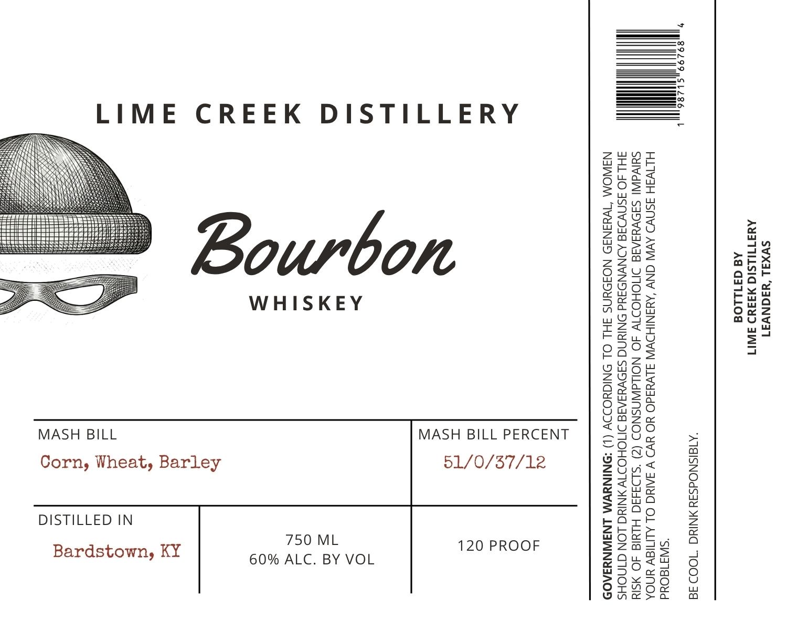

# TTB COLA Label Images - TTBID 26238001000037

**Brand Name:** LIME CREEK DISTILLERY

**Issue Date:** 09/02/2026

**Origin Code:** 44

**Product Class/Type:** 141

**Source:** [TTB Public COLA Registry](https://ttbonline.gov/colasonline/viewColaDetails.do?action=publicFormDisplay&ttbid=26238001000037)

## Label Images

### Label 1

## Extracted Label Text

*Text extracted via OCR - may contain errors*

**Detected Proof:** 120

### Label 1

——!
——4
——
_————s
LIME CREEK DISTILLERY ———]
ESN gHwe
ZT NESS Ssraa
BUN ACA Sung
SEN ARTA oh
SNES 8 Suet
Sitti teteceecseecieeeieses gow z au
ISEERE SSE SESS SSESSEESSIS 5227" 2 g a= a = S
sats 5 ES YU 8 a A E
ya WHISKEY SESE EES
wO9Z aud
T2ttz ws
5 be =
Paes a
nz
UMNO im
Z29Fs
aoga
ees
OFS56
Onn
£065
MASH BILL MASH BILL PERCENT gus >»
eis a
Corn, Wheat, Barley 51/0/57/12 8O,< 8
Z2zbs °&
exis 4g
Zwa Ww
S200 x
DISTILLED IN BrE>
Ome.
Bardstown, KY OME 120 PROOF z2528 9
ay 60% ALC. BY VOL 29420 3
wd [eamaa}
2O0Ox~D0 oO
Saeok #
