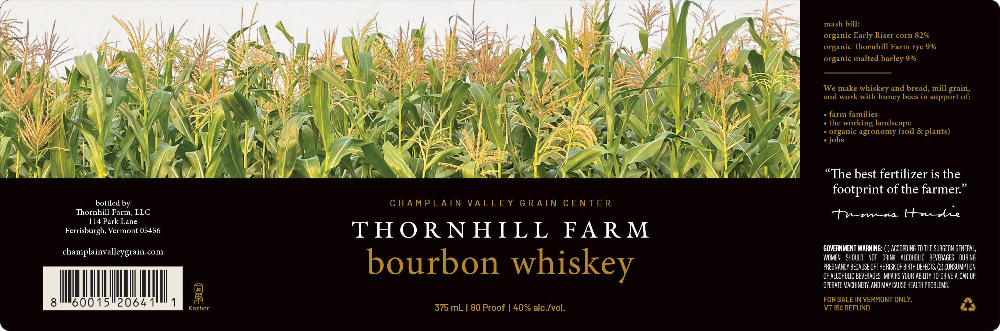

# TTB COLA Label Images - TTBID 26238001000141

**Brand Name:** THORNHILL FARM

**Issue Date:** 09/21/2026

**Origin Code:** 46

**Product Class/Type:** 141

**Source:** [TTB Public COLA Registry](https://ttbonline.gov/colasonline/viewColaDetails.do?action=publicFormDisplay&ttbid=26238001000141)

## Label Images

### Label 1

## Extracted Label Text

*Text extracted via OCR - may contain errors*

**Detected Proof:** 80

### Label 1

mash bill:
organic Early Riser corn 82%
organic Thornhill Farm rye 9%
organic malted barley 9%
We make whiskey and bread, mill grain,
and work with honey bees in support of:
farm families
the working landscape
organic agronomy (soil & plants)
jobs
(The best fertilizer is the
footprint of the farmer:
bottled by
C HAMPLAIN VALLEY G RAIN
C ENTE R
Thornhill Farm, LLC
tnmu HuAe
114 Park Lane
Ferrisburgh, Vermont 05456
THO RN HIL L
FAR M
champlainvalleygrain _
GOVERNMENT WARNING:
ACCORDING TO THE SURGEON GENERAL,
com
WOMEN   Should   NOT   DRINK
ALCOHOLIC   bEVERAGES   DURING
bourbon
whiskey
PREGMANCY BECAuSE Ofthe RISK OF BIRTH DEfECTS, (2) CONSUMPTION
OF ALCOHOLIC BEVERAGES IMPAIRS YOUR ABILITV TO DRIVE A CAR OR
OPERATE MACHINERY,AND May CAUSE HEALTH PROBLEMS,
8
60015"2064 1
FOR SALE IN VERMONT ONLY:
Kosher
375 mL | 80 Proof | 40% alc Ivol:
VT 15c REFUND
