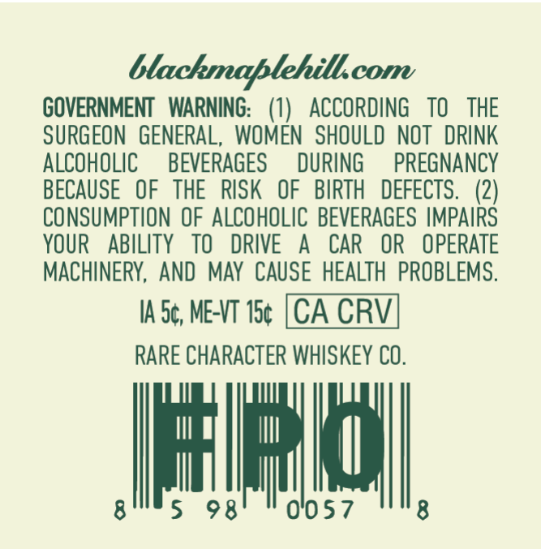
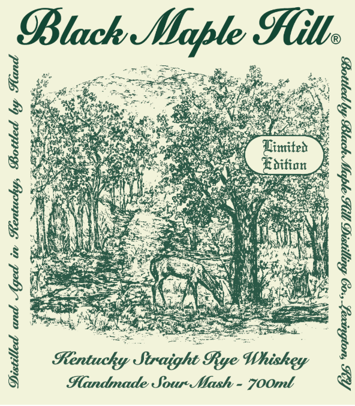
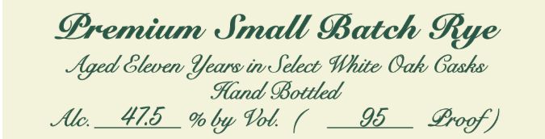

# TTB COLA Label Images - TTBID 26238001000181

**Brand Name:** BLACK MAPLE HILL

**Fanciful Name:** PREMIUM SMALL BATCH

**Issue Date:** 09/02/2026

**Origin Code:** 22

**Product Class/Type:** 102

**Source:** [TTB Public COLA Registry](https://ttbonline.gov/colasonline/viewColaDetails.do?action=publicFormDisplay&ttbid=26238001000181)

## Label Images

### Back Label

### Front Label

### Label 3

## Extracted Label Text

*Text extracted via OCR - may contain errors*

### Back Label

lM.com
GOVERNMENT WARNING: (1) ACCORDING TO THE
SURGEON GENERAL, WOMEN SHOULD NOT DRINK
ALCOHOLIC BEVERAGES DURING PREGNANCY
BECAUSE OF THE RISK OF BIRTH DEFECTS. (2)
CONSUMPTION OF ALCOHOLIC BEVERAGES IMPAIRS
YOUR ABILITY TO DRIVE A CAR OR OPERATE
MACHINERY, AND MAY CAUSE HEALTH PROBLEMS.

IA 5¢, MET 15¢ [CA CRV
RARE CHARACTER WHISKEY CO.

gun 98) "0057 8

### Front Label

Black Hill
®
ne Se. cS
: ogee Some ie: Ls ae :
Sib 0 Bg, Paes oe ah BN la ae a
S Bee OES g
Wepesceter ad at Soe 1 Cex eee
y Re eae ie epee ee
eRe Mas aan aay? Linitet
& Voss ign Samer ncegk. Roition
patie Resco ons ee
ARNG, Sie Bo Bs Oe Ep aN 8
Nie Wiha cere Rte es Ml
Wie i Ee aap: |) Cero IS
Lis Fee mele eS
aS ewan pes a i
1 ’
§ Handmade Sour-Mash - 70Omt g

### Label 3

@remium Small Batch 9ye
Aged &lever Iears inSetect White Oak Gashs
%land OBottled
Alc
475
% by Vol
95
Erogf )
